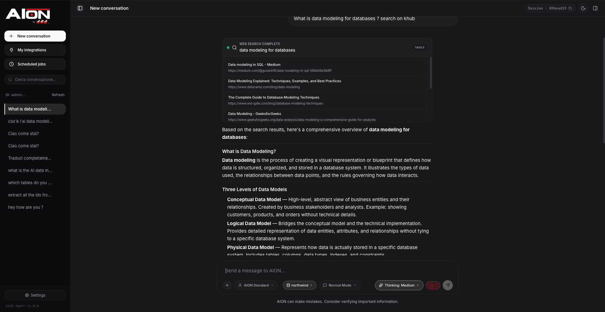
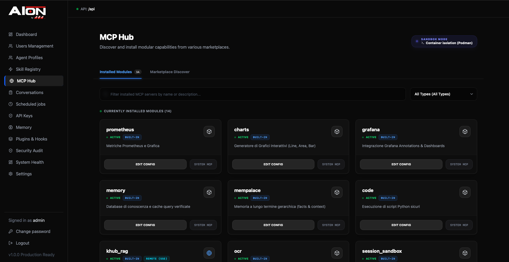

# AION Agent

Self-hosted AI agent platform with MCP tool integration, multi-level memory (STM/LTM),
YAML profiles, skills, and Plan Mode for structured multi-step work.

[](https://github.com/AION-by-ASA-Computer/AION_Agent/actions/workflows/ci.yml)
[](LICENSE)
[](https://www.python.org/)
[](https://fastapi.tiangolo.com/)
[](https://haystack.deepset.ai/)
[](https://nextjs.org/)
[](https://react.dev/)
[](https://www.typescriptlang.org/)
[](https://docs.docker.com/compose/)
[](https://redis.io/)
[](https://www.sqlite.org/)
[](docs/mcp/)
[](https://caddyserver.com/)

**Commercial site:** [https://aion-asa.com](https://aion-asa.com) · **Italian README:** [README.it.md](README.it.md) · **Docs:** [docs/](docs/)

## Screenshots

### Chat UI

<p align="center">
  
</p>

### Admin UI

<p align="center">
  
</p>

## Quick start (Docker)

The recommended way to run AION is the full Docker stack (Caddy + backend + chat-ui + admin-ui + docs + Redis).

### Local (HTTP, no domain)

```bash
git clone https://github.com/AION-by-ASA-Computer/AION_Agent.git
cd AION_Agent

cp .env.example .env
# Required: set your LLM endpoint (see DEPLOY DOCKER section in .env.example)
#   AION_API_URL=http://host.docker.internal:11434/v1   # Ollama on the host
#   AION_MODEL=llama3.2
#   DOMAIN=:80

./scripts/setup-aion-env.sh --docker
docker compose up -d --build
```

| URL | Service |
|-----|---------|
| http://localhost/ | Chat UI |
| http://localhost/admin | Admin UI |
| http://localhost/docs/ | Documentation |
| http://localhost/api/health | Backend health |

### Production (HTTPS via Let's Encrypt)

```bash
cp .env.example .env
# Set DOMAIN=your.example.com, LETS_ENCRYPT_EMAIL, AION_PUBLIC_API_URL, secrets
./scripts/setup-aion-env.sh --docker
docker compose up -d --build
```

Caddy provisions TLS automatically. One DNS `A` record pointing at the server is enough.

Details: [docs/deployment/docker.md](docs/deployment/docker.md)

### Pre-built images (GHCR)

Published on each [GitHub Release](https://github.com/AION-by-ASA-Computer/AION_Agent/releases). Pin a version in production:

```bash
export AION_VERSION=0.1.0
docker compose -f docker-compose.yml -f docker-compose.ghcr.yml pull
docker compose -f docker-compose.yml -f docker-compose.ghcr.yml up -d --no-build
```

See [docs/opensource/releases.md](docs/opensource/releases.md).

### Development compose (hot reload)

API + chat-ui + Redis only — run admin-ui and docs via `pnpm dev` when needed:

```bash
docker compose -f docker-compose.dev.yml up
```

## Features

| Area | Description |
|------|-------------|
| **Chat UI** (`chat-ui/`) | Primary Next.js client: SSE streaming, attachments, plan dock |
| **Admin UI** (`admin-ui/`) | Profiles, users, memory, agent DB management |
| **MCP tools** | Dynamic stdio/SSE tools; registry in `config_std/mcp_registry.yaml` |
| **Memory** | STM window, LTM extraction (MemPalace), SQLite + FTS history |
| **Profiles & skills** | YAML profiles; Markdown skills with frontmatter |
| **Plan Mode** | Tool-first plans, human approval, background execution |
| **Docker** | Production stack with Caddy path routing; dev compose with hot reload |

## Default credentials

When admin auth is enabled (default): **`admin` / `admin`** — change password on first login.

Chat auth is optional (`AION_CHAT_PASSWORD_AUTH=0` opens chat without login; useful for local dev).

Generate secrets for production:

```bash
openssl rand -hex 32   # AION_CHAT_AUTH_SECRET (if chat password auth enabled)
```

## Project layout

```text
src/              FastAPI backend, agent pipeline, memory, MCP manager
chat-ui/          Primary Next.js chat client
admin-ui/         Admin dashboard (Next.js)
website/          Docusaurus docs site
config_std/       Committed config templates (synced to config/ at setup)
mcp_servers_std/  Committed MCP server sources
docs/             Documentation source of truth
data/             Runtime data (gitignored; eval fixtures whitelisted)
```

See [docs/architecture/source-tree.md](docs/architecture/source-tree.md).

## Local development (without Docker)

**Prerequisites:** Python 3.13+, [uv](https://github.com/astral-sh/uv), [pnpm](https://pnpm.io/) 9+, OpenAI-compatible LLM.

```bash
cp .env.example .env
# Set AION_API_URL, AION_MODEL, AION_LLM_API_KEY

./scripts/setup-aion-env.sh
uv venv && uv pip install -r requirements.txt

# Terminal 1 — API (port 8001, single worker required)
uvicorn src.api.main:app --reload --reload-exclude data/sessions

# Terminal 2 — Chat UI (port 8003)
cd chat-ui && pnpm install && pnpm dev
```

Open http://localhost:8003. Optional admin UI: `cd admin-ui && pnpm dev --webpack` (port 3870).

```bash
# Curated CI test suite (no live LLM)
./scripts/run_ci_tests.sh

# Lint
uv run ruff check --config ruff.toml src/
uv run ruff format --check --config ruff.toml src/
```

**Constraints:** backend must run with **one worker**; use **pnpm** in JS packages; import `src.aion_env` before reading `os.environ` in scripts.

Assistant onboarding: [AGENTS.md](AGENTS.md), [CLAUDE.md](CLAUDE.md).

## Contributing

See [CONTRIBUTING.md](CONTRIBUTING.md). Open PRs against **`main`** on this repository.

## Documentation

Rendered site: build from `website/` or read sources in `docs/`.

| Topic | Path |
|-------|------|
| Architecture | [docs/architecture/](docs/architecture/) |
| Configuration / env | [docs/configuration/](docs/configuration/) |
| API & runtime | [docs/api-and-runtime/](docs/api-and-runtime/) |
| MCP | [docs/mcp/](docs/mcp/) |
| Security | [docs/security/](docs/security/) |

## Telemetry

OpenTelemetry and Opik hooks exist but are **off by default** (`AION_OTEL_ENABLED=0`). No phone-home analytics in the default configuration.

## Security

Report vulnerabilities privately — [SECURITY.md](SECURITY.md).

## Disclaimer

**AION Agent is under active development.** APIs, configuration, and behavior may change between releases without prior notice.

The software is provided **“as is”**, without warranty of any kind. AION / ASA Computer **assumes no liability** for damages, data loss, security incidents, or operational issues arising from the use of this project in any environment (including production).

You are responsible for evaluating fitness for your use case, securing your deployment, and complying with applicable laws and third-party license terms.

## License

[Apache License 2.0](LICENSE). Third-party notices: [NOTICE](NOTICE).

## Star History

[](https://www.star-history.com/#AION-by-ASA-Computer/AION_Agent&type=date&legend=top-left)
