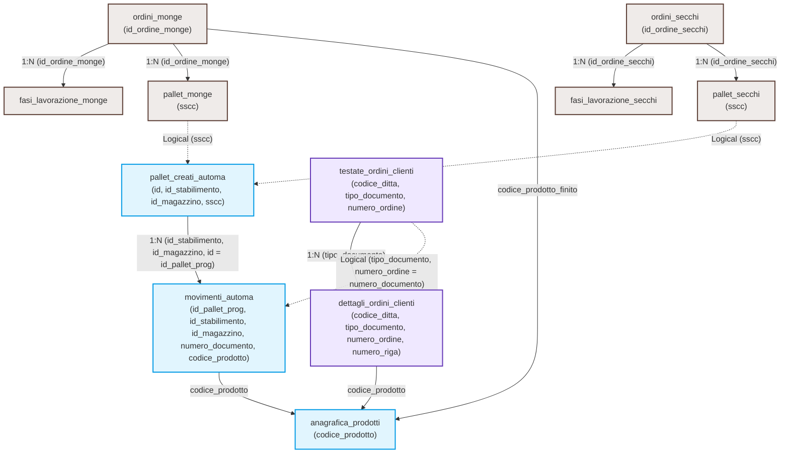

# Database Navigation Map (Alibr Production & Logistics ERP)

> **Operational source of truth:** MemPalace wing `wing_proj_alibr` (SQL QM project **`alibr`**, not `default`). Seed: `python scripts/bootstrap_db_navigation_mempalace.py --project alibr`. In chat-ui select project **Alibr** before queries. Read-only skill — prefer `mempalace_search` on the active project.

This skill provides the essential logical structure, entry points, and physical and logical connection keys (`JOIN`s) of the database. Use it as a fallback reference to formulate coherent, performant, and error-free SQL queries.

---

## ℹ️ Crucial Information and Database Limitations

> [!WARNING]
> **Partial Database and Key Exclusions (READ CAREFULLY):**
> * **Customer Information:** There is **NO** customer master data or customer details in this database. If a request refers to a customer, limit yourself to identifying and returning the customer code obtained exclusively from the `testate_ordini_clienti` and `dettagli_ordini_clienti` tables.
> * **Automa Pallet Table (`pallet_creati_automa`):** This table acts as a centralized collector and contains the union of all pallets from both `pallet_monge` (wet production) and `pallet_secchi` (dry production). Therefore, the exact same pallets present in these two source tables are also registered in `pallet_creati_automa`.
> * **Retrieving Pallet Details:** If the request requires specific details or native attributes of a pallet, you must refer to and perform a `JOIN` with the correct source table (`pallet_monge` or `pallet_secchi`), as `pallet_creati_automa` only contains summary logistical data. If the request requires the number of pallets, always search for distinct pallets and compare the query on the single table (`pallet_monge` or `pallet_secchi`) and on the union table (`pallet_creati_automa`).

---

## 🤖 Querying Guidelines for the SQL Agent

> [!IMPORTANT]
> **MANDATORY RULES FOR GENERATING SQL QUERIES**
>
> 1. **Do Not Rely Only on Physical Foreign Keys:**
>    Physical introspection of the PostgreSQL database will show only a fraction of the real relationships (structural constraints). Many critical business connections in this ERP are **logical relationships** (fields with the same meaning and value, but lacking a physical `FOREIGN KEY` constraint on the DB).
>
> 2. **Always Consult This Skill:**
>    Before declaring that two tables "are not connected" or that "it is not possible to cross-reference data", check the **Relationship Graph** and the **JOIN Details** in this document to find the correct logical path.
>
> 3. **Use OpenMetadata for Support:**
>    To understand the meaning of ambiguous columns, check their quality, or verify their profiling before writing complex queries, consult the `openmetadata_guide` skill as a priority.

---

## 🎯 1. Main Entry Points

Identify the entity requested by the user and start from the appropriate target table:

| Category | Entity | Target Table | Primary Keys / Logical Reference Keys |
| :---: | :--- | :--- | :--- |
| 📦 | **Product Catalog (Anagrafica)** | `anagrafica_prodotti` | `codice_prodotto` |
| 🧾 | **Wet Production Orders (Monge)** | `ordini_monge` | `id_ordine_monge` |
| 🧾 | **Dry Production Orders (Secchi)** | `ordini_secchi` | `id_ordine_secchi` |
| 🏗️ | **Pallets in Wet Production (Monge)** | `pallet_monge` | `sscc` |
| 🏗️ | **Pallets in Dry Production (Secchi)** | `pallet_secchi` | `sscc` |
| 🤖 | **Finished & Labeled Pallets** | `pallet_creati_automa` | `id_aion` <br> *(Logical Key: `id_stabilimento`, `id_magazzino`, `id`)* |
| 🚛 | **Internal Movement / Logistics** | `movimenti_automa` | `id_aion` |
| 🛒 | **Customer Sales Orders (Headers)** | `testate_ordini_clienti` | `codice_ditta`, `tipo_documento`, `numero_ordine` |
| 📝 | **Order Line Details** | `dettagli_ordini_clienti` | `codice_ditta`, `tipo_documento`, `numero_ordine`, `numero_riga` |

# Field Information

The `codice_cliente_fornitore` field in the `testate_ordini_clienti` table indicates the customer code for that record; if you are asked to search for the customer associated with an order or pallet, this is the field to return.
The `codice_ditta` field in the `testate_ordini_clienti` table DOES NOT indicate the customer code!
Do not confuse `codice_ditta` with `codice_cliente_fornitore`; when "the customer" is requested, you MUST return `codice_cliente_fornitore`.

---

## 📊 Visual Relationship Graph

The following architectural map illustrates how the main tables are interconnected within the ERP system:



---

## 🔗 2. Relationship Details and JOIN Conditions

Use these `JOIN` clauses (physical and logical) to navigate through operational flows without generating unwanted cartesian products:

### 🏭 Wet Production Flow (Monge)
* **From Orders to Processing Phases:**
  ```sql
  JOIN fasi_lavorazione_monge ON ordini_monge.id_ordine_monge = fasi_lavorazione_monge.id_ordine_monge
  ```
* **From Orders to Produced Pallets:**
  ```sql
  JOIN pallet_monge ON ordini_monge.id_ordine_monge = pallet_monge.id_ordine_monge
  ```
* **From Pallets to Automation Labeling (Finished Pallets):**
  ```sql
  JOIN pallet_creati_automa ON pallet_monge.sscc = pallet_creati_automa.sscc
  ```

### 🏭 Dry Production Flow (Secchi)
* **From Orders to Processing Phases:**
  ```sql
  JOIN fasi_lavorazione_secchi ON ordini_secchi.id_ordine_secchi = fasi_lavorazione_secchi.id_ordine_secchi
  ```
* **From Orders to Produced Pallets:**
  ```sql
  JOIN pallet_secchi ON ordini_secchi.id_ordine_secchi = pallet_secchi.id_ordine_secchi
  ```
* **From Pallets to Automation Labeling (Finished Pallets):**
  ```sql
  JOIN pallet_creati_automa ON pallet_secchi.sscc = pallet_creati_automa.sscc
  ```

### 🤖 Automatic Movement & Logistics Flow (Movimenti Automa)
* **From Finished Pallets to Warehouse Movements:**
  > [!NOTE]
  > The relationship uses a composite key with 3 fields (`id_stabilimento`, `id_magazzino`, `id = id_pallet_prog`) to uniquely identify the moved pallet.
  ```sql
  JOIN movimenti_automa 
    ON pallet_creati_automa.id_stabilimento = movimenti_automa.id_stabilimento
   AND pallet_creati_automa.id_magazzino = movimenti_automa.id_magazzino
   AND pallet_creati_automa.id = movimenti_automa.id_pallet_prog
  ```

### 🛒 Sales Flow and Customer Orders (Sales)
* **From Headers to Order Details:**
  > [!IMPORTANT]
  > For a correct and efficient JOIN and to avoid spurious record duplication, always connect using the entire composite primary key of the order headers:
  ```sql
  JOIN dettagli_ordini_clienti 
    ON testate_ordini_clienti.tipo_documento = dettagli_ordini_clienti.tipo_documento
  ```

### 🔄 The Complete Traceability Bridge: From Sales to Logistics (End-to-End)
To track which warehouse movements or shipments (`movimenti_automa`) were executed to fulfill customer order lines (`testate_ordini_clienti`), you can connect them directly using the following logical fields:
* **From Customer Order Headers to Logistical Movements:**
  ```sql
  JOIN movimenti_automa 
    ON testate_ordini_clienti.tipo_documento = movimenti_automa.tipo_documento
   AND testate_ordini_clienti.numero_ordine = movimenti_automa.numero_documento
  ```

### 📦 Connection to Product Catalog (Anagrafica Prodotti)
Any table containing products can be joined to `anagrafica_prodotti` to obtain descriptions, weights, packaging, and tax parameters:
* **From Customer Order Details:**
  ```sql
  JOIN anagrafica_prodotti ON dettagli_ordini_clienti.codice_prodotto = anagrafica_prodotti.codice_prodotto
  ```
* **From Warehouse Movements:**
  ```sql
  JOIN anagrafica_prodotti ON movimenti_automa.codice_prodotto = anagrafica_prodotti.codice_prodotto
  ```
* **From Production Orders (Finished Product):**
  ```sql
  JOIN anagrafica_prodotti ON ordini_monge.codice_prodotto_finito = anagrafica_prodotti.codice_prodotto
  ```

---

## ⚠️ 3. Navigation Rules and Crucial Heuristics

Follow these practical heuristics when performing multi-table queries to ensure optimal performance and data accuracy:

### 1. Space Removal and Code Matching (`TRIM`)
* **Padding Issue:** Product codes (`codice_prodotto`, `codice_prodotto_neutro`, `codice_prodotto_finito`) in some external ERP tables or order details may be stored with trailing/leading spaces (padding).
* **Solution:** **Always use `TRIM(field)`** on both sides of the comparison in `JOIN`s or `WHERE` filters (e.g., `TRIM(ma.codice_prodotto) = TRIM(ap.codice_prodotto)`) to prevent silent mismatches.

### 2. Stock Calculation and Movement Sign
* In the `movimenti_automa` table, the `segno` column indicates the direction of the warehouse movement:
  * `+` -> Receipt / Stock In.
  * `-` -> Issue / Stock Out.
* To calculate the logical stock or the traceability of a pallet, compute the algebraic sum of the movements filtered for the specific `id_pallet_prog` (e.g., `SUM(CASE WHEN segno = '+' THEN quantita ELSE -quantita END)`).

### 3. Pallet Correspondence (SSCC / Prog)
* The `sscc` code uniquely connects physical production pallets to automation (`pallet_creati_automa`).
* The `id_pallet_prog` field in logical movements (`movimenti_automa`) always corresponds to the `id` column within the `pallet_creati_automa` table, for the same facility (`id_stabilimento`) and warehouse (`id_magazzino`).
