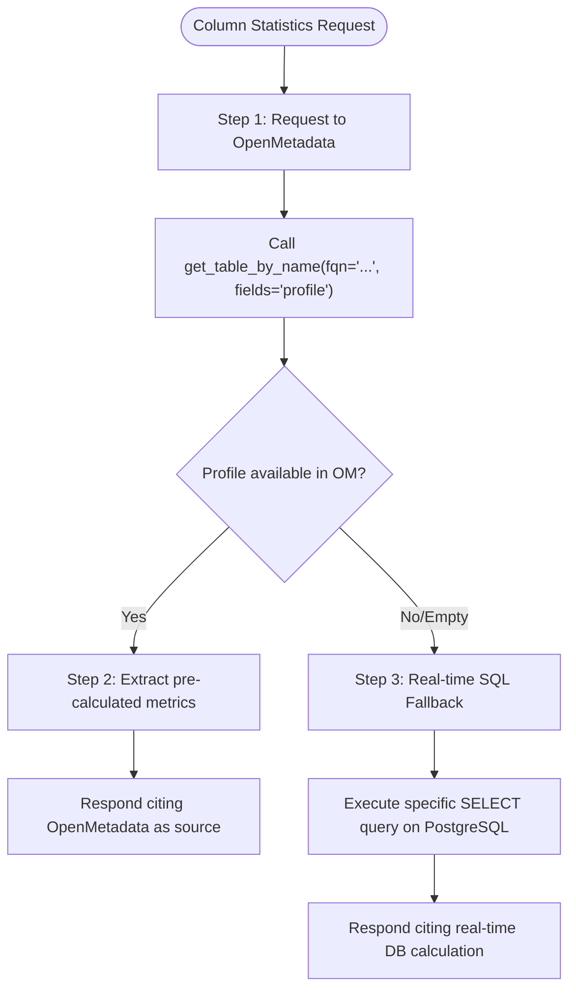

# OpenMetadata (OM) Integration and Usage Guide

This skill provides the Agent with a detailed operational protocol and tool mapping to navigate, search, and analyze business metadata through the **OpenMetadata** platform.

---

## Overview and operational efficiency

OpenMetadata is the centralized data catalog. Its usage **prevents reasoning loops** and reduces the query load on the PostgreSQL database.
* **Golden Rule:** If a question concerns data quality, the business meaning of a term, or the overall database structure, query **OpenMetadata first** before running queries on PostgreSQL.

---

## OpenMetadata tool catalog and parameters

The `openmetadata` MCP server provides the following specialized tools. Use them precisely by setting the right parameters:

### 1. `table` Module (Details and Structure)
* **`get_table_by_name(fqn: str, fields: Optional[str] = None)`**
  * *Usage:* Retrieve the complete structural details of a table via its Fully Qualified Name (FQN), e.g., `local_postgresql.alibr_prod.public.pallet_monge`.
  * *Key parameter:* Set `fields="profile"` to extract Data Observability metrics.
* **`get_table(table_id: str, fields: Optional[str] = None)`**
  * *Usage:* Same as `get_table_by_name`, but uses the table's unique UUID.
* **`list_tables(limit: int = 10, offset: int = 0, fields: Optional[str] = None, database: Optional[str] = None, include_deleted: bool = False)`**
  * *Usage:* List cataloged tables. Useful for initial schema exploration.

### 2. `search` Module (Data Discovery)
* **`search_entities(q: str, index: Optional[str] = None, from_: int = 0, size: int = 10, sort: Optional[str] = None, service_name: Optional[str] = None, classification: Optional[str] = None, entity_type: Optional[str] = None)`**
  * *Usage:* Search tables, columns, or glossaries starting from natural language terms.
  * *Example:* `q="pallet AND stoccaggio"` to locate logistics tables.
* **`suggest_entities(q: str, index: Optional[str] = None, field: Optional[str] = None, size: int = 10)`**
  * *Usage:* Provide quick auto-completion suggestions for business entities and terms.

### 3. `glossary` Module (Business Glossary)
* **`get_glossary_by_name(name: str, fields: Optional[str] = None)`** and **`get_glossary_term(term_id: str, fields: Optional[str] = None)`**
  * *Usage:* Resolve terminological ambiguity. Map common language words to technical definitions and physical columns.

### 4. `test_cases` & `test_suites` Modules (Data Quality)
* **`list_test_cases(limit: int = 10, fields: Optional[str] = None, entity_link: Optional[str] = None, test_case_status: Optional[str] = None)`**
  * *Usage:* Verify the status of quality tests associated with a specific table or column.

---

## Data profiling protocol (data observability)

When asked about the **percentage of null values**, **data uniqueness**, **distinct values**, **minimum/maximum**, or other statistics on a column, strictly follow this two-way flow:



### Technical details of profiling in OpenMetadata (monkeypatched)
The OpenMetadata MCP server is configured with a transparent **monkeypatch** that automatically merges information from the most recent profile (`/tableProfile/latest`).

When you call `get_table_by_name(fqn="...", fields="profile")`, inspect the returned JSON structure looking for these keys:

1. **Table Profile (Global Level):**
   * `result["profile"]` contains global metrics such as `rowCount`.

2. **Column Profile (Field Details):**
   * Within `result["columns"]`, each column object has a `profile` key if profiling has occurred. Parse these metrics:
     * `nullCount`: Absolute number of null values.
     * `nullProportion`: Fraction of null values (e.g., `0.12` = 12% nulls).
     * `uniqueCount`: Absolute number of unique values.
     * `uniqueProportion`: Proportion of unique values.
     * `distinctCount`: Number of distinct values.
     * `distinctProportion`: Proportion of distinct values.
     * `min` / `max`: Minimum and maximum value of the column.
     * `mean` / `sum` / `stddev`: Arithmetic statistics (for numeric columns only).

### SQL fallback example (if OM has no profile data)
If the returned profile is null or incomplete, calculate the metrics on PostgreSQL using optimized queries:
```sql
SELECT 
  COUNT(*) as total_rows,
  COUNT(column_name) as non_null_rows,
  (COUNT(*) - COUNT(column_name))::float / COUNT(*) * 100 as percent_null,
  COUNT(DISTINCT column_name) as distinct_values
FROM table_name;
```

---

## Operational guidelines for anomalies

1. **Sensitivity and Governance Tags:**
   * If you see tags like `PII.Sensitive` or `Tier.Critical` associated with columns, pay close attention to how you show or filter this data.
2. **Deprecated/Draft Table Alerts:**
   * If the `status` or tags of a table contain keywords like `Deprecated` or `Draft`, **always** notify the user before presenting the data (e.g., *"Note: The queried table is marked as Deprecated in OpenMetadata"*).
3. **Data Quality Failures:**
   * If `test_cases` show a status of `Failed` or `Aborted`, warn the user that the data might not be completely consistent or accurate before drawing analytical conclusions.
