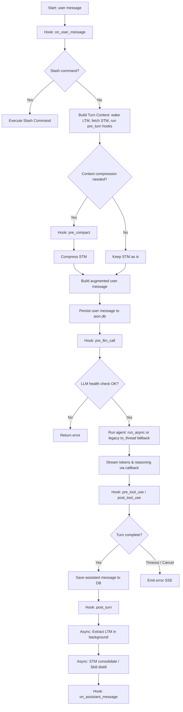

# Agent pipeline (`AgentPipeline`)

Implementation: **`src/agent_pipeline.py`**. Class **`AgentPipeline`** that encapsulates the Haystack agent, `session_id`, `profile_name`, `user_id`.

## Architectural philosophy

### Why separate STM and LTM?

The system implements **two levels of memory** with opposite characteristics:

| Characteristic | STM (Short-Term Memory) | LTM (Long-Term Memory) |
|----------------|-------------------------|------------------------|
| **Fast or slow?** | Very fast (SQLite, in-memory) | Slow (LLM extraction, JSON parsing) |
| **Persistent?** | Volatile (cleaned periodically) | Persistent (permanently structured) |
| **Used in real time?** | Yes, for every turn | No, only async background |
| **Structure** | Raw messages | Semantic structured JSON |
| **Goal** | Low latency, fluid conversation | Semantic understanding, permanent memory |

**Trade-off:** Separating STM and LTM allows not blocking the conversation with LTM persistence operations that could take seconds or minutes (extraction via LLM, JSON parsing). STM gives speed, LTM gives semantic persistence.

### Why is LTM extraction asynchronous?

LTM extraction occurs **after** the response has been completed, via `asyncio.create_task()`. This means:

1. **Does not block the user:** The user receives the response immediately
2. **Background processing:** The extraction can last several seconds, but does not impact the UX
3. **Decoupling:** The system can work even if the LTM extraction fails

### Why context compression?

**Problem:** LLM models have token limits (typically 32k for vLLM). If the context becomes too long:

1. The response is truncated (`finish_reason=length`)
2. Latency and token cost increase
3. The agent can become confused with too much irrelevant context

**Solution:** Compression that keeps only the last `AION_CONTEXT_COMPRESS_KEEP_LAST` messages intact, summarizing the initial part.

**Why threshold 0.5?** `AION_CONTEXT_COMPRESS_THRESHOLD=0.5` means: "compress when you are using 50% of the token budget". This threshold balances:

- **Early compression:** Less information preserved, but more space for long responses
- **Late compression:** More information preserved, but risk of truncation

### Model window and input budget

Set **`AION_MODEL_MAX_CONTEXT`** to the model's limit on the LLM server.
The compressor (`ContextCompressor` in `agent_pipeline._apply_context_compression`) counts:

- STM messages passed to `agent.run`
- **`AION_CONTEXT_COMPRESS_FIXED_OVERHEAD`** (system prompt + tool schema estimate)
- **`AION_CHAT_MAX_TOKENS`** reserved for output if `AION_CONTEXT_COMPRESS_RESERVE_OUTPUT=1`

Compresses **before** `agent.run` when `messages + system/tools` ≥ `AION_MODEL_MAX_CONTEXT × AION_CONTEXT_COMPRESS_THRESHOLD` (e.g. `131072 × 0.5 ≈ 65536` tokens).
The chat-ui shows *Compacting in progress…* on `context_compacting` SSE events.
`/compact` sets a Redis flag to force compaction on the next turn.

### Why 600s timeout per turn?

`AION_AGENT_TURN_TIMEOUT=600` (10 minutes) is a conservative timeout because:

1. **Complex queries with tools:** The agent may need to call many tools in sequence (Prometheus, Grafana, OCR)
2. **Complex reasoning:** The model may need to reason for several turns
3. **LTM retrieval:** The LTM context can be large and take time to be retrieved

A timeout that is too short would interrupt legitimate but complex queries.

### Execution Strategy: Asynchronous vs Thread

AION supports both native asynchronous execution and execution in separate threads for the Haystack agent:

1. **Native Asynchronous Execution (Default)**: By default, the agent is executed by calling `agent.run_async` with `haystack_agent_streaming_callback_async`. This guarantees optimal resource utilization and avoids thread context switching.
2. **Fallback to separate Thread (Legacy)**: If configured via the environment `AION_AGENT_EXEC_LEGACY_THREAD=1` (or if the generator class does not support asynchronous execution), the system synchronously executes `agent.run` in a separate thread via `asyncio.to_thread` with `haystack_agent_streaming_callback`.

**Why the queue (`asyncio.Queue`)?**
Regardless of the execution mode (thread or asynchronous), the tokens and events generated by the model or during calls to the MCP tools are funneled into a queue (`asyncio.Queue`). This allows to:
- Decouple the execution cycle of the agent from the SSE (Server-Sent Events) send cycle of the response.
- Securely manage interruptions, timeouts, and cancellations at the turn level.

---

## `run_stream` flow



### Hook System
AION implements a hook system inspired by Claude Code and Hermes that allows extending the behavior of the pipeline without modifying the core code.

- **`on_user_message`**: Allows intercepting the user message (used for slash commands).
- **`pre_llm_call`**: Allows modifying the messages or context before sending to the LLM.
- **`pre_tool_use` / `post_tool_use`**: Monitoring and control over the execution of MCP tools (e.g. for smart approvals).
- **`pre_compact`**: Called before context compression to save important data in the LTM.

### Subagent Pattern

> [!WARNING]
> Sub-agents are under development and **are not working** in this version of the codebase.
> 
> The architecture provides for delegating tasks to specialized **Subagents** (isolated profiles operating in child conversations via the `delegate_to_subagent` tool), in order to guarantee context isolation and prevent pollution of the main context. However, this functionality is currently not active or usable.

### Slash Commands
Slash commands (e.g. `/help`, `/clear`, `/compact`, `/ttc`) are managed by the `SlashCommandRouter` via the `on_user_message` hook. If a message starts with `/`, it is routed to the corresponding command handler, skipping the normal LLM call if the command is self-contained. The old `/plan` no longer creates plans: it replies with a message indicating to use **Plan mode** in the chat-ui.

---

### Step-by-step with explanations

#### 1. **Wake + memory inject (pre-turn)**
```python
wake = await ltm_orchestrator.wake_up(self.conversation_id)
# pre_turn hooks: SQL QueryMemory + MemPalace navigation (wing_proj_{sql_query_project})
augmented_user = ltm_orchestrator.build_augmented_user_text(augmented_user, "", wake)
```
**Why:** `wake_up` provides a compact summary (identity / top drawers). The `pre_turn` hooks inject validated SQL caches and MemPalace navigation drawers for the **active project** (same slug as the QueryMemory drawer). `retrieve_context()` remains available but is not on the hot path — navigation retrieval is aligned to SQL QM via hook.

#### 2. **STM window**
```python
stm_window = await history_manager.get_window(..., max_turns=10)
```
**Why:** The STM is the agent's "short-term memory" - the last N messages of the current conversation retrieved from the new unified DB `aion.db` via `history_manager`.

#### 3. **Hooks and Plugins**
The pipeline queries the `HookRegistry` at critical points. Plugins in `data/plugins/` can register handlers to modify runtime behavior (e.g. PII redaction via `pre_llm_call`).

#### 4. **Augmented user message**
```python
augmented_user = await self._augment_user_input(user_input)
# + inject da query_memory_hooks e db_navigation_mempalace_hooks
augmented_user = ltm_orchestrator.build_augmented_user_text(augmented_user, "", wake)
```
**Why:** The message to the model includes workspace manifest, QueryMemory SQL, MemPalace navigation (project), and wake hint — without duplicating entire SELECTs in MemPalace (only paths/JOINs).

#### 5. **Agent execution**
```python
agent_task = asyncio.create_task(
    run_agent_turn(
        messages,
        sync_runner=_run_agent_sync,
        async_runner=_run_agent_async,
    )
)
```
**Why:** It executes the agent's turn by relying on `run_agent_turn` to dynamically select the native asynchronous path or the fallback to a separate thread, without blocking the FastAPI event loop.

#### 6. **Streaming callback**
The callback receives chunks from the model and sends them via SSE to the client. If the agent calls a tool, a `tool_event` event is emitted. In **Plan mode** (`agent_mode=plan`) the parser intercepts `<plan>...</plan>` and emits `orchestration_plan_pending` for the sidebar.

#### 7. **Post-turn async tasks**
```python
loop.create_task(ltm_orchestrator.extract_and_persist(...))
loop.create_task(skill_distiller.maybe_distill(...))
await hook_registry.dispatch("post_turn", ctx)
```
**Why:** After the response has been sent to the user, the system executes LTM extraction, optional skill distillation, and the dispatch of closing hooks in the background. These tasks **do not block** the return of the response to the user.

**MemPalace / OpenClaw Parity:** on Claude Code, the `mempal_save_hook` and `mempal_precompact_hook` hooks save automatically without regex on the user text. In AION, `extract_and_persist` (`ltm_extraction` skill) is the equivalent of the save hook; `precompact_flush` covers STM compression. Explicit "remember" requests are managed with **in-turn MCP tools** (`mempalace_kg_add`, …) according to `mempalace_protocol`, not with server-side catchers.

---

## LLM Provider Management (`AionChatGeneratorWrapper`)

Implementation: **`src/runtime/llm_adapter.py`**. Class **`AionChatGeneratorWrapper`**.

AION does not directly invoke a raw OpenAI or Anthropic client, but uses a unified adapter that acts as a wrapper for Haystack generator components. This wrapper takes care of:
1. Resolving the correct provider.
2. Dynamically instantiating the corresponding generator.
3. Normalizing generation parameters (`generation_kwargs`) for the specific characteristics of each provider (e.g. thinking/reasoning, max tokens).
4. Applying optimizations (such as prompt caching for Anthropic) and telemetry (Opik).

### Supported providers and resolution

The provider is resolved dynamically via the `_resolve_provider` function according to these rules:
1. **Explicit Provider**: If a provider (e.g., `"openai"`, `"anthropic"`, `"google"`) is explicitly passed during initialization, that one is used.
2. **Environment Variable / Model Name**:
   - If the `AION_LLM_ADAPTER` environment variable or the `AION_MODEL` model contain the strings `"anthropic"`, `"claude"`, the **Anthropic** provider is selected.
   - If they contain `"google"` or `"gemini"`, the **Google** provider is selected.
   - In other cases, the system falls back to **OpenAI** (also compatible with servers like vLLM or LM Studio).

Each provider instantiates the correct Haystack class:
- **OpenAI**: `OpenAIChatGenerator` (from `haystack.components.generators.chat`)
- **Anthropic**: `AnthropicChatGenerator` (from `haystack_integrations.components.generators.anthropic`)
- **Google**: `GoogleGenAIChatGenerator` (from `haystack_integrations.components.generators.google_genai`)

### Normalization of generation parameters

Since different providers use different formats and parameter names for the same functionality, `AionChatGeneratorWrapper` performs an automatic normalization of the parameters passed in `generation_kwargs` via `_normalize_generation_kwargs`:

- **Thinking / Reasoning**:
  The wrapper intercepts the configuration in OpenAI `extra_body` format (specifically `thinking_token_budget` and `chat_template_kwargs.enable_thinking`) and maps it for the other providers:
  - **Google GenAI**: Maps to `thinking_budget` (e.g. `thinking_budget = budget_int` or `thinking_budget = 0` if disabled).
  - **Anthropic Claude**: Maps to the native structure `thinking = {"type": "enabled", "budget_tokens": budget_int}` (or removes it if disabled).
  - **OpenAI / vLLM**: Keeps the `thinking_token_budget` parameter in `extra_body`.
  - In other providers, `extra_body` is removed before sending.
- **Max Tokens**:
  - For **Google GenAI**, the `max_tokens` parameter is converted to `max_output_tokens`.
- **Beta Headers**:
  - For **Anthropic**, the wrapper ensures that the HTTP headers contain the enablement of the beta for Prompt Caching (`prompt-caching-2024-07-31`).

### Provider-specific optimizations

- **Ephemeral Prompt Caching (Anthropic)**:
  When using the Anthropic provider, the wrapper automatically marks all messages with the `system` role or that have `is_from_system() == True` with the metadata `cache_control = {"type": "ephemeral"}`. This allows Anthropic to save the system prompt and tools cache, drastically reducing input token costs and improving response times.
- **Async Fallback**:
  If the underlying generator class does not expose a native `run_async` method, `run_async` executes the synchronous `run` method inside a thread pool via `asyncio.to_thread` to ensure that the FastAPI event loop is never blocked during calls to the model.

### Telemetry and Monitoring (Opik)

If the Opik library is installed and configured:
1. The `run` wrapper is decorated with `@track(type="llm")` preserving its original signature via `functools.wraps` (allowing Haystack to pass signature checks during agent initialization).
2. Real consumed tokens (`prompt_tokens`, `completion_tokens`, `reasoning_tokens`) are extracted directly from the responses of the different providers and published on the token SSE queue via the `llm_tokens` event.
3. All registered tools are tracked with `@track(type="tool")` to monitor their times and any errors.

---

## Typical SSE Chunks

| Type | Content | When it is emitted |
|------|---------|--------------------|
| `token` | Model delta text | Every chunk from the LLM |
| `reasoning` | Reasoning blocks | If the model supports reasoning output (e.g. Qwen3) |
| `tool_event` | Serialized `tool_end` / `tool_error` | When an MCP tool completes or fails |
| `error` | Network errors, timeouts, crashes | LLM unreachable, turn timeout, agent crash |
| `final` | Turn closure with full text | End of the turn |

### Reasoning Qwen3 and vLLM (budget vs “loop”)

#### `reasoning_effort` (per request)

`POST /chat` and `POST /v1/chat/stream` accept **`reasoning_effort`** in the JSON: `min` | `medium` | `max`. If the field is **omitted** or **`null`**, the default is resolved from env (in order):

1. **`AION_DEFAULT_REASONING_EFFORT`** — `min` | `medium` | `max` (recommended for an explicit default).
2. Otherwise **`AION_THINKING_ENABLED`**: `0` / `false` / `off` → `min`; `1` / `true` / `on` → `medium`.
3. Otherwise **`medium`**.

| Value | Effect (current turn) |
|------|-----------------------|
| `min` | `extra_body.chat_template_kwargs.enable_thinking = false`; `thinking_token_budget` removed from the turn. |
| `medium` | No override: the generator's `generation_kwargs` remain (env / init). |
| `max` | `enable_thinking = true`; if **`AION_REASONING_EFFORT_MAX_BUDGET`** (integer) is set, `thinking_token_budget` is sent for that turn (same vLLM caveats as the global budget). |

The pipeline constructs a **complete `generation_kwargs`** for the turn (not just `extra_body`), so the Haystack merge does not clear `max_tokens` or other fields defined in init.

The model can emit **many** tokens in the `reasoning` channel before the useful text. It is not an application loop: without a dedicated limit, vLLM applies only general constraints (including `max_tokens` on the **entire** completion, reasoning + response).

- **`AION_THINKING_TOKEN_BUDGET`**: if set, AION sends `thinking_token_budget` in **`extra_body`**. **Without a value**, AION does not send it (prevents the API error if the server does not yet expose an initialized `ReasoningConfig` for the budget).
- **`AION_VLLM_EXTRA_BODY`**: optional JSON object, merged with `extra_body` (keys defined here take precedence over the default budget, except that `thinking_token_budget` is set with `setdefault` if missing).
- **vLLM Server**: for **streaming reasoning**, **`--reasoning-parser qwen3`** is required; see [Reasoning outputs (vLLM)](https://docs.vllm.ai/en/latest/features/reasoning_outputs/).
- **`AION_CHAT_MAX_TOKENS`**: remains the global ceiling of the completion; the thinking budget prevents almost all of the budget from being consumed by the internal monologue.

#### Parser vs `--reasoning-config` (why it seems redundant)

In the official *Thinking budget control* documentation ([Reasoning outputs](https://docs.vllm.ai/en/latest/features/reasoning_outputs/)) the roles are distinct:

| Mechanism | Role |
|-----------|------|
| **`--reasoning-parser`** | Extracts / exposes the reasoning in the response (e.g. `reasoning_content` vs `content`). |
| **`--reasoning-config`** | Explicitly defines the boundaries of the reasoning block (`reasoning_start_str`, `reasoning_end_str`) used by the **logit processor** that applies `thinking_token_budget` (forcing `reasoning_end_str` when the budget is reached). |
| **`thinking_token_budget`** | Per-request limit on the number of reasoning tokens **after** `reasoning_start_str`. |

The same page also says: *«If not set, vLLM will attempt to automatically initialize these tokens from the reasoning parser»* (i.e. the documented intention is that the delimiters can derive from the parser). In practice, however, many builds still respond with **`thinking_token_budget is set but reasoning_config is not configured`**: the API/engine-side check requires that a `ReasoningConfig` has been **materialized** on the server before accepting the budget; auto-initialization from the parser is not always equivalent to "config present" for that check, or it depends on the vLLM version. Therefore, it is not "absurd" as a UX, but it is a **tight coupling** between client parameter and `ReasoningConfig` internal state that the doc describes as evolving.

To limit thinking **without** going through `--reasoning-config` on your version, the typical routes are: do not send `thinking_token_budget`; use only `max_tokens`; or follow the example in the doc (`--reasoning-parser qwen3` **+** `--reasoning-config '…'`). Also evolving is the **`reasoning_budget`** parameter designed to latch onto the parser without manual configuration of delimiters ([PR #37112](https://github.com/vllm-project/vllm/pull/37112)) — to be verified on your release.

Quick check to your endpoint (adapt `AION_API_URL` and model):

```bash
curl -sS -X POST "${AION_API_URL}/chat/completions" \
  -H "Content-Type: application/json" \
  -H "Authorization: Bearer ${AION_LLM_API_KEY:-placeholder-token}" \
  -d "{\"model\":\"${AION_MODEL}\",\"messages\":[{\"role\":\"user\",\"content\":\"Ciao\"}],\"max_tokens\":512,\"thinking_token_budget\":128}" | head -c 400
```

If the response is `400` on the field, try the same key inside `extra_body` in the client or update vLLM.

### Agentic Qwen3.x: reasoning vs tool (upstream sources)

Behaviors reported in the community and issues (not specific to AION): with **tools in the schema**, the model may **shorten** reasoning; with **thinking active**, tools can be **planned in reasoning but not emitted**; vLLM can **separate** XML tools in the reasoning channel leaving `tool_calls` empty depending on the parser.

| Resource | Useful content |
|----------|----------------|
| [QwenLM/Qwen3.6#89](https://github.com/QwenLM/Qwen3.6/issues/89) | Deep reasoning vs presence of tools in the request. |
| [vllm-project/vllm#39056](https://github.com/vllm-project/vllm/issues/39056) | Tool call inside `<think>` / reasoning: interaction of `reasoning-parser` vs `tool-call-parser`; `qwen3_xml` workaround, `tool_choice`, upstream patch. |
| [QwenLM/Qwen3#1817](https://github.com/QwenLM/Qwen3/issues/1817) | Thinking on vs tool execution reliability (`/no_think` more stable). |

#### Verification checklist on the vLLM server (manual)

1. **Version and flags:** note the vLLM version (`vllm --version` or Docker image) and actual arguments: `--reasoning-parser`, `--tool-call-parser` (`qwen3_coder` vs `qwen3_xml`), `--enable-auto-tool-choice`, optional `--reasoning-config`.
2. **Smoke `chat/completions`:** `curl` to `${AION_API_URL}/chat/completions` with a message that should force a tool (if defined on the server) and check in the JSON `tool_calls`, `reasoning` / `reasoning_content`, `finish_reason`.
3. **AB thinking (AION client):** same request via `POST /chat` with `reasoning_effort=min` and then `max` (or body without field + alternating `AION_DEFAULT_REASONING_EFFORT`); compare API logs (`finish_reason=length`, `tool_event` events) and response.
4. **AB vLLM parser:** repeat the smoke after changing **only** `--tool-call-parser` (e.g. `qwen3_xml` vs `qwen3_coder`), without changing AION; re-run step 2.
5. **`tool_choice`:** if the OpenAI-compatible client sends `tool_choice: "required"`, check in issue #39056 the known branch on vLLM; prefer `auto` for the test if applicable.

Chat UI: **Thinking (CoT)** switch off always sends `reasoning_effort=min` to the backend; on uses the three-level selector.

---

## Critical configurations

| Variable | Default | Rationale |
|----------|---------|-----------|
| `AION_AGENT_TURN_TIMEOUT` | `600` | 10 minutes for complex queries with many tools |
| `AION_STM_MAX_TURNS` | `10` | 10 STM messages = ~10-20k tokens, sufficient for current conversation |
| `AION_CONTEXT_COMPRESS_THRESHOLD` | `0.5` | Compress when using 50% of the token budget |
| `AION_MODEL_MAX_CONTEXT` | `131072` | Model context limit (preferred) |
| `AION_CONTEXT_COMPRESS_MODEL_WINDOW` | `131072` | Legacy alias if `AION_MODEL_MAX_CONTEXT` is absent |
| `AION_CONTEXT_COMPRESS_RESERVE_OUTPUT` | `1` | Reserve `AION_CHAT_MAX_TOKENS` from the input budget |
| `AION_CONTEXT_COMPRESS_FIXED_OVERHEAD` | `4096` | Minimum system+tools estimate (added to the real count) |
| `AION_CONTEXT_COMPRESS_KEEP_LAST` | `6` | Always keep the last 6 messages intact |
| `AION_DEFAULT_REASONING_EFFORT` | (empty → see below) | If the JSON **omits** `reasoning_effort`: `min` / `medium` / `max` |
| `AION_THINKING_ENABLED` | `1` | Fallback if `AION_DEFAULT_REASONING_EFFORT` is not set: `0`/`off`→`min`, `1`/`on`→`medium` |
| `AION_THINKING_TOKEN_BUDGET` | (empty) | `extra_body.thinking_token_budget`; your vLLM build may require initialized `--reasoning-config` (see below) |
| `AION_REASONING_EFFORT_MAX_BUDGET` | (empty) | Only with `reasoning_effort=max`: thinking budget on the single turn (override of `thinking_token_budget` in `extra_body` for that request) |
| `AION_VLLM_EXTRA_BODY` | (empty) | JSON merge in `extra_body` for additional vendor parameters |

---

## Common errors

### `finish_reason=length`

**Cause:** The model response exceeds `AION_CHAT_MAX_TOKENS`.

**Solutions:**
1. Increase `AION_CHAT_MAX_TOKENS` (e.g. from 8192 to 16384)
2. Reduce STM context (`AION_STM_MAX_TURNS`)
3. Enable compression (`AION_CONTEXT_COMPRESS_ENABLED=1`)
4. Reduce LTM context (`AION_LTM_CONTEXT_MAX_CHARS`)

### Timeout after 600s

**Cause:** The agent does not complete in 10 minutes.

**Solutions:**
1. Verify that the LLM server is reachable
2. Check that there are no infinite loops in the MCP tools
3. Increase `AION_AGENT_TURN_TIMEOUT` if necessary

### Extremely long reasoning (Qwen3) without useful response

**Cause:** No `thinking_token_budget` on the vLLM side or budget too high compared to the need.

**Solutions:**
1. On vLLM configure **`--reasoning-config`** (and `--reasoning-parser qwen3`) as per documentation, then set `AION_THINKING_TOKEN_BUDGET` (e.g. `512`–`2048`) and restart the API.
2. If you **do not** use `reasoning-config` on the server, **do not** set the budget (empty variable): otherwise the API responds with an error.
3. If the server still rejects the parameter, update vLLM or adapt `AION_VLLM_EXTRA_BODY`.

### LLM health check fails

**Cause:** The LLM server is not reachable (incorrect `AION_API_URL`, VPN not active, firewall).

**Solutions:**
1. Verify that the VPN is active (if the URL is internal)
2. Check that `AION_API_URL` points to the correct LLM (not to the FastAPI API)
3. Verify that the LLM server is running

---

## Tool step persistence (streaming)

During SSE streaming, `tool_start` / `tool_end` events are queued in `pending_db_steps` and flushed periodically (`AION_STREAM_DB_FLUSH_SEC`). If the end event has a `call_id` already registered at the start, the record uses `pending_update=True` and updates the existing step instead of creating a new one. Implementation: `src/runtime/tool_step_queue.py`.

---

## Tool-first file delivery (OpenCode-style)

File creation and edits use **registered sandbox tools**, not chat-stream XML:

| Tool | Use |
|------|-----|
| `sandbox_write_workspace_file` | New file or full rewrite under `workspace/` |
| `sandbox_edit_workspace_file` | Surgical replace on existing file |
| `sandbox_apply_patch` | Multi-file hunks (exposed for GPT models when `AION_MODEL_TOOL_POLICY=1`) |

**Settlement layer** (`src/runtime/tool_settlement.py`) rejects phantom tool names (`aion_artifact`, `artifact`, `create_file`) and empty required arguments before MCP runs.

**SSE artifact panel:** `src/runtime/stream/loop.py` bridges `tool_start`/`tool_end` from write/edit/patch tools into `artifact_*` events for chat-ui — no `<aion_artifact>` stream required.

**Legacy:** `<aion_artifact>` parsing remains for Plan Mode overlays and when `AION_ARTIFACT_STREAM_LEGACY=1` (also re-blocks the write tool via `artifact_tool_policy`).

**Doom loop:** `src/runtime/doom_loop.py` detects identical `(tool, args)` repeats (`AION_DOOM_LOOP_THRESHOLD`, action `reminder` or `stop`).

**Run preflight:** `sandbox_run_node_file` / `sandbox_run_python_file` require a non-empty existing script (`preflight_run_file_tool` in `mcp_tool_args.py`).

Model-specific prompt fragments live in `config_std/prompts/` and are merged by `src/runtime/system_prompt.py`.

## Tool-first plan mode

With `AION_PLAN_MODE_TOOL_FIRST=1` (default), the model registers the plan by calling **`draft_execution_plan`**; the backend persists to the orchestration DB and emits `orchestration_plan_pending` SSE with structured JSON (`plan_id`, `plan.tasks[]`). The `<plan>` textual parser is opt-in via `AION_PLAN_TEXT_PARSER=1`.

The chat-ui consumes the orchestration JSON as SSOT (`planDisplay.ts`, polling `GET /internal/orchestration/plans/{plan_id}`) without re-parsing markdown from the transcript.

---

## Related documents

- [Architectural overview](../architecture/overview.md)
- [STM/LTM memory](../memory/stm-ltm-and-query.md)
- [History and FTS](../memory/chat-history-and-fts.md)
- [Hermes features](../learning/hermes-features.md)
- [Environment variables](../configuration/environment.md)
