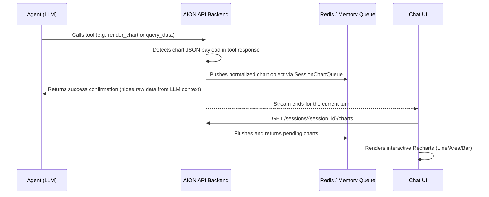

# Session Charts (`/sessions/{session_id}/charts`)

Interactive BI (Business Intelligence) charts in the **chat-ui** are powered by a session-specific chart queue. When an agent executes a tool that generates graphical/tabular data, that data is pushed to the queue. After a chat turn completes, the frontend consumes this queue with a single API call to render the charts for the user.

---

## Overview of the Flow



---

## Interception and Queuing Mechanisms

Charts can enter the session queue in two different ways:

### 1. Automatic MCP Tool Interception
Any MCP tool that returns a JSON string can automatically trigger chart generation. During tool execution inside [`src/main.py`](../../src/main.py) (specifically in the `_aion_mcp_tool_run` wrapper), the backend attempts to parse the tool's return string as a JSON object:
- If the parsed JSON is a dictionary containing both **`"query"`** and **`"data"`** keys, the backend intercepts it.
- The payload is normalized and pushed directly into the `SessionChartQueue`.
- The raw JSON output (which could be very large) is **replaced** in the tool response returned to the LLM with a brief notification:
  ```
  [Grafico generato con successo per la query: <query_text>]
  ```
  This prevents bloating the LLM's context window with large tables or raw JSON datasets.

### 2. Direct Backend/Python Queuing
Custom Python tools can import and interact with the queue directly:
```python
from src.chart_queue import chart_queue

# Pushes a serialized dictionary to the session queue
chart_queue.push_serialized(session_id, chart_data)
```

---

## REST API Endpoints

### Get and Consume Session Charts
`GET /sessions/{session_id}/charts`

Retrieves all charts accumulated during the current chat turn.

- **Authentication**: Chat Bearer JWT or BFF Shared Secret (`X-AION-Chat-Ui-Secret`).
- **Behavior**: This is a **destructive read** (flush operation). Consuming the charts clears the queue for this session on the backend.
- **Response Example (200 OK)**:
  ```json
  {
    "charts": [
      {
        "query": "rate(http_requests_total[5m])",
        "chart_kind": "area",
        "stacked": false,
        "x_key": "index",
        "data": [
          {"index": "2025-01-01T10:00:00", "job/api": 12.4, "job/web": 3.1},
          {"index": "2025-01-01T10:05:00", "job/api": 14.2, "job/web": 2.9}
        ]
      }
    ]
  }
  ```

---

## JSON Payload Schema

Chart dictionaries are validated and normalized by [`src/chart_payload.py`](../../src/chart_payload.py) before being queued.

### Minimum Required Payload

| Field | Type | Required | Description |
| :--- | :--- | :---: | :--- |
| `query` | string | **Yes** | Title or PromQL query shown in the header of the chart in the UI. |
| `data` | array of objects | **Yes** | Dataset to plot. Each object represents a data row. Columns are plotted as series. |

### Visual Layout Extensions

| Field | Type | Default | Description |
| :--- | :--- | :--- | :--- |
| `chart_kind` | string | `"line"` | Visualization style: `"line"`, `"area"`, or `"bar"`. Invalid values fallback to `"line"`. |
| `x_key` | string | `"index"` | The column name representing the X-axis values (usually a timestamp or sequential index). |
| `series_keys` | string[] | *All other columns* | A list of specific column names to render. Missing keys are automatically omitted. |
| `stacked` | boolean | `false` | If `true`, stacks area segments or bar groups (relevant for `area` and `bar` kinds). |
| `y_label` | string | — | Label for the Y-axis (truncated to a maximum of 120 characters by the backend). |
| `legend_off` | boolean | `false` | If `true`, hides the chart legend in the user interface. |

### Legacy Fields

| Field | Type | Description |
| :--- | :--- | :--- |
| `range_seconds` | integer | Query range duration window (legacy Prometheus queries). |
| `step_seconds` | integer | Query range step duration (legacy Prometheus queries). |

---

## Backend Queue Architecture

The backend queue is defined in [`src/chart_queue.py`](../../src/chart_queue.py) under the `SessionChartQueue` class. It manages chart storage depending on the infrastructure configuration:

1. **Redis Queue**: If `AION_REDIS_URL` is set, charts are stored in a Redis list.
   - **Key Template**: `{AION_REDIS_NAMESPACE}:charts:{session_id}` (where namespace defaults to `"aion"`).
   - **TTL**: Expiration is controlled by `AION_CHART_QUEUE_TTL_SEC` (default: `3600` seconds / 1 hour).
2. **In-Memory Fallback**: If Redis is not available or falls back to local storage, charts are stored in a thread-safe class-level dictionary (`_queues: Dict[str, List[Dict[str, Any]]]`) protected by a `threading.Lock`.

---

## Environment Variables

| Variable | Default | Description |
| :--- | :---: | :--- |
| `AION_CHART_KIND_ENABLED` | `1` | Set to `0` to disable layout customizations. When disabled, all charts are forced to `line` and extra formatting options (`x_key`, `series_keys`, etc.) are stripped. |
| `AION_CHART_QUEUE_TTL_SEC` | `3600` | TTL in seconds for Redis chart lists. |
| `AION_REDIS_NAMESPACE` | `aion` | Redis key namespace prefix. |

---

## Frontend Integration (`chat-ui`)

The frontend component [`SessionCharts.tsx`](../../chat-ui/components/chat/SessionCharts.tsx) parses the charts returned by the API and maps them to **Recharts** configurations.

### Key Features:
- **Theme Colors**: Colors are assigned sequentially using CSS variable tokens from the AION design system (`--chart-1`, `--chart-2`, `--chart-3`, `--chart-4`, `--chart-5`).
- **Dynamic Series Detection**: If no `series_keys` are specified, the frontend detects columns dynamically by extracting all keys from the first row of data (excluding the X-axis key).
- **Responsive Layout**: Wraps charts in a `<ResponsiveContainer>` with standard tooltips and legends.
- **Empty State Fallback**: Displays a clean "Nessun dato" (No data) placeholder if the data array is empty.
