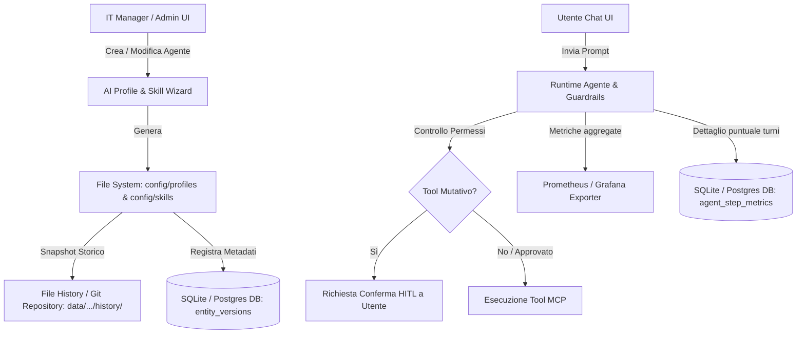

# Governance e Deploy dei Singoli Agenti per IT Manager

Questo documento riassume le funzionalità e la struttura tecnica pensate per consentire agli **IT Manager aziendali** di creare, configurare, monitorare e valutare singoli Agenti (con i relativi profili, skill e server MCP) in autonomia ed in sicurezza, in un ambiente basato su **Modelli LLM Locali**.

---

## 🎯 Obiettivi Principali

1. **Autonomia dell'IT Manager**: Permettere la creazione e personalizzazione guidata di Profili ed il binding di Skill ed MCP senza toccare manualmente la sintassi YAML/JSON di basso livello.
2. **Controllo & Sicurezza (Human-In-The-Loop)**: Evitare azioni indesiderate da parte degli agenti sui sistemi aziendali attraverso un sistema di approvazione preventiva delle chiamate ai tool mutativi.
3. **Qualità & Misurabilità (Local LLM Performance)**: Tracciare latenze, throughput di generazione (token/sec), saturazione del contesto e tassi di errore degli MCP.
4. **Resilienza (Document-Based Versioning)**: Mantenere uno storico completo dei profili e delle skill per consentire il rollback in 1-Click senza appesantire il database.

---

## 📋 Elenco delle Funzionalità (Scope Riscritta)

### 1. 📊 Statistiche & Metriche per Singolo Profilo e MCP
Focalizzate sulle prestazioni dei modelli locali (senza tracciamento costi API o rate-limit cloud):
* **Latenza di Risposta:** Time-To-First-Token (TTFT) e tempo totale di generazione.
* **Throughput del Modello:** Velocità di generazione in **Token/Secondo**.
* **Affidabilità & Latenza MCP:** Tempo di esecuzione e tasso di errore dei singoli server MCP invocati dall'agente.
* **Saturazione Context Window:** Monitoraggio della percentuale di utilizzo della finestra di contesto del modello locale durante ogni turno di conversazione.

### 2. 🪄 Costruzione Assistita da AI (AI Profile & Skill Wizard)
* **Prompt-to-Agent:** L'IT Manager descrive l'obiettivo in linguaggio naturale (es. *"Agente per la gestione ticket su Jira e query SQL sul DB clienti"*).
* **Generazione Automatica:** L'IA sintetizza:
  * System Prompt e istruzioni comportamentali.
  * Struttura delle **Skill** necessarie.
  * **Auto-Assignment MCP:** Selezione ed aggancio automatico dei server MCP pertinenti presenti nel catalogo AION.

### 3. 🛡️ Sistema di Guardrails dell'Agente
* **Input Guardrails (Pre-LLM):**
  * *Prompt Injection / Jailbreak Defense:* Rilevamento e blocco di tentativi di override delle istruzioni.
  * *PII Masking & Anonymization:* Mascheramento automatico di dati sensibili, credenziali e informazioni personali prima che arrivino al modello.
* **Execution Guardrails (In-Tool):**
  * Limiti sui parametri inviati ai tool MCP (es. massimo numero di righe ritornabili, sanitizzazione query, timeout stringenti).

### 4. ✋ Human-In-The-Loop (HITL) & Approvazioni dei Tool
* **Classificazione dei Tool MCP:**
  * 🟢 **Auto-Approve (Read-Only):** Query di lettura (SELECT), ricerca su documentazione, web search.
  * 🟡 **Requires Confirmation (Write/Mutations):** Modifiche a file, UPDATE/INSERT su DB, invio di messaggi/email.
* **Flusso di Conferma in Chat:**
  * L'agente sospende l'esecuzione del tool e invia una richiesta all'utente.
  * Se l'utente **approva**, l'azione viene eseguita.
  * Se l'utente **rifiuta** (con eventuale motivazione), l'agente riceve il feedback e cerca una strada alternativa per completare il compito.

### 5. 🧪 Agent Evaluation Suite (Test Bench Pre-Deploy)
* **Dataset di Test ("Golden Cases"):** Suite di prompt di prova specifici per il profilo creato.
* **Valutazione Automatica (LLM-as-a-Judge):** Esecuzione automatizzata in ambiente sandbox per verificare:
  * Correttezza della risposta.
  * Selezione dei tool MCP adeguati.
  * Rispetto delle istruzioni e dei guardrail prima del rilascio in produzione.

### 6. 🔄 Versioning & Rollback di Profili e Skill (Document-Based)
* **Storico Versioni:** Registrazione di ogni salvataggio/modifica apportata da un amministratore ad un profilo YAML o ad una skill Markdown.
* **Rollback in 1-Click:** Ripristino immediato a qualsiasi versione precedente con hot-reload al volo del runtime, senza necessità di riavviare i servizi AION.

---

## 🛠️ Architettura Tecnica delle Soluzioni

### 1. Gestione Metrische: Approccio Ibrido
* **Prometheus:** Utilizzato per le metriche aggregate temporali a livello di sistema (throughput token/sec, latenza P95, contatore errori MCP per exporter Grafana/Admin UI).
* **Tabella DB `agent_step_metrics`:** Utilizzata per la consultazione puntuale da Admin UI delle esecuzioni per singola sessione/profilo:
  `session_id`, `profile_slug`, `timestamp`, `tokens_prompt`, `tokens_completion`, `generation_ms`, `mcp_tool_used`, `mcp_status`, `error_details`.

### 2. Versioning Document-Based (Senza Sovraccarico DB)
* **Storage su File System:** I file YAML dei profili e i file Markdown delle skill rimangono la fonte di verità, con snapshot storici salvati sotto `data/profiles/history/` e `data/skills/history/`.
* **Tabella Metadati Ultraleggera `entity_versions`:** Memorizza unicamente l'indice dei cambi: `(entity_type, slug, version, created_at, created_by, change_summary, file_path)`.
* **Meccanismo di Rollback:** La ripristinazione della versione legge lo snapshot corrispondente e sovrascrive il file in `config/profiles/` o `config/skills/`, notificando l'invalidazione della cache a `ProfileManager` e `SkillRegistry`.
