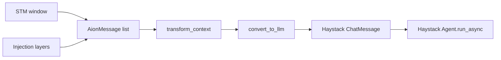

# Harness v2 (Pi-inspired patterns)

AION keeps Haystack as the agent runtime. Harness v2 ports **context-shaping patterns** from [Pi](https://github.com/earendil-works/pi) without replacing the Python stack.

All flags default to **off** for safe rollout. Enable incrementally and run the focused pytest modules under `src/test/test_aion_*` and `src/test/test_*_policy.py`.

## Feature flags

| Flag | Module | Effect |
|------|--------|--------|
| `AION_HARNESS_V2_MESSAGES` | `src/runtime/messages/` | Two-layer transcript → `convert_to_llm()` |
| `AION_HARNESS_V2_INJECTIONS` | `src/runtime/context_builder.py` | LTM/nudge/hooks as XML injection layers, not fake user text |
| `AION_HARNESS_V2_COMPACTION` | `src/runtime/compaction/` | Valid cut points (never split tool pairs) |
| `AION_HARNESS_V2_PROVIDER` | `src/runtime/provider_adapter.py` | Unified stream chunk + generation kwargs merge |
| `AION_HARNESS_V2_TOOLS` | `src/runtime/tool_protocol.py` | Skip tool execution after `finish_reason=length` |
| `AION_HARNESS_V2_TURN` | `src/runtime/turn/model.py` | Explicit input message count instead of object-identity slicing |

## Fase 0 quick wins (always on unless overridden)

| Variable | Default | Notes |
|----------|---------|-------|
| `AION_CONTEXT_COMPRESS_MID_TURN_REASONING` | `0` | No sync compaction on every reasoning chunk |
| `AION_CONTEXT_COMPRESS_MID_TURN_SYNC` | `0` | Mid-turn LLM summarization off on agent thread |
| `AION_CONTEXT_COMPRESS_MID_TURN_RATIO` | `0.92` | Higher bar before mid-turn compact |
| `AION_STREAM_LOOP_LEGACY` | `0` | StreamLoop v2 is default |

Compaction summaries use Pi-style `
` blocks via `format_compaction_block()` in `context_compressor.py`.

## Architecture sketch

## Out of scope

Fase 7 (native Python agent loop / Haystack removal) is **not** part of this harness. See the main agent pipeline docs for the current Haystack integration.
