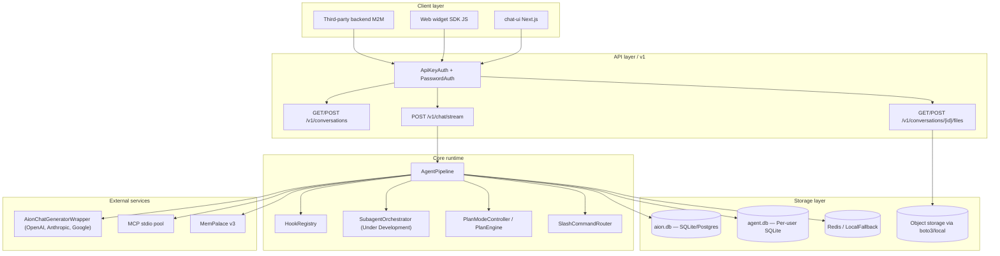

# Architectural overview

AION Agent exposes an HTTP API (FastAPI) that for each user message executes the following end-to-end flow:

1. **Profile and System Prompt Resolution**: Resolves the **agent profile** loading the corresponding YAML file. Standard profiles reside in `config/profiles/*.yaml` (synchronized at startup starting from `config_std/profiles/`), while custom overwritable profiles can optionally reside in `AION_PROFILES_WRITE_DIR`. Constructs the **system prompt** including the instructions of the profile, the MCP servers and references to the enabled skills (in `full` or `index` mode depending on `AION_SKILL_SYSTEM_PROMPT_MODE`). If `AION_SOUL_MEMORY_USER_SPLIT=1` is enabled, it also dynamically integrates the soul (*soul*), the operational memory (*memory*) and the preferences of the user (*user*).
2. **MCP Server Initialization**: Starts or reuses the **MCP servers** based on the stdio protocol configured for the profile. If `AION_MCP_POOL=1` is active (enabled by default), the connections remain persistent and are kept in a dedicated pool per chat session to avoid the overhead of starting new subprocesses at each turn.
3. **Language Model Execution (LLM)**: Runs the Haystack agent engine delegating calls to a unified wrapper, **`AionChatGeneratorWrapper`** (`src/runtime/llm_adapter.py`). This wrapper dynamically selects the correct generator (**`OpenAIChatGenerator`** for OpenAI/vLLM compatible providers, **`AnthropicChatGenerator`** for Anthropic Claude with prompt caching enabled, or **`GoogleGenAIChatGenerator`** for Gemini models) based on `AION_LLM_ADAPTER` and the configured model, managing the normalization of the generation parameters.
4. **Persistence and Memory Management**:
   - Persists conversations, messages and attachments in the **unified database** of runtime (configured via `AION_DB_URL`, by default local SQLite in `data/aion.db` or PostgreSQL).
   - Manages isolated per-user operating databases saved under `data/agent_dbs/<tenant>/<user>.db`.
   - If enabled, extracts long-term memory (**LTM**) using the integration with **MemPalace v3**.
   - Applies short-term memory (**STM**) context compression if the context window exceeds the established token threshold (`AION_CONTEXT_COMPRESS_ENABLED=1`), with optional database persistence (`AION_CONTEXT_COMPRESS_PERSIST=1`). See **[Context Compaction](../memory/context-compaction.md)** for the full two-level architecture (pre-turn and mid-turn).

> [!WARNING]
> The delegation and execution module of **Sub-agents** (`SubagentOrchestrator` / `delegate_task` / `delegate_to_subagent`) is currently **under active development and not working** in this version of the codebase. It must not be configured or used in production environments.



## Key modules

| Area | Typical path | Role |
|------|-------------|--------|
| **Entry API & Routing** | `src/api/main.py`, `src/api/v1/` | CORS configuration, routing of HTTP v1 calls, `/health` endpoints, and token validation via `ApiKeyAuth` or `PasswordAuth`. |
| **Data Layer** | `src/data/` | SQLAlchemy models (`models.py`), database engine configuration (`engine.py`), migration management (Alembic) and message history bridge (`history_bridge.py`). |
| **Storage** | `src/storage/` | Abstract storage backends for files and attachments. Supports local (`local_backend.py`) or remote storage compatible with AWS S3 via `boto3` (`s3_backend.py`). |
| **Agent Factory** | `src/main.py` | Exports the `get_agent()` function, responsible for assembling the agent, retrieving the profile, and dynamically registering MCP tools. |
| **Pipeline** | `src/agent_pipeline.py` | Manages `AgentPipeline`, which orchestrates asynchronous execution (`run_stream`), tool call management, event tracking, and turn budget control. |
| **Runtime & Logic** | `src/runtime/` | Redis client and in-process fallback (`redis_client.py`), system hooks management (`hooks.py`), slash commands routing (`slash.py`), planning engines (`plan_engine.py`, `plan_mode.py`), and profile synchronization. |
| **Memory & LTM** | `src/memory/` | STM context compression (`context_compressor.py`), LTM extraction and integration with MemPalace v3 (`ltm_orchestrator.py`), and project memory scoping. |
| **Security** | `src/security/` | PII/personal data redaction (`pii_redactor.py`), smart approvals for destructive or shell tools (`approval_manager.py`), and session sandbox isolation (`session_runner.py`, `container_runtime.py`). |

## Typical startup

IJS packages must be executed using **pnpm** (never npm/yarn). Below are the commands to start the services in a local environment:

- **Backend API (port 8001)**:
  ```bash
  uvicorn src.api.main:app --reload --reload-exclude data/sessions
  # OR: python -m src.api.main
  ```
- **Chat UI (port 8003)**:
  ```bash
  cd chat-ui && pnpm dev
  ```
- **Admin UI (port 3870)**:
  *Note: for Next.js 16 in admin-ui the `--webpack` flag is required.*
  ```bash
  cd admin-ui && pnpm dev
  ```
- **Documentation (website)**:
  ```bash
  cd website && pnpm start
  ```

## Notes on concurrency and persistence

- **Redis & LocalFallback**:
  Redis (`AION_REDIS_URL`) is used to coordinate cross-process and asynchronous operations:
  - **Active Stream Tracking**: Registers active chat turns (`redis_set_stream_active`) allowing the reconnection of clients after temporary disconnections or page reloads.
  - **Distributed Locks**: Best-effort session locks (`session_lock`) to prevent race conditions.
  - **Rate Limiting**: Request rate limiter based on a fixed time window (`rate_limiter_check`).
  - **Cancel & Compaction signals**: Allows the asynchronous sending of stream cancellation commands (`cancel`) and forces context compaction (`force_compact`).
  - **Local Fallback**: If Redis is not configured or is not reachable, the system automatically and transparently degrades to an in-memory implementation (`_LocalFallback` in `src/runtime/redis_client.py`), suitable for single-process development.
- **Hybrid storage**:
  Files uploaded or generated during the agent session reside locally within the `data/sessions/<session_id>/` directory (excluded from git tracking). Uploads are stored both in the local filesystem and, optionally, saved via the remote S3-compatible `StorageBackend`.
- **Database Persistence**:
  - **Unified Runtime Database (`data/aion.db`)**: Shared between the Chat UI, the Admin Panel and the backend API. Uses asynchronous SQLAlchemy with Alembic for migrations.
  - **Isolated User Databases**: Each user has their own SQLite file for personal agent data under `data/agent_dbs/<tenant>/<user>.db`.

## Further readings

- [Source tree](source-tree.md) — map of the `src/`, `mcp_servers/`, `config/` folders.
- [Agent pipeline](../api-and-runtime/agent-pipeline.md) — operational sequence in `AgentPipeline`.
- [REST API](../api-and-runtime/rest-api.md) — HTTP v1 contract.
- [SDK and Widget](../clients/sdk-and-widget.md) — how to integrate AION in external apps.
- [Observability](observability.md) — tracking (OpenTelemetry), metrics (Prometheus) and structured logging.
- [Testing and Optimization](testing-and-optimization.md) — guide to the use of the Profiler, Optuna and the Evaluation Harness.
