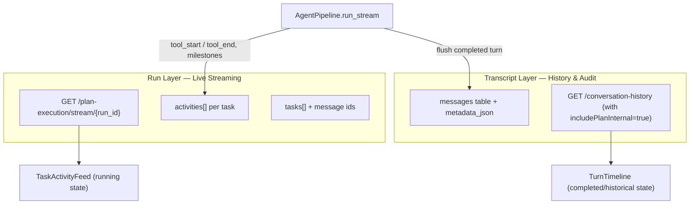

# Plan execution — run model and activity feed

This document outlines the architecture for background execution of approved plans, progress persistence across page refreshes, and the real-time UI streaming model.

---

## 1. Core Architecture: Separated Layers

To ensure that background tasks run reliably and that the user interface can remain synchronized even after page reloads, the architecture splits plan execution data into two distinct layers:

| Layer | Single Source of Truth (SSOT) | Contents | UI View |
| :--- | :--- | :--- | :--- |
| **Run** | Local JSON files: `data/plan_execution/{run_id}.json` | `status`, `tasks[]`, `activities[]`, `current_task_id` | Plan sidebar panel, compact chat banners, and the live task activity feed |
| **Transcript** | Database `messages` table (with `metadata_json` containing `plan_id` and `plan_task_id`) | Complete conversational turns, including reasoning and detailed tool outputs | Task-specific chat view (post-run) or "View Details" audit page |



---

## 2. Live Transport: Real-Time Event Stream

During plan execution, AION does not stream conversational tokens to the main chat window. Instead, it runs as an asynchronous background task. Progress updates and tool activities are streamed to the client using a dedicated Server-Sent Events (SSE) endpoint:

* **Endpoint**: `GET /plan-execution/stream/{run_id}`
* **Mechanism**: The backend handler (`PlanExecutionHandler`) registers an `asyncio.Event` per running execution. Whenever a tool starts or finishes, or a task completes, the handler appends the event to `activities` and triggers `_notify_stream(run_id)`. The API router yields the latest execution state immediately upon notification, falling back to a `0.5s` polling timeout to keep the connection alive.

---

## 3. Run Event Model (Activities)

Tool activities are logged as structured progress entries in the execution's `activities` array. When `AgentPipeline.run_stream` processes tool events (`tool_start`, `tool_end`, `tool_error`), it passes them to the handler callback which converts them into human-readable operations:

### Event Schema
```json
{
  "phase": "tool",
  "plan_id": "ep-12345",
  "task_id": "task_02",
  "tool_name": "sandbox_write_workspace_file",
  "status": "running",
  "detail": "LICENSE",
  "ts": 1718040000.12,
  "label": "Writing file to workspace: LICENSE"
}
```

### Label Mapping Heuristic
The handler uses an English mapping heuristic (`_tool_activity_label`) to generate descriptive, human-readable labels from technical tool names and parameters:
* `sandbox_write_workspace_file` → *Writing file to workspace: `[file_path]`*
* `sandbox_read_workspace_file` → *Reading file dal workspace: `[file_path]`*
* `sandbox_edit_workspace_file` → *Editing file nel workspace: `[file_path]`*
* `mark_task_completed` → *Segno task completed: `[task_id]`*
* `mempalace_*` → *Querying MemPalace: `[query]`*
* `grep / search / ripgrep` → *Searching codebase: `[pattern]`*

---

## 4. UI Task View: Dual Modes

The component `TaskChatView` replaces the main chat area when a specific task is clicked in either the Plan sidebar panel or a chat status banner. It adapts its layout based on the task's current state:

### 1. Running State
* **Vista Primaria**: Shows the **`TaskActivityFeed`** which lists the real-time tool execution log (e.g., *"Searching codebase..."*, *"Writing file..."*) streamed from the SSE connection.
* **Conversational Output**: Hidden during execution to focus on the active tool flow.
* **Control Actions**: A footer banner allows the user to cancel the execution (`cancelPlanExecution` API).

### 2. Completed / Error State
* **Vista Primaria**: Renders the complete, audit-ready transcript (**`TurnTimeline`**) retrieved from the conversation history API. This uses the exact same messaging components as the main chat feed (including rich text, code blocks, artifacts, and tool outputs).
* **Activity Log**: Collapses or falls back to a static, secondary activity view.
* **Navigation**: When a task completes successfully (`status: done`), a card at the bottom of the feed prompts the user to open the next pending task.

---

## 5. Multi-Retry Turns (Fault Tolerance)

If a task fails during execution, the backend performs up to 2 retry attempts. Rather than overwriting the message associations, the handler appends each attempt to a `turns` array in the run JSON record:

```json
{
  "task_id": "task_01",
  "title": "Define requirements",
  "status": "done",
  "turns": [
    {
      "user_message_id": "msg-usr-retry1",
      "assistant_message_id": "msg-ast-retry1"
    },
    {
      "user_message_id": "msg-usr-retry2",
      "assistant_message_id": "msg-ast-retry2"
    }
  ]
}
```
The frontend component `TaskChatView` maps over `turns` to render each attempt in sequence, separated by visual headings (e.g., *Retry #2*).

---

## 6. Page Refresh and Rehydration Flow

To ensure plan execution state survives browser refreshes or conversation switches, the frontend uses a dedicated hook, **`usePlanExecutionRehydrate`**, triggered when the workspace becomes ready:

```
1. fetchActivePlanExecutions(userId, token, conversationId)
   └─ Retrieves any active runs from the server memory/disk.
2. fetchPlanExecutionRuns(userId, token, conversationId, limit=20)
   └─ Retrieves recent runs in the session.
3. loadWatchedPlanExecutions(conversationId)
   └─ Retrieves watched run IDs stored in localStorage.
4. pickBestRun()
   └─ Merges and ranks candidates: Running (priority 3) > Done (priority 2) > Terminated/Interrupted (priority 1).
5. adoptPlanExecution(best.runId, best.planId)
   └─ Restores UI state, activates the Plan panel tab, and mounts the active run.
6. fetchOrchestrationPlan(planId)
   └─ Fetches plan markdown from the database to restore the Plan sidebar tasks list.
```

---

## 7. Storage and Database Layout

1. **Approved Plans (`execution_plans` table)**:
   Persisted in the database. The markdown content of approved plans is the source of truth for the list of tasks shown in the Plan sidebar.
2. **Execution Runs (`data/plan_execution/{run_id}.json`)**:
   Runs are saved as JSON files in the filesystem. Scan operations (`list_runs_for_owner`) read this directory dynamically. If the server is restarted during a run, the handler marks the orphaned run status as `interrupted` upon loading the JSON file.
3. **Messages and Associations (`messages` table)**:
   All conversational history is stored in the database. Message records generated during plan executions include a `metadata_json` field linking them to their parent `plan_id` and `plan_task_id`, allowing the history API (`includePlanInternal: true`) to fetch and reconstruct the exact chat transcript for any completed task.
