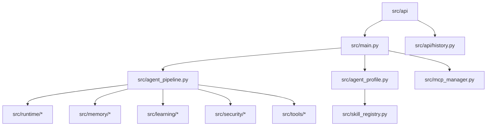

# Source Tree - Architectural Principles

## Separation principles

This section explains **why** the code is organized into these folders, describing the key principles of modularity and separation of concerns of the system.

### Standard vs Local Structure (`_std` sync)

To ensure maximum configuration flexibility and process isolation without polluting the Git repository, AION Agent uses a pattern of splitting sensitive folders for local environment and runtime:

- **`config_std/`** and **`mcp_servers_std/`**: They are the official reference folders, tracked by Git. They contain default templates for configurations, agent profiles, skills, and built-in MCP servers.
- **`config/`** and **`mcp_servers/`**: They are the active directories at runtime, completely ignored by Git (`.gitignore`). They are synchronized starting from their respective standard templates using the scripts:
  - [sync_config.py](scripts/sync_config.py): Populates `config/` keeping local overrides intact (e.g., `mcp_registry.local.yaml`).
  - [sync_mcp_servers.py](scripts/sync_mcp_servers.py): Synchronizes MCP server source files locally.
  - Automatic synchronization occurs at startup in production (if `AION_SYNC_ON_BOOT=1` in containers) or via setup and upgrade scripts ([setup-aion-env.sh](scripts/setup-aion-env.sh), [upgrade-aion.sh](scripts/upgrade-aion.sh)).

---

## Complete directory layout

### `src/` — Core Python Runtime

The directory [src/](src/) houses the agent's Python runtime, divided into well-defined areas of responsibility:

#### `src/api/` — HTTP Boundary (FastAPI)

The APIs represent the "boundary" that separates the agent's business logic from external clients. For this reason, routes must not contain complex logic, but delegate to runtime modules.

| Path | Role | Rationale |
|----------|-----------|-----------|
| [main.py](src/api/main.py) | HTTP entrypoint and initialization | Configures the lifespan of the FastAPI server, starts the unified databases, and defines basic public endpoints (`/health`, `/profiles`). |
| [chat_ui.py](src/api/chat_ui.py) | SSE endpoint for Chat Client | Manages Server-Sent Events (SSE) connections and the reception of asynchronous/streaming messages from the chat. |
| [orchestration.py](src/api/orchestration.py) | Internal orchestration APIs | Manages approval, rejection, and modification of execution plans for tasks. |
| [plan_execution.py](src/api/plan_execution.py) | Task and execution status | Monitoring the status of current executions for active plans. |
| [cron_admin.py](src/api/cron_admin.py) & [cron_user.py](src/api/cron_user.py) | Cron Job scheduling APIs | Endpoints to create, monitor, and delete periodic/scheduled tasks of the agent. |
| [research.py](src/api/research.py) | Deep Research APIs | Support for external queries for running deep research cycles. |
| [history.py](src/api/history.py) | STM & FTS data layer | Provides services to retrieve chat history and full-text searches on old messages. |
| [session_uploads.py](src/api/session_uploads.py) | File upload management | Dedicated endpoint for uploading attachments (PDFs, images) to be stored in the session. |
| [admin.py](src/api/admin.py) | Administrative CRUD dashboard | Endpoints for centralized management of profiles, users, sessions, and installed skills. |
| [admin_agent_db.py](src/api/admin_agent_db.py) | Personal Agents Database CRUD | Administration and export of the isolated SQLite databases of each user. |
| [admin_profile_memory.py](src/api/admin_profile_memory.py) | SOUL/MEMORY/USER CRUD | Management of persistent profile files for agents (legacy endpoints). |
| [admin_query_memory.py](src/api/admin_query_memory.py) & [ltm_admin.py](src/api/ltm_admin.py) | Long-term memory search and debug | Allows administrators to inspect information extracted in LTM and semantic metadata. |
| **`src/api/v1/`** | REST v1 routers and controllers | Collection of endpoints for version 1 of the APIs, including: `chat.py` (streaming), `conversations.py` (sessions), `files.py` (file management), `mcp_integrations.py` (credentials and per-user integrations), `navigation_memory.py`, `query_memory.py` and `steps.py` (intermediate steps of tools). |

#### `src/runtime/` — The agent engine (Agent Engine)

The package [src/runtime/](src/runtime/) contains the internal logic of the agent's execution cycle. It resolves alignment with language models, coordinates execution plans, and implements background daemons.

- **Adapters and Routing**: 
  - [llm_adapter.py](src/runtime/llm_adapter.py): Adapts streaming and non-streaming requests for various providers (OpenAI, Anthropic, Gemini, vLLM).
  - [llm_router.py](src/runtime/llm_router.py) and [llm_health.py](src/runtime/llm_health.py): Control the status of configured providers and apply automatic fallback policies.
- **Execution Plan & Activity Feed Engine**:
  - [plan_engine.py](src/runtime/plan_engine.py), [plan_execution.py](src/runtime/plan_execution.py) and [plan_mode.py](src/runtime/plan_mode.py): Execute and track task execution plans. They integrate the human-in-the-loop (HITL) approval workflow.
  - [plan_coercion.py](src/runtime/plan_coercion.py) and [plan_display.py](src/runtime/plan_display.py): Translate structured plans into viewable Markdown in the chat sidebar.
  - [plan_wait_registry.py](src/runtime/plan_wait_registry.py): Manages the blocking state waiting for user interaction for task approval.
- **Background Cron Daemon**:
  - [cron_runner.py](src/runtime/cron_runner.py), [cron_scheduler.py](src/runtime/cron_scheduler.py) and [cron_db.py](src/runtime/cron_db.py): The dynamic in-process scheduler for the periodic startup of user prompts or scripts.
- **Workspace & Sandbox Controls**:
  - [agent_fs_policy.py](src/runtime/agent_fs_policy.py): Applies and validates the declared filesystem rules depending on the agent.
  - [mcp_installer.py](src/runtime/mcp_installer.py) and [mcp_health.py](src/runtime/mcp_health.py): Control the installation and health of external MCP connectors.
- **Turn, Prompts & Context Budgets**:
  - [turn_compaction.py](src/runtime/turn_compaction.py) and [turn_budget.py](src/runtime/turn_budget.py): Dynamically reduce the context of intermediate messages and reasonings within a single turn if the model's capacity is exceeded.
- **Tool-first agent loop (OpenCode-style)**:
  - [stream/loop.py](src/runtime/stream/loop.py): StreamLoop v2 — Haystack SSE demux, settlement, file-preview bridge (`AION_STREAM_LOOP_V2`).
  - [tool_settlement.py](src/runtime/tool_settlement.py), [settlement_tool_registry.py](src/runtime/settlement_tool_registry.py): Phantom-tool blocking and arg validation before MCP.
  - [file_tool_preview.py](src/runtime/file_tool_preview.py): Early `artifact_*` events from filesystem tool args.
  - [doom_loop.py](src/runtime/doom_loop.py), [json_recovery.py](src/runtime/json_recovery.py), [mcp_tool_args.py](src/runtime/mcp_tool_args.py): Loop guards and tool JSON repair.
  - [model_tool_policy.py](src/runtime/model_tool_policy.py), [apply_patch/](src/runtime/apply_patch/): Per-model tool exposure and patch format.
  - [system_prompt.py](src/runtime/system_prompt.py): Model prompt fragments from `config_std/prompts/`.
  - [llm_probe.py](src/runtime/llm_probe.py), [llm_call_audit.py](src/runtime/llm_call_audit.py), [litellm_errors.py](src/runtime/litellm_errors.py): Admin probe, per-step LLM audit, safe error mapping.
- [llm_providers.py](src/api/llm_providers.py): Admin CRUD + `POST /admin/llm-providers/probe`.
- **Sub-agents Delegation**:
  - [delegate_subagent.py](src/runtime/delegate_subagent.py), [subagent_orchestrator.py](src/runtime/subagent_orchestrator.py) and [subagent_tools.py](src/runtime/subagent_tools.py): Protocol to spawn isolated hierarchical sub-agents with a dedicated file workspace.
- **Database & Query Memory Integration**:
  - [sql_query_memory_tools.py](src/runtime/sql_query_memory_tools.py), [query_memory_hooks.py](src/runtime/query_memory_hooks.py) and [db_navigation_mempalace_hooks.py](src/runtime/db_navigation_mempalace_hooks.py): Automatically register and optimize SQL queries that returned correct data in order to reuse them semantically.
- **Slash Commands**:
  - [slash.py](src/runtime/slash.py): Dispatches commands typed by the user (e.g., `/goal`, `/schedule`).

#### `src/memory/` — Data Persistence Patterns

The memory runtime coordinates data persistence, both semantic (LTM) and short-term (STM).

| File | Pattern | Description |
|------|---------|-------------|
| [ltm_orchestrator.py](src/memory/ltm_orchestrator.py) | Long-term memory orchestrator | Asynchronously extracts relevant conversation fragments and indexes them semantically on a vector store. |
| [stm_consolidator.py](src/memory/stm_consolidator.py) | Short-term memory consolidation | Cleans up and compacts recent conversation turns. |
| [context_compressor.py](src/memory/context_compressor.py) | Context compression | Manages the compression of overall tokens to be sent to the LLM. |
| [llm_extract.py](src/memory/llm_extract.py) | Entity structuring via LLM | Performs targeted HTTP calls to the LLM to extract semantic keys in JSON format. |
| [navigation_memory_service.py](src/memory/navigation_memory_service.py) | Database navigation tracking | Stores information related to tables, joins, and entities explored by the agent. |
| [project_memory_scope.py](src/memory/project_memory_scope.py) | Memory scope isolation | Isolates semantic memory data per tenant/project. |
| [mempalace_manager.py](src/memory/mempalace_manager.py) | MemPalace MCP Bridge | Manages the integration of LTM with the MemPalace archive. |

#### `src/learning/` — Evolutionary Features (Experimental)

This module collects the agent's learning capabilities starting from previous usage sessions.

- [skill_distiller.py](src/learning/skill_distiller.py): Dynamically generates reusable skill packages when observing chains of actions that successfully complete a task.
- [skill_view_metrics.py](src/learning/skill_view_metrics.py): Computes efficacy and usage frequency metrics to evaluate whether a skill is useful or redundant.
- [nudge.py](src/learning/nudge.py): Intervenes in the chat UI by suggesting the user try tools or skills in certain situations.
- [skill_patcher.py](src/learning/skill_patcher.py): Updates or corrects saved skills following environmental changes.
- [dedup.py](src/learning/dedup.py): Deletes duplicate skills by calculating the semantic similarity of embeddings.

#### `src/security/` — Security and Control-Plane

Ensures access control and system integrity during tool calls.

- [pii_redactor.py](src/security/pii_redactor.py): Recognizes and redacts strings containing sensitive data (PII) before they are sent to third-party LLMs.
- [checker.py](src/security/checker.py) and [approval_manager.py](src/security/approval_manager.py): Validate input/output and activate preventive human approval in case of high-risk tools (e.g., executing shell commands).
- [trust_manager.py](src/security/trust_manager.py), [session_runner.py](src/security/session_runner.py), and [container_runtime.py](src/security/container_runtime.py): Manage the accumulated trust level per session and regulate sandbox subprocess/container execution.

#### `src/tools/` — Integrated Native Wrappers

Contains the Python wrappers of the tools exposed to the agent.

- [code_tools.py](src/tools/code_tools.py): Utilities to read, inspect, and analyze code files.
- [session_fs_tools.py](src/tools/session_fs_tools.py), [session_code.py](src/tools/session_code.py) and [session_exec.py](src/tools/session_exec.py): Standard operations for file manipulation in the session workspace and command execution.
- [session_venv.py](src/tools/session_venv.py) and [session_npm.py](src/tools/session_npm.py): Creation and isolation of Python packages (via `uv pip`) and Node libraries (in local `node_modules/`).
- [skill_materialize.py](src/tools/skill_materialize.py): Physically materializes distilled skills on disk.
- [promo_capture.py](src/tools/promo_capture.py): Performs graphic capture (screenshots) of HTML reports and dashboards using integrated Chromium (Playwright).
- [prometheus_tools.py](src/tools/prometheus_tools.py) and [grafana_tools.py](src/tools/grafana_tools.py): PromQL queries and interaction with Grafana.

#### `src/a2a/` and `src/plan_execution/` — Inter-agent protocol and Execution

- **`src/a2a/`**: Implements the communication and delegation protocol between agents.
  - [protocol.py](src/a2a/protocol.py): Defines standard data models for interaction (`ExecutionPlan`, `ExecutionTask`, `TaskStatus`).
  - [plan_markdown.py](src/a2a/plan_markdown.py): Manages the translation of plans into readable Markdown tables.
- **`src/plan_execution/`**:
  - [handler.py](src/plan_execution/handler.py): Coordinates the orchestration of tasks and intermediate progress.

---

### `mcp_servers/` — MCP Process Pool

MCP (Model Context Protocol) servers are executed as stdio processes external to the main Python runtime for security, modularity, and language independence reasons.

#### Synchronization and startup

The AION runtime does not start the servers directly from `mcp_servers_std/` but executes the binaries and scripts inside the local `mcp_servers/` folder (populated via [sync_mcp_servers.py](scripts/sync_mcp_servers.py)).

#### The 14 Standard MCP Servers (`mcp_servers_std/`)

Below is the list of standard submodules ready for use:

1. **`agent_db/`**: Manages personal SQLite instances of users (table creation, conditional queries, exports).
2. **`aion_subagents/`**: Performs spawning and communication with per-session hierarchical sub-agents.
3. **`charts/`**: Calculates and returns structured data formats to display area, line, or bar charts in the chat UI.
4. **`code_executor/`**: Provides an isolated sandbox for script execution.
5. **`grafana/`**: Allows querying Grafana monitoring dashboards.
6. **`legacy_rag/`**: Bridge for backward compatibility with RAG components from previous versions.
7. **`memory/`**: Manages advanced semantic integration of the database via [mem0_server.py](mcp_servers_std/memory/mem0_server.py).
8. **`ocr_mcp/`**: Processes PDF files or images, extracting structured text blocks (GPU/CPU heavy).
9. **`orchestration/`**: Allows third-party agents or sub-agents to interface with the task scheduler.
10. **`prometheus/`**: Query interface for system monitoring metrics.
11. **`promo_render/`**: Generates graphic previews in PNG format starting from HTML or React templates (dashboards and promos).
12. **`query_memory/`**: Maintains the semantic index of successful queries and enables their inter-session retrieval.
13. **`session_sandbox/`**: Controls secure access and filesystem isolation for each chat.
14. **`skills_hub/`**: Manages the alignment of loaded skills in the agent's active profile.

---

### `config/` — Declarative Configuration

#### The two configuration levels (`config_std/` and `config/`)

- **`config_std/`**: Contains the default declarative configuration distributed with the code.
- **`config/`**: Created at runtime (gitignored). Houses active settings modified locally.

#### Main files in `config_std/`

- **`fs_policy.example.yaml`** and **`fs_policy.dev.yaml`**: Define the domains and commands executable by the agent within the workspace. Synchronized in `config/fs_policy.yaml`.
- **`mcp_registry.yaml`**: Declaration of startup parameters (path, environment variables, flags) of all MCP servers. It can be extended by an uncommitted `config/mcp_registry.local.yaml` file to add local definitions.
- **`native_tool_registry.yaml`**: Configuration listing the native Python tools that can be enabled.
- **`profiles/`**: YAML files containing the system prompt instructions, enabled skills, and tool groups for specific profiles (e.g., `data_agent.yaml`, `infra_sre.yaml`, `orchestrator.yaml`).
- **`skills/`**: Markdown files with YAML frontmatter (e.g., `core_protocol.md`, `db_navigation_map.md`) detailing specific procedures read at runtime by [skill_registry.py](src/skill_registry.py).

> [!NOTE]
> The `config/default.yaml` file mentioned in various log and configuration files is not committed to git. Runtime configuration loaders ([config.py](src/config.py) and [llm_router.py](src/runtime/llm_router.py)) read it only if present, otherwise they fail silently inheriting defaults from code or environment variables.

---

## Deployment and Environment

### Environment variables and `.env.example`

All system environment variables are centralized in a single template file **`.env.example`**. Unlike other architectures, **there is no separate `.env.docker.example` file**: configurations for containers (such as `DOMAIN`, `AION_SYNC_ON_BOOT`, ports exposed by Caddy, etc.) are appended directly inside `.env.example`.

When starting in Docker mode, the installation script copies `.env.example` directly to local `.env` before starting docker compose.

### `docker/` structure

The directory [docker/](docker/) collects deployment assets:
- **`Dockerfile.backend`**: Builds the Python 3.13 image with pre-installed system tools like Tesseract (OCR) and Poppler.
- **`Dockerfile.chat-ui`** and **`Dockerfile.admin-ui`**: Generate the standalone Next.js images.
- **`Dockerfile.website`**: Generates the static Nginx image to serve Docusaurus.
- **`Caddyfile`**: Reverse proxy with path-based balancing (`/admin`, `/api`) and automatic SSL certificate generation.
- **`nginx-website.conf`**: File caching configuration for the docs portal.

---

## Frontend Applications and Documentation

### `chat-ui/` — Primary Chat Client

Next.js 16 (React 19) application that manages the main conversation UI with the agent. Uses **pnpm** for package management.
- `app/`: Application routing (App Router).
- `components/`: Contains the React conversation components (messages, tool accordions, sidebar for execution plans).
- `lib/`: API services to call FastAPI.
- `styles/`: Vanilla CSS style sheets for rendering and responsiveness.

### `admin-ui/` — Administrative Dashboard

Next.js 16 dashboard for maintenance. Provides the graphical interface to inspect user sessions, configure profiles, and inspect security audit logs.
- Note: To start it in local development it requires the webpack flag: `next dev --webpack -p 3870`.

### `website/` — Documentation Portal

Docusaurus site hosted in the directory [website/](website/). Loads and statically renders the Markdown documentation present in the [docs/](docs/) directory of the repository.
