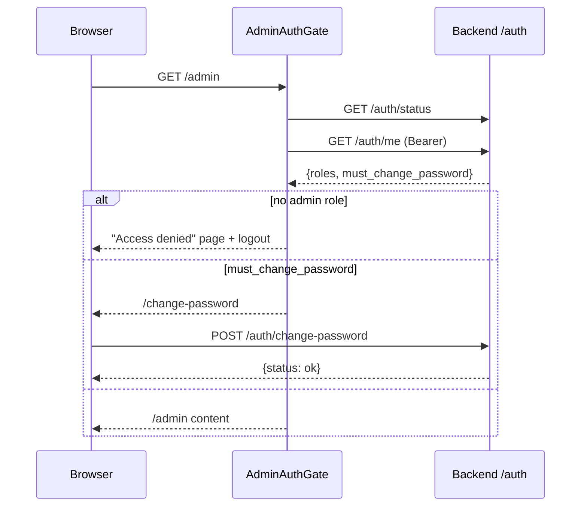
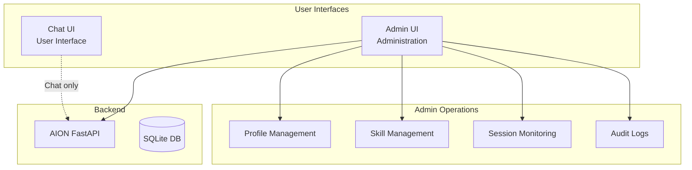

# Admin UI - Philosophy and Role

:::info Admin auth — always active (default)
Starting from the current release, the `/admin` panel is **always protected** (Grafana style): all `/admin/*` endpoints require a Bearer token and the `admin` role.
See the sections [Admin auth (always on)](#admin-auth-always-on),
[First login & default admin](#first-login--default-admin) and
[Change password flow](#change-password-flow) below.
:::

## Admin auth (always on)

The `FastAPI` backend applies a global guard to the `/admin/*` router
(`src/api/admin.py` + `src/api/admin_agent_db.py`):

```python
router = APIRouter(
    prefix="/admin",
    dependencies=[Depends(require_admin_role)],
)
```

`require_admin_role` (in `src/api/auth_login.py`):

1. Resolves identity by calling `require_chat_auth` (Bearer / API key / internal BFF secret).
2. Verifies that the token payload contains the `admin` role.
3. Responds with `401` if the token is missing, `403` if the `admin` role is not present.

Override variable (escape hatch in dev):

| Variable | Default | Description |
|-----------|---------|-------------|
| `AION_ADMIN_PASSWORD_AUTH` | `1` | `0` makes `require_admin_role` a no-op (opens `/admin/*`). Do not use in production. |
| `AION_CHAT_PASSWORD_AUTH`  | `0` | Independent: the admin remains protected even when the chat is open. |

Login works if at least one of the two auths (chat or admin) is active. The
token issued by `POST /auth/login` now includes `roles` (HMAC-signed CSV, no
DB lookup needed per request) and `must_change_password`:

```json
{
  "access_token": "<base64-urlsafe>",
  "user_id": "u_admin",
  "identifier": "admin",
  "roles": ["admin"],
  "must_change_password": true
}
```

User schema: new columns `users.roles` (`TEXT`, JSON list) and
`users.must_change_password` (`BOOLEAN`). Idempotent migration:
`migrations/versions/d1a23b4f0001_user_roles_must_change.py`. For existing DBs
already marked as `head` by Alembic, the columns are added by
`src/data/bootstrap.py::_patch_sqlite_columns`.

## First login & default admin

At `setup_aion_env.py` (or at the first boot when setup is automatic) the
backend creates a default admin if **no user with the `admin` role** is
yet present in the tenant (`src/data/user_password.py::admin_exists`).

Default credentials:

| Field       | Value (env override)                              |
|-------------|----------------------------------------------------|
| Identifier  | `AION_SETUP_ADMIN_DEFAULT_IDENTIFIER` (`admin`)    |
| Password    | `AION_SETUP_ADMIN_DEFAULT_PASSWORD` (`admin`)      |
| Roles       | `["admin"]`                                        |
| Flag        | `must_change_password=True`                        |

Disable with `AION_SETUP_ADMIN_BOOTSTRAP=0` in `.env` before setup.

The script prints a conspicuous warning when it creates the admin:

```
========================================================================
 DEFAULT ADMIN CREATED: identifier='admin' password='admin'
 At the first login, changing the password will be proposed (skippable 24h).
 Disable with AION_SETUP_ADMIN_BOOTSTRAP=0 in the .env before setup.
 ========================================================================
```

## Change password flow

The `must_change_password` flag is read by `GET /auth/me`. On the admin-ui side:

- The `AdminAuthGate` automatically redirects to `/change-password` if the flag is
  `true` and the user has not already "skipped".
- The password change page calls `POST /auth/change-password` with
  `{old_password, new_password}`. The backend revalidates the old password
  (bcrypt), updates the hash and clears the flag.
- "Remind me tomorrow" button → sets
  `localStorage.aion_admin_change_pw_skipped_until = now + 24h`.

On the chat-ui side there is a parallel flow (`chat-ui/app/change-password/page.tsx`).
Skip key: `localStorage.aion_chat_change_pw_skipped_until`.



## Why is the Admin UI separate from the Chat UI?

**Decision:** The system has **two separate interfaces**:
1. **Chat UI** - For end users (chat, conversation)
2. **Admin UI** - For administrators (management, configuration)

### Why separate?



**Why separate:**

| Reason | Explanation |
|--------|-------------|
| **Separation of responsibilities** | Users only use the chat, administrators manage the system |
| **Security** | Administration operations require elevated privileges and different roles |
| **User experience** | End users must not be confused by technical configuration options |
| **Access control** | The Admin UI requires a separate authentication and authorization policy |

### Distinct roles

| Interface | Who uses it | What they can do |
|-------------|------------|---------------|
| **Chat UI** | End users | Messaging, file upload, management of personal sessions and personal credentials |
| **Admin UI** | Administrators | Management of users, profiles, skills, cron jobs, API keys, global monitoring and security |

---

## What can an administrator do?

### 1. Dashboard (Overview)

**Path:** `/`

**Features:**
- Real-time summary view of system metrics.
- Count of active profiles, registered skills, and installed MCP servers.
- Visualization of the global system security score.
- Log of the latest system health checks.

### 2. User Management

**Path:** `/users`

**Features:**
- Create new user accounts.
- Modify user details (display name and email).
- Update or reset user passwords.
- Delete existing accounts.

### 3. Profile Management

**Path:** `/profiles`

**Features:**
- Create new agent profiles.
- Modify existing profiles (system instructions, description, parameters).
- Export individual profiles to YAML or all in bulk to a ZIP archive.
- Import profiles via YAML files with schema validation.
- Associate MCP servers and enable/disable skills for each profile.

### 4. Skill Management

**Path:** `/skills`

**Features:**
- View registered skills in the system (with usage metrics).
- Create new skills by directly editing Markdown code with YAML frontmatter metadata.
- Promote skills generated from drafts ("draft") to verified ("verified").
- Remove skills (preventing the deletion of those currently in use by active profiles).

### 5. MCP Hub (unified)

**Path:** `/hub` — the "MCP Policy (Hub)" menu item points to `/hub?focus=integrations`. `/integrations` redirects here.

**Features:**
- Install servers from the marketplace and connector catalog.
- **Guided wizard:** installation → AI analysis → admin review → deployment (see [MCP Hub Wizard](../mcp/hub-wizard.md)).
- Configure registry (`command`, `env`, `aion_connector_id`).
- **User availability:** chat enablement, `credential_mode` (`none` | `org_shared` | `per_user`), schema preview from the catalog, application of suggested `${AION_USER_*}` env.
- Advisor: "Ask the assistant" button (`POST /admin/mcp-integrations/advise`) or `mcp_integration_advisor` chat profile.
- **Probe** (`POST /admin/mcp/{slug}/probe`): verifies MCP handshake and tool list after install/config.

**Post-install checklist (e.g. email):**

1. Wizard or Edit → correct `credential_mode` → **Apply suggested env**.
2. Enable chat for users.
3. **PROBE** on the installed card (≥1 tool, e.g. `search_emails`).
4. Agent profile: `mcp_servers` includes the slug + MCP skill (e.g. `email_imap_mcp` in `config/profiles/`).
5. Chat-ui: user credentials if `per_user`.

### 6. Interaction Ledger (Conversations)

**Path:** `/conversations`

**Features:**
- Monitor the global and cross-tenant list of all conversations.
- Filter sessions by date or via search string (title, user, tenant, profile).
- Inspect the complete message history of each session.
- Examine in detail the tool executions (input sent, output returned, success/error status).
- View and download the execution plans generated by the agent and the artifacts produced during the turn.

### 7. Scheduled Jobs (Scheduled tasks)

**Path:** `/schedules`

**Features:**
- Manage cron jobs for the scheduled sending of prompts to the agent (requires `AION_CRON_ENABLED=1` in the backend).
- Define cron expressions, time zones, associated profiles, and prompts to execute.
- Bind each job to a dedicated **SQL QueryMemory project** — required for memory-enabled profiles (the `default` drawer is blocked at runtime to prevent cross-project contamination). The selected project is persisted on the job and written into the scheduled-job conversation metadata so the run is scope-bound exactly like a chat-ui turn.
- Monitor the outcome of the latest executions and view the detailed history of each run (status, timestamp, error messages).
- Enable, disable, or force immediate execution of a job.

### 8. API Credentials (API Keys)

**Path:** `/api-keys`

**Features:**
- Generate secure programmatic access keys for external systems.
- Assign granular authorization scopes (`conversations:read`, `conversations:write`, `chat`, `chat:scoped`, `files:read`, `files:write`, `admin`).
- Monitor key usage (date of last access).
- Instantly revoke obsolete or compromised API keys.

### 9. Memory Management

**Path:** `/memory`

**Features:**
- Monitor usage and status of the PromQL cache.
- Manage long-term memory (LTM) via MemPalace and Knowledge Graph.
- View detailed statistics on the number of entities and relationships inserted in the graph.
- Perform manual optimization or purging (purge) of the cache and memory nodes.

### 10. Logic Extension Hub (Plugins & Hooks)

**Path:** `/plugins`

**Features:**
- Monitor active runtime modules under `data/plugins/`.
- View the status of the execution pipeline hooks (e.g. `on_user_message`, `pre_llm_call`, `on_assistant_message`, `pre_tool_use`).
- Perform hot reloading (hot reload) of logical extensions without interrupting the main server process.

### 11. SOUL/MEMORY/USER Management (legacy)

**Path:** `/profile-memory`

**Features:**
- Modify `SOUL.md` files (deprecated — use `instructions` in the YAML profile).
- Modify `MEMORY.md` (deprecated — use MemPalace/LTM).
- Modify `USER.md` (active and recommended to customize end user preferences).

### 12. Audit and Security (Security Audit)

**Path:** `/security`

**Features:**
- Manage security audit logs and static scan reports.
- Initiate AI-driven security analyses (via profiles like "Security Officer") on specific code files.
- View, mark as trusted ("trust") or download detailed reports in JSON or Markdown format.

### 13. System Health (Infrastructure Integrity)

**Path:** `/system`

**Features:**
- Monitor the integrity of the underlying infrastructure in real time.
- Check the status and URL of the Redis cluster (detecting if the in-process fallback mechanism is active).
- Monitor the unified SQLite database (physical file size and connection string).
- View the active storage backend (local or hybrid) and its root directory for session files.

### 14. General Settings

**Path:** `/settings`

**Features:**
- Configure global environment variables by writing them directly to the `.env` file via an integrated visual editor.
- Automatic parameter validation (e.g. consistency between `AION_CHAT_MAX_TOKENS` and `AION_THINKING_TOKEN_BUDGET` for Anthropic models).
- Automatic restart of the Docker container in case of changes (if the environment runs under Docker).

---

## Next.js Architecture

### Why Next.js?

| Reason | Explanation |
|--------|-------------|
| **React** | Modern UI framework, flexible ecosystem |
| **SSR & App Router** | Fast rendering and clean management of routes and APIs |
| **API routes / BFF** | Secure proxying of requests to the FastAPI backend |
| **Type safety** | Type safety for a complex control panel |

### Project structure

```
admin-ui/
├── app/                    # Next.js App Router
│   ├── page.tsx            # Home dashboard
│   ├── users/              # User Management
│   ├── profiles/           # Profile Management
│   ├── skills/             # Skill Management
│   ├── hub/                # MCP Hub (marketplace and wizard)
│   ├── conversations/      # Interaction Ledger (chat monitoring)
│   ├── schedules/          # Scheduled Cron Jobs
│   ├── api-keys/           # API Keys Management
│   ├── memory/             # LTM & Memory Management
│   ├── plugins/            # Runtime Plugins & Hooks
│   ├── profile-memory/     # Legacy SOUL/MEMORY/USER (deprecated)
│   ├── security/           # Security Audit & Scans
│   ├── system/             # Infrastructure integrity (System health)
│   └── settings/           # General Settings (.env editor)
├── public/                 # Static files
│   └── reports/            # Generated security audit reports
└── package.json            # Package scripts and dependencies
```

---

## Configuration

### Variables

| Variable | Default | Purpose |
|-----------|---------|-------|
| `NEXT_PUBLIC_AION_API_URL` | `http://localhost:8001` | FastAPI backend URL |

### Development

```bash
cd admin-ui
pnpm dev
# Access to the development interface on http://localhost:3870
```

### Production

```bash
cd admin-ui
pnpm build
pnpm start
# Access to the interface on http://localhost:3870 or via reverse proxy
```

---

## Security considerations

### Input validation

**The Admin UI must validate:**
- Profile creation (name uniqueness, validity of associated MCP servers).
- Skill creation (correctness of the frontmatter syntax).
- MCP configurations (security of commands, arguments, and environment).
- Global settings (validation of integers and token budgets).

### Audit logging

All administrative operations (user creation, configuration modification, key release) are logged in the audit system to ensure traceability and compliance.

---

## Troubleshooting

### "Cannot fetch profiles"

**Cause:** Incorrect `NEXT_PUBLIC_AION_API_URL` or backend offline.

**Fix:**
```bash
# Check that the backend is active
curl http://localhost:8001/health

# Verify that the environment variable contains the correct path
echo $NEXT_PUBLIC_AION_API_URL
```

### "403 Forbidden on /admin/*"

**Cause:** The user has not logged in or does not have the required `admin` role.

**Fix:**
1. Make sure you have logged in to the `/admin` portal with an enabled user.
2. Verify that the JWT token has not expired.
3. In development, if necessary, it is possible to bypass the protection by setting `AION_ADMIN_PASSWORD_AUTH=0` in the `.env` and restarting the FastAPI backend.

### "Cannot upload audit report"

**Cause:** Write permission error on the host's `admin-ui/public/reports/` folder.

**Fix:**
```bash
chmod 755 admin-ui/public/reports
chown -R $USER admin-ui/public/reports
```

---

## Related documents

- [REST API](../api-and-runtime/rest-api.md) - Backend FastAPI endpoints
- [Chat UI](./chat-ui.md) - Main chat user interface
- [Identity and Chat Auth](../security/identity-and-chat-auth.md) - Authentication and authorization
- [Agent profiles](../configuration/profiles.md) - Management and configuration of profiles
- [Hermes features](../learning/hermes-features.md) - Administrative operations for learning features
