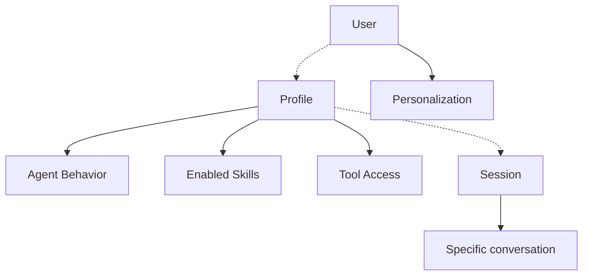
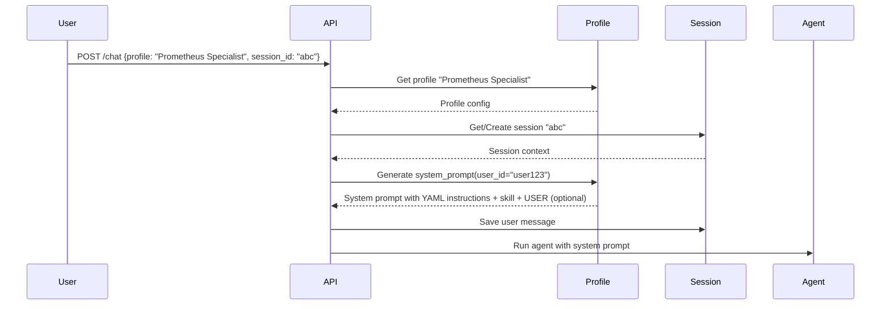

# Agent Profiles (YAML)

## Philosophy: Why separate profiles?

### Separation of responsibilities

The system separates three distinct dimensions:



| Dimension | What it defines | Why separate |
|------------|----------------|-----------------|
| **Profile** | "Who the agent is" (persona, tool access, skills) | Independent of conversation |
| **Session** | "What we are talking about" (current conversation) | Independent of the profile |
| **User** | "Who you are" (cross-session personalization) | Independent of conversation and profile |

**Why profiles:**
1. **Reuse:** The same profile can serve many sessions and many users
2. **Personalization:** The same user can use different profiles for different tasks
3. **Composition:** Profile = Persona + Skills + Tool Access

---

## Canonical files in `config/profiles/`

The loader only reads `*.yaml` with slug `[a-z0-9_]+`. Files duplicated by Finder (`generic_assistant copy.yaml`), backups (`*_OLD.yaml`) or names with spaces are **ignored** with a WARNING log. Do not create them in the profiles folder: use git or Admin export for versions. `upgrade-aion.sh` automatically removes the patterns `* copy*` and `*_OLD*` after the sync from `config_std/`.

---

## When to create a new profile?

### ✅ Create a profile when:

#### 1. Different agent persona
The agent has a specific role different from the default:

```yaml
# Example: "Security Auditor" Profile
name: Security Auditor
description: Expert in security, auditing, compliance
instructions: "You are a senior Security Auditor... Focus on risk identification..."
skills:
  - security_audit
  - compliance_check
  - threat_analysis
mcp_servers:
  - security_scanner
  - vulnerability_db
```

**When:** The agent must behave differently (persona, focus, style).

#### 2. Different tool set
The agent has access to different tools:

```yaml
# Example: "Backend Developer" Profile
mcp_servers:
  - code_analysis
  - git_tools
  - prometheus
  - grafana
```

**When:** The agent must do different things (backend vs frontend vs security).

#### 3. Different enabled skills
The agent has different functionalities:

```yaml
# Example: "Data Analyst" Profile
skills:
  - data_analysis
  - visualization
  - statistical_tests
```

**When:** The agent must perform specific tasks (data analysis, coding, writing).

### ❌ Do NOT create a profile when:

#### 1. Only for a change in environment variables
**Problem:** The `AION_*` variables are global, not per profile.

**Solution:** Use the same profile, modify the environment variables.

#### 2. For minor differences
**Problem:** Small differences in tone or style do not justify a new profile.

**Solution:** Modify the `instructions` of the existing profile.

#### 3. For every new user
**Problem:** A profile per user creates unnecessary proliferation.

**Solution:** Use the same profile, change `user_id` for cross-session personalization.

---

## Structure of a YAML profile

```yaml
name: Prometheus Specialist
description: Prometheus and Grafana expert for monitoring and auditing
instructions: |
  You are a Prometheus & Grafana Expert Assistant.
  Your task is to help users with any infrastructure-related request,
  whether it is queries, dashboards or document analysis.
skills:
  - core_protocol
  - infra_audit
  - promql_library
  - mempalace_protocol
  - llm_wiki
mcp_servers:
  - prometheus
  - grafana
  - mempalace
  - memory
  - ocr
  - session_sandbox
  - skills_hub
```

### Required fields

| Field | Description | Example |
|-------|-------------|---------|
| `name` | Displayed name (how the user sees it) | "Prometheus Specialist" |
| `description` | Short description of the purpose | "Prometheus and Grafana expert" |
| `instructions` | Agent persona (tone, style, scope) | Detailed text of the behavior |

### Optional fields

| Field | Description | Example |
|-------|-------------|---------|
| `skills` | List of enabled skills | `["promql_library", "grafana_dashboard"]` |
| `mcp_servers` | List of accessible MCP servers | `["prometheus", "grafana"]` |

**Built-in Plan/HITL:** the `orchestration` MCP server (`draft_execution_plan`, `list_session_execution_plans`, `get_execution_plan`, `update_execution_plan`, `mark_task_completed`, `type: in_process`) is **automatically** injected into each profile by `build_all_tools` — do **not** list it in `mcp_servers` (Plan Mode is global in chat-ui). The approved plan is SSOT on DB/SQLite, not in `workspace/execution_plan_*.md` files.

---

## Best practices for profiles

### 1. Keep names concise

**Good:**
```yaml
name: Prometheus Specialist
slug: prometheus_specialist
```

**Bad:**
```yaml
name: Super Mega Prometheus and Grafana Specialist Agent
slug: super_mega_prometheus_and_grafana_specialist_agent
```

**Why:** Long names are difficult to remember and use.

### 2. Limit the number of MCP servers

**Advice:** 3-5 MCP servers per profile max.

**Why:**
- Too many tools confuse the agent
- Increases latency for tool discovery
- Makes the system prompt too long

**Example:**
```yaml
# OK: Focused
mcp_servers:
  - prometheus
  - grafana

# Avoid: Too many
mcp_servers:
  - prometheus
  - grafana
  - memory
  - ocr
  - session_sandbox
  - code_analysis
  - git_tools
  - security_scanner
```

### 3. One skill at a time

**Advice:** Do not enable too many skills in the same profile.

**Why:**
- Skills can conflict (e.g., two skills for the same tool)
- System prompt becomes confusing
- Difficult debugging

**Example:**
```yaml
# OK: Focused
skills:
  - promql_library

# Avoid: Too many
skills:
  - promql_library
  - grafana_dashboard
  - data_analysis
  - security_audit
  - code_review
  - infrastructure_monitoring
```

### 4. Clear and concise instructions

**Good:**
```yaml
instructions: |
  You are a Prometheus Specialist Assistant.
  Your task is to help with Prometheus queries and Grafana dashboards.
  Always use the prometheus and grafana tools to answer.
```

**Bad:**
```yaml
instructions: |
  You are an Assistant.
  You can do many things: queries, code, writing, analysis.
  You are not sure what to do always.
  Sometimes use prometheus tools, sometimes grafana, sometimes others.
  Be polite and helpful.
  Try to be precise but also concise.
  But sometimes be detailed.
  I don't really know what to say here.
  Maybe add more here to fill up.
```

**Why:** Confusing instructions lead to unpredictable behavior of the agent.

### 5. Unique and consistent slugs

**Rule:** The slug must be unique and consistent with the name.

```yaml
name: Prometheus Specialist
slug: prometheus_specialist  # OK: kebab-case, descriptive
```

**Avoid:**
```yaml
slug: prom  # Too short, not descriptive
slug: Prometheus_Specialist  # Not kebab-case
slug: p_specialist  # Not clear
```

---

## Design patterns for common profiles

### 1. Specialist Profile

**Pattern:** Profile focused on a specific domain.

```yaml
name: Data Analyst
slug: data_analyst
description: Expert in data analysis, visualization, statistics
instructions: |
  You are an expert Data Analyst.
  Your task is to help with data queries, visualizations and statistical analysis.
skills:
  - data_analysis
  - visualization
  - statistical_tests
mcp_servers:
  - database_query
  - visualization
  - statistics
```

**When:** When a specific area of expertise is needed.

### 2. Generalist Profile

**Pattern:** Versatile profile for general tasks.

```yaml
name: Generic Assistant
slug: generic_assistant
description: All-rounder assistant for general tasks
instructions: |
  You are a Generic Assistant.
  Your task is to help with any general request.
  Use the available tools to answer.
skills:
  - general_knowledge
mcp_servers:
  - generic_tools
```

**When:** When there is no specific specialization.

### 3. Security Profile

**Pattern:** Profile focused on security and auditing.

```yaml
name: Security Auditor
slug: security_auditor
description: Expert in security, auditing, compliance
instructions: |
  You are a senior Security Auditor.
  Your task is to identify security risks, audit systems, verify compliance.
skills:
  - security_audit
  - compliance_check
  - threat_analysis
mcp_servers:
  - security_scanner
  - vulnerability_db
  - compliance_check
```

**When:** For security, auditing, compliance tasks.

### 4. Developer Profile

**Pattern:** Profile focused on development and coding.

```yaml
name: Backend Developer
slug: backend_developer
description: Expert in backend development, code analysis, debugging
instructions: |
  You are an expert Backend Developer.
  Your task is to help with coding, debugging, code review.
skills:
  - code_analysis
  - debugging
  - code_review
mcp_servers:
  - code_analysis
  - git_tools
  - linting
```

**When:** For software development, coding, debugging tasks.

---

## Profiling and composition

### How profiles interact with sessions and users



**Flow:**
1. Client specifies `profile` and `session_id`
2. API loads the profile
3. Profile generates system prompt with user context (`user_id`)
4. Session provides conversation context
5. Agent combines everything to generate answer

### Cross-session personalization

**Why `user_id`:** Allows retrieving context from past conversations, independently of the profile or the session.

```yaml
# Example: Profile uses user_id for personalization
instructions: |
  You are an Assistant.
  The current user is: {{ user_id }}.
  Use LTM context for relevant memories about this user.
```

---

## Profiles troubleshooting

### "The agent does not do what I expect"

**Possible causes:**
1. `instructions` too vague
2. conflicting `skills`
3. too many `mcp_servers`

**Solutions:**
- Rewrite more specific `instructions`
- Remove unnecessary skills
- Reduce mcp_servers

### "The profile does not load"

**Possible causes:**
1. File does not exist in `config/profiles/`
2. YAML syntax error
3. Profile not specified correctly in the request

**Solutions:**
- Verify path: `config/profiles/filename.yaml`
- Verify YAML valid (use `yamllint`)
- Verify name in request matches the name or slug

### "Too many tool calls, slow response"

**Possible cause:** Too many MCP servers enabled.

**Solution:** Reduce `mcp_servers` to the 3-5 most relevant.

---

## Example configuration

### Minimal profile

```yaml
name: Minimal Assistant
slug: minimal_assistant
description: Minimal assistant
instructions: "You are a helpful assistant."
skills: []
mcp_servers: []
```

### Complete profile

```yaml
name: Full Stack Developer
slug: full_stack_developer
description: Expert in full stack development, coding, debugging, deployment
instructions: |
  You are a senior Full Stack Developer.
  Your task is to help with coding on frontend and backend,
  debugging, code review, deployment, infrastructure.
  
  Use the available tools to answer requests.
  Be precise, concise and professional.
  
  Remember:
  - Use the git_tools tools for Git operations
  - Use code_analysis for code analysis
  - Use prometheus/grafana for monitoring
skills:
  - code_analysis
  - debugging
  - code_review
  - infrastructure_monitoring
mcp_servers:
  - code_analysis
  - git_tools
  - prometheus
  - grafana
  - deployment
```

---

## Validation and canonical slug (P2)

- Each file in `config/profiles/` has **slug = file stem** (`aion_std.yaml` → slug `aion_std`). `get_profile()` only resolves the slug (display name only with `AION_PROFILE_LEGACY_NAME_LOOKUP=1`).
- At API startup: `validate_all()` logs warnings on missing skills/MCP; with `AION_PROFILE_VALIDATE_STRICT=1` startup fails on invalid YAML.
- `AION_DEFAULT_PROFILE` (default `aion_std`) is the only fallback if the chat request passes an unknown slug — the first profile in alphabetical order is no longer used.
- Reload: `load_all_if_stale()` compares the folder's `mtime`; `AION_PROFILE_HOT_RELOAD=1` forces the check at each `get_agent`. After admin save: `invalidate()` + reload.

| Variable | Default | Role |
|-----------|---------|--------|
| `AION_DEFAULT_PROFILE` | `aion_std` | Profile if request slug is absent |
| `AION_PROFILE_VALIDATE_STRICT` | `0` | Boot fails on schema errors |
| `AION_PROFILE_HOT_RELOAD` | `0` | mtime check every turn (dev) |
| `AION_PROFILE_LEGACY_NAME_LOOKUP` | `0` | Lookup by display name |

---

## Source files

| File / Folder | Role |
|------|-------|
| `src/agent_profile.py` | Profile manager, YAML loading |
| `src/runtime/profile_schema.py` | Pydantic validation P2.1 |
| `src/runtime/skill_alias.py` | Maps logical `artifact_protocol` → `artifact_protocol` skill file |
| `config_std/skills/artifact_protocol.md` | Tool-first file delivery protocol (replaces strategy-specific artifact skills) |
| `config_std/skills/docx.md` | docx-js workflow for Word generation in sandbox |
| `config_std/profiles/` | Profile templates (versioned in Git) |
| `config/profiles/*.yaml`| Active profiles loaded by the agent (local) |
| `config/skills/` | Skills referenced by profiles (local) |

---

## Related documents

- [YAML Profiles](./environment.md) - Environment variables
- [Skills and System Prompt](./skills-and-prompts.md) - How skills influence the prompt
- [SOUL, MEMORY and USER](./soul-memory-user.md) - User personalization (SOUL/MEMORY deprecated, USER active)
