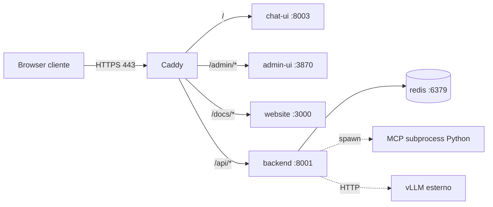

# Deploy con Docker Compose

AION Agent include una stack Docker pronta per il deploy **multi-tenant**:
singolo dominio + routing path-based via reverse proxy Caddy con auto-HTTPS
(Let's Encrypt). L'onboarding di un nuovo cliente richiede **un solo record
DNS A** e un file `.env`.

## Architettura



| Path                          | Servizio                  | Porta interna |
|-------------------------------|---------------------------|---------------|
| `https://${DOMAIN}/`          | chat-ui Next.js           | 8003          |
| `https://${DOMAIN}/admin`     | admin-ui Next.js          | 3870 (`basePath=/admin`) |
| `https://${DOMAIN}/docs/`     | website Docusaurus        | 3000 (nginx, `baseUrl=/docs/`) |
| `https://${DOMAIN}/api/*`     | backend FastAPI           | 8001 (prefisso strippato da Caddy) |

Tutti i servizi comunicano sulla rete bridge interna `aion_net`. Solo Caddy
espone le porte 80/443 al cliente.

## Componenti containerizzati

| Container  | Immagine base       | Note                                        |
|------------|---------------------|---------------------------------------------|
| `caddy`    | `caddy:2.8-alpine`  | Reverse proxy + ACME Let's Encrypt          |
| `backend`  | `python:3.13-slim`  | FastAPI + spawn MCP server subprocess       |
| `chat-ui`  | `node:22-alpine`    | Next.js 16 standalone (one build = all customers) |
| `admin-ui` | `node:22-alpine` + `pnpm@10.30.1` | Next.js 16 standalone + `basePath=/admin`   |
| `website`  | `nginx:alpine`      | Docusaurus build statico                    |
| `redis`    | `redis:7.4-alpine`  | Rate limit, lock, chart queue               |

### Versioni runtime pinnate

I Dockerfile espongono le versioni come `ARG` per facilitare aggiornamenti
controllati. Default attuali (allineati alle versioni in uso in dev):

| Componente | ARG                           | Default       | Dove                        |
|------------|-------------------------------|---------------|-----------------------------|
| Python     | `PYTHON_VERSION`              | `3.13-slim`   | `docker/Dockerfile.backend` builder + runtime |
| uv         | `UV_VERSION`                  | `latest`      | `docker/Dockerfile.backend` (image `ghcr.io/astral-sh/uv`; pin opzionale in `.env`) |
| Node.js    | `NODE_VERSION`                | `22-alpine`   | `docker/Dockerfile.chat-ui`, `Dockerfile.admin-ui`, `Dockerfile.website` |
| pnpm       | `PNPM_VERSION` (corepack)     | `10.30.1`     | `docker/Dockerfile.admin-ui` |

#### `UV_VERSION`: `latest` vs pin

| Strategia | Quando usarla |
|-----------|----------------|
| **`latest`** (default) | Dev, staging, rebuild periodici: ogni `docker compose build` prende l'ultimo binario uv (fix e patch di sicurezza del tool installer). |
| **Tag pin** (es. `0.6.17`) | Prod con audit rigoroso: build byte-identici finché non cambi il pin esplicitamente. |

`latest` riguarda solo il **binario uv** nel layer di build, non le wheel Python: quelle restano da `requirements.txt` (aggiornamenti dipendenze = rebuild + eventuale bump requirements). Per vulnerabilità nei pacchetti Python usare il tuo processo abituale (`pip-audit`, Dependabot, ecc.) sul requirements, non confondere con la versione di uv.

#### Perché uv invece di pip

Il `Dockerfile.backend` usa [**uv**](https://github.com/astral-sh/uv) (Astral)
per l'installazione dei pacchetti Python:

- ~10–50× più veloce di `pip` su requirements > 30 dipendenze (haystack-ai,
  mempalace, mcp portano pacchetti transitivi aggiuntivi)

**MemPalace / embeddings:** l'immagine backend pre-scarica il modello Chroma ONNX in
`/app/data/chroma_embedding_cache` (build + warmup al boot). Con volume `aion_data` vuoto al
primo deploy, il warmup lifespan ripopola la cache sul volume persistente. Variabili:
`AION_MEMPALACE_WARMUP`, `AION_CHROMA_SHARED_EMBEDDING_CACHE`, `AION_SSE_KEEPALIVE_SEC`.
- Risolutore deterministico (no problemi di metadata caching pip)
- Binario statico copiato da `ghcr.io/astral-sh/uv:${UV_VERSION}` (no Rust toolchain
  richiesta nel builder; versione configurabile in `.env` → `docker-compose.yml`)
- BuildKit cache mount (`--mount=type=cache,target=/tmp/uv-cache`) riusa le
  wheel tra build successive senza gonfiare l'immagine finale

Il pattern adottato è quello [raccomandato da Astral](https://docs.astral.sh/uv/guides/integration/docker/):

```dockerfile
COPY --from=ghcr.io/astral-sh/uv:${UV_VERSION} /uv /uvx /usr/local/bin/
RUN uv venv /opt/venv
ENV VIRTUAL_ENV=/opt/venv PATH="/opt/venv/bin:$PATH"
RUN --mount=type=cache,target=/tmp/uv-cache \
    uv pip install --python /opt/venv/bin/python -r requirements.txt
```

`docker compose build` passa `UV_VERSION` e `PYTHON_VERSION` dai build arg in `.env`
(vedi `.env.example`). Richiede **BuildKit** (`DOCKER_BUILDKIT=1`, default su Docker Desktop).

Il runtime stage copia il venv in blocco (`COPY --from=builder /opt/venv /opt/venv`),
senza dipendere dal path Python hardcoded.

#### Config, MCP e skill office (sync al boot)

Il backend **non** copia più `config/` o `mcp_servers/` dal build context (gitignored).
Flusso:

1. **Build** (`Dockerfile.backend`): `COPY config_std/` + `mcp_servers_std/`; bootstrap con `ensure_skill_packages.py` come fallback se i volumi mancano.
2. **Runtime** (`docker/backend-entrypoint.sh`): con `AION_SYNC_ON_BOOT=1` (default) esegue `sync_config.py --force` e `sync_mcp_servers.py --force` prima di uvicorn.
3. **Compose** monta `./config_std` e `./mcp_servers_std` (read-only dal repo) più `./config` e `./mcp_servers` (overlay scrivibile sul host).

Dopo `git pull` che aggiorna solo profili/skill/MCP standard:

```bash
docker compose restart backend    # prod o dev — niente rebuild immagine
```

Rebuild serve solo per cambi a `src/`, `requirements.txt` o Dockerfile. `sync_config --force` non sovrascrive `mcp_registry.yaml` / `mcp_registry.local.yaml` (overlay locale).

**Profili (dev e Docker):** un solo percorso, `config/profiles/` (bind mount `./config` in compose).
L'admin UI scrive lì; in locale e in container vedi gli stessi file.

All'avvio, `sync_config --force` aggiorna i profili standard da `config_std/profiles/`
ma **non sovrascrive** i YAML che hai customizzato. Lo stato è tracciato in
`config/profiles/.aion-sync-state.json` (hash per file). Dopo un salvataggio admin,
il profilo resta intatto su `git pull` + `docker compose restart`.

Per forzare il ripristino di un profilo dal template: elimina il file in `config/profiles/`
e riavvia il backend (oppure riesegui `sync_config --force`).

`AION_PROFILES_WRITE_DIR` resta disponibile solo come escape hatch avanzato (overlay
su volume separato); non è necessario nel deploy standard.

Per aggiornare i pacchetti skill nel repo prima del deploy: `python scripts/sync_local_skill_packages_to_std.py`.

> ATTENZIONE! **Lockfile non versionati.** I file `package-lock.json` (chat-ui, website)
> e `pnpm-lock.yaml` (admin-ui) sono in `.gitignore`. Per questo i Dockerfile
> usano `npm install` / `pnpm install` (non `npm ci` né `--frozen-lockfile`):
> se il lockfile è presente in working tree viene usato per accelerare il build,
> altrimenti viene rigenerato on-the-fly. Pinniamo invece la versione del
> package manager (Node 22 + pnpm 10.30.1) per garantire build deterministici.

Per provare un override temporaneo, ad esempio Python 3.14:

```bash
docker compose build --build-arg PYTHON_VERSION=3.14-slim backend
```

## Due scenari supportati

### A) Local (HTTP, nessun dominio richiesto)

Per provare lo stack sul proprio laptop senza configurare nulla. **`DOMAIN` non è
obbligatorio**: se assente o uguale a `:80`, Caddy ascolta in HTTP puro su
porta 80 per qualsiasi hostname.

```bash
git clone https://github.com/AION-by-ASA-Computer/aion-agent.git
cd aion-agent
cp .env.example .env                    # copia il template principale
# edita .env impostando DOMAIN=:80 per lo sviluppo locale e configura AION_API_URL al tuo LLM
docker compose up -d --build
```

Accesso:

| URL                                  | Servizio   |
|--------------------------------------|------------|
| `http://localhost/`                  | chat-ui    |
| `http://localhost/admin`             | admin-ui   |
| `http://localhost/docs/`             | docs       |
| `http://localhost/api/health`        | backend    |

### B) Prod (cliente reale, TLS automatico)

Onboarding cliente in 3 step:

1. **Clone + setup `.env`**
   ```bash
   git clone https://github.com/AION-by-ASA-Computer/aion-agent.git
   cd aion-agent
   ./scripts/setup-aion-env.sh            # wizard interattivo: scegli il target 'docker'
   # in alternativa per setup manuale: cp .env.example .env
   vim .env                               # configura DOMAIN, LETS_ENCRYPT_EMAIL, secrets e abilita la sezione Docker in fondo
   ```
   Nel `.env` cambia:
   ```bash
   DOMAIN=cliente.example.com
   LETS_ENCRYPT_EMAIL=ops@tuoazienda.com
   # commenta i default HTTP e abilita gli HTTPS:
   AION_CORS_ORIGINS=https://${DOMAIN}
   AION_PUBLIC_API_URL=https://${DOMAIN}/api
   ```
   Non impostare `AION_CORS_ORIGINS=*` in produzione: senza `AION_CORS_ALLOW_WILDCARD=1` il backend usa comunque una lista ristretta, ma è preferibile l'origine esplicita del dominio.
2. **Record DNS**: un singolo `A` record per `${DOMAIN}` che punta all'IP del server (porte 80/443 aperte verso internet).
3. **Avvio**
   ```bash
   docker compose up -d --build
   ```
   Caddy ottiene automaticamente il certificato Let's Encrypt al primo avvio
   (~30s). Lo stack è raggiungibile via `https://${DOMAIN}/`.

## Comandi quotidiani

```bash
# Produzione (full stack)
docker compose up -d --build         # build + start
docker compose ps                    # stato servizi
docker compose logs -f caddy backend # tail log multi-servizio
docker compose down                  # stop + rimozione container

# Sviluppo (solo essenziali con hot reload)
docker compose -f docker-compose.dev.yml up

# Upgrade in-place (rebuild immagini + restart + alembic stato)
./scripts/upgrade-aion.sh --docker

# Solo profili/skill/MCP da git (senza rebuild)
docker compose restart backend

# Promo PNG in container (Playwright non è nell'immagine di default)
docker compose exec backend bash -c \
  'python -m pip install "playwright>=1.49.0" && python -m playwright install chromium'

# Backup dei volumi persistenti
docker compose exec backend python scripts/aion_backup.py --output /app/data/_backups
```

### Migrazioni Alembic

Le migrazioni del DB unificato (`AION_DB_URL`) sono applicate **automaticamente
al boot del backend** da `src/data/migrations.py`.
La sequenza esatta e':

1. `ensure_bootstrap_schema()` crea le tabelle dal modello corrente (`Base.metadata.create_all()`),
   piu' FTS5 e trigger.
2. `run_migrations()` decide cosa fare:
   - se il DB ha le tabelle core ma `alembic_version` e' vuoto (caso tipico:
     DB nato dal bootstrap), esegue `alembic stamp head` e segna la revision
     corrente senza eseguire la baseline (che farebbe `ALTER COLUMN`, non
     supportato nativamente da SQLite);
   - altrimenti esegue `alembic upgrade head` normalmente (futuri upgrade).
3. `backfill_message_timelines()` popola `messages.timeline_json` per i messaggi
   assistant esistenti (idempotente; ordine UI chat-ui, vedi `docs/clients/chat-ui.md`).

Lo script `upgrade-aion.sh --docker` esegue solo un check `alembic current`
read-only per verificare che il DB sia allineato. Per ispezionare manualmente:

```bash
docker compose logs backend | grep -iE 'alembic|migrat'
docker compose exec backend alembic current
```

:::info Driver async vs sync
`AION_DB_URL` usa il driver async (`sqlite+aiosqlite`, `postgresql+asyncpg`).
Alembic e' sincrono: l'URL viene convertito al driver sync equivalente
**solo per le migration**, l'app a runtime continua a usare il driver async.
:::

## File rilevanti

```
docker/
├── Dockerfile.backend     # Python 3.13 + tesseract + poppler + tini; COPY *_std + entrypoint sync
├── backend-entrypoint.sh  # sync config_std/mcp_servers_std → runtime dirs at boot
├── Dockerfile.chat-ui     # Next.js standalone (output: 'standalone')
├── Dockerfile.admin-ui    # Next.js standalone + basePath=/admin
├── Dockerfile.website     # Docusaurus build + nginx static
├── Caddyfile              # routing path-based + SSE-friendly /api/*
└── nginx-website.conf     # cache headers per asset Docusaurus

docker-compose.yml         # produzione: caddy + 4 app + redis
docker-compose.dev.yml     # dev: backend + chat-ui + redis (hot reload)
.dockerignore              # esclude .venv, node_modules, data/, *.db
.env.example               # template env con sezione Docker in fondo (DOMAIN + override AION_*)
```

Vedi:
- [`docker-compose.yml`](https://github.com/AION-by-ASA-Computer/aion-agent/blob/main/docker-compose.yml)
- [`docker/Caddyfile`](https://github.com/AION-by-ASA-Computer/aion-agent/blob/main/docker/Caddyfile)

## Variabili d'ambiente Docker-specific

Le seguenti chiavi sono lette **solo** da Compose/Caddy (non dal codice Python):

| Variabile             | Esempio                  | Descrizione                              |
|-----------------------|--------------------------|------------------------------------------|
| `DOMAIN`              | `cliente.example.com`    | Hostname pubblico; `:80` per dev HTTP    |
| `LETS_ENCRYPT_EMAIL`  | `ops@aion-asa.com`       | Contatto ACME Let's Encrypt              |
| `REDIS_PASSWORD`      | _(opzionale)_            | Se valorizzata, Redis richiede auth      |
| `AION_ROOT_PATH`         | `/api`                  | Root path FastAPI; deve coincidere col prefisso strippato da Caddy (`handle_path /api/*`) |
| `AION_API_DOCS_ENABLED`  | `0`                     | Disabilita `/docs` e `/openapi.json` in produzione (`0` = disabilitato, `1` = abilitato) |
| `NEXT_PUBLIC_AION_API_URL` | `/api`              | Baked in chat-ui/admin-ui a build time   |
| `NEXT_PUBLIC_AION_ADMIN_UI_URL` | `/admin`       | Link da chat-ui ad admin-ui              |
| `DOCUSAURUS_BASE_URL` | `/docs/`                 | baseUrl del sito Docusaurus              |
| `AION_SYNC_ON_BOOT`   | `1`                      | Entrypoint backend: sync `*_std` → runtime prima di uvicorn (`0` = skip) |

Le variabili `AION_*` (LTM, MCP, ecc.) sono descritte in [Ambiente e Config](../configuration/environment.md).
Il file [`.env.example`](.env.example)
contiene una sezione finale dedicata al deploy in ambiente container:

```bash
AION_REDIS_URL=redis://redis:6379/0          # DNS interno Docker
AION_DATA_DIR=/app/data                       # mount point del volume aion_data
AION_FASTAPI_URL=http://backend:8001          # service-to-service
AION_PUBLIC_API_URL=https://${DOMAIN}/api     # browser-facing
AION_CORS_ORIGINS=https://${DOMAIN}
```

:::tip Risoluzione del percorso SQLite
Nel file `docker-compose.yml`, la variabile `AION_DB_URL` è impostata su `sqlite+aiosqlite:///data/aion.db` (con 3 slash). In SQLAlchemy, questo rappresenta un percorso relativo a partire dalla directory di lavoro dell'applicazione. Poiché in `Dockerfile.backend` la directory di lavoro è impostata su `/app` (`WORKDIR /app`), il percorso si risolve in `/app/data/aion.db`, il quale si trova all'interno del volume persistente `aion_data` (montato su `/app/data`), garantendo la persistenza del database.
:::

## Volumi persistenti

| Mount / volume  | Mount point         | Contenuto                                              |
|-----------------|---------------------|--------------------------------------------------------|
| `./config_std`  | `/app/config_std`   | Template versionati (git); read-only                   |
| `./mcp_servers_std` | `/app/mcp_servers_std` | MCP standard versionati (git); read-only          |
| `./config`      | `/app/config`       | Runtime profili/skill/registry (sync da `config_std`)  |
| `./mcp_servers` | `/app/mcp_servers`  | Runtime MCP (sync da `mcp_servers_std` + Hub clone)    |
| `aion_data`     | `/app/data`         | SQLite `aion.db`, sessioni, profili, skills generate   |
| `caddy_data`    | `/data`             | Certificati Let's Encrypt + ACME state                 |
| `caddy_config`  | `/config`           | Config autosave di Caddy                               |
| `redis_data`    | `/data` (redis)     | RDB / AOF di Redis                                     |

Tutti i volumi sopravvivono a `docker compose down`. Per reset completo:
`docker compose down -v` (**attenzione: cancella DB e certificati**).

## SSE e streaming `/chat`

Il Caddyfile è configurato con `flush_interval -1` e timeout disabilitati
sull'upstream `/api/*`, condizione necessaria perché lo streaming
Server-Sent Events di `/chat` non venga bufferizzato. Vedi
[`docker/Caddyfile`](https://github.com/AION-by-ASA-Computer/aion-agent/blob/main/docker/Caddyfile)
per il dettaglio dei `transport http { read_timeout 0 }`.

## API docs e `root_path`

La documentazione interattiva di FastAPI (`/docs`, `/openapi.json`, `/redoc`) è
**disabilitata per default in produzione** tramite la variabile
`AION_API_DOCS_ENABLED=0`. Questa scelta è un hardening di sicurezza per evitare
l'information disclosure della superficie API.

Per riattivare la documentazione (accesso amministrativo/debug):

```bash
# 1. Nel .env:
echo 'AION_API_DOCS_ENABLED=1' >> .env

# 2. Rebuild e riavvio del solo backend:
docker compose up -d --build backend

# 3. Accesso: https://${DOMAIN}/api/docs
```

La variabile **`AION_ROOT_PATH=/api`** (già impostata in `docker-compose.yml`)
risolve un problema noto: quando Caddy strippa il prefisso `/api` prima di
inoltrare al backend, FastAPI deve sapere che è servito sotto quel prefisso
per generare URL corretti. Senza `root_path` la UI Swagger carica la pagina
ma fallisce nel fetch dello schema OpenAPI:

```
/swiper-ui/ → Swagger UI cerca di fare fetch di "/openapi.json"
              (URL senza `/api/` prefix) → finisce su chat-ui → errore
```

Con `AION_ROOT_PATH=/api`:

```
/api/docs → pagina Swagger UI
         → JavaScript carica "/api/openapi.json" (grazie a root_path)
         → Caddy matcha /api/* e proxy al backend → schema JSON corretto ✅
```

**Nota**: `AION_ROOT_PATH` influenza solo la generazione degli URL della
documentazione e il campo `servers` nello schema OpenAPI. Non modifica il
routing effettivo delle route, che restano sui loro path nativi (`/health`,
`/chat`, ecc.).

## Workers backend e scalabilità orizzontale

Il backend gira con `uvicorn --workers 1`. Questo è **obbligatorio** per via
dello stato in-process:

- `agent_cache` (cache di agenti Haystack per `(session, profile, user)`)
- `TOOL_EVENT_QUEUE` (canale eventi tool tra `src/main.py` e `agent_pipeline.py`)
- Pool stdio MCP (`AION_MCP_POOL=1`) + warm al boot (`AION_MCP_STARTUP_WARM=1`, `AION_MCP_USER_POOL=1`). Con molti MCP, valutare `AION_MCP_STARTUP_WARM_ASYNC=1` per healthcheck rapido e warm in background.

Per scalare orizzontalmente serve un layer di **sticky session** su Caddy
(hash del cookie di sessione → backend specifico) e separazione
dello stato condivisibile in Redis. Fuori scope di questo deploy.

## Modalità sviluppo

`docker-compose.dev.yml` avvia **solo** backend + chat-ui + redis con
hot reload via bind-mount. `admin-ui` e `website` restano avviabili
da terminale come da [`CLAUDE.md`](https://github.com/AION-by-ASA-Computer/aion-agent/blob/main/CLAUDE.md):

```bash
docker compose -f docker-compose.dev.yml up
# In altri terminali, quando servono:
cd admin-ui && npm run dev    # http://localhost:3870
cd website  && npm run start  # http://localhost:3000
```

Hot reload:
- **backend**: `uvicorn --reload` su `src/` montato dal filesystem host
- **chat-ui**: `next dev` su `chat-ui/` montato (`npm install` al primo avvio)
- **redis**: persistente su volume `redis_dev_data`

## Caveat URL Docusaurus

Con `DOCUSAURUS_BASE_URL=/docs/` e `routeBasePath=docs` (default), gli
URL profondi della documentazione diventano `/docs/docs/<page>`. Per
collapso del prefisso:

1. impostare `docs.routeBasePath: '/'` in
   [`website/docusaurus.config.ts`](https://github.com/AION-by-ASA-Computer/aion-agent/blob/main/website/docusaurus.config.ts)
2. rimuovere `website/src/pages/index.tsx` per evitare conflitto di route
   con la homepage (docs-only mode)
3. aggiornare i link footer in `website/docusaurus.config.ts` togliendo
   il prefisso `/docs/` (Docusaurus prepende automaticamente `baseUrl`)

### Asset statici (`/docs/assets`, `/docs/img`)

Il build Docusaurus mette gli bundle hashed in `build/assets/` e `build/img/`,
ma nei puntano a `/docs/assets/…` e `/docs/img/…`. Il container **website**
usa `docker/nginx-website.conf` nel repo: gli `alias` mappano quei prefissi
sulla radice del document root.

Se vedi pagina `/docs/` senza CSS e nella console richieste **404** verso
`/assets/…` (senza `/docs/`), la build è stata fatta con **`baseUrl` errato**
(di solito `/`): il browser interroga il chat-ui su `/`, che non ha quei file.
Ricostruire con `DOCUSAURUS_BASE_URL=/docs/` (default in `docker-compose.yml`)
e `docker compose build website`.

## Troubleshooting

### "DOMAIN must be set"
Manca o è vuota la variabile `DOMAIN` in `.env`. Per dev locale HTTP:
`DOMAIN=:80`.

### Caddy non ottiene il cert
Verificare:
- Porte 80/443 raggiungibili dall'esterno (firewall, NAT)
- Il record DNS `A` per `${DOMAIN}` punta al server
- `LETS_ENCRYPT_EMAIL` è valida
- Log: `docker compose logs caddy | grep -i "obtained\|error"`

Per test usare staging ACME: decommentare `acme_ca https://acme-staging-v02...`
in [`docker/Caddyfile`](https://github.com/AION-by-ASA-Computer/aion-agent/blob/main/docker/Caddyfile).

### Backend healthcheck failing
`docker compose ps` mostra `(unhealthy)`. Verificare:
```bash
docker compose logs backend | tail -100
docker compose exec backend curl -fsS http://127.0.0.1:8001/health
```
Cause tipiche: `AION_API_URL` (vLLM) irraggiungibile, `AION_DB_URL`
non scrivibile (permessi sul volume `aion_data`).

### chat-ui mostra "Network error" su `/api/chat`
Verificare che `NEXT_PUBLIC_AION_API_URL=/api` sia stato baked nella build.
Ispezionare il bundle:
```bash
docker compose exec chat-ui sh -c 'grep -r "AION_API_URL\|localhost:8001" /app/.next/standalone | head'
```
Se la build punta a `http://localhost:8001`, rifare con:
```bash
docker compose build --no-cache chat-ui
```

## Documenti correlati

- [Ambiente e Config](../configuration/environment.md) — variabili `AION_*` complete
- [Albero sorgenti](../architecture/source-tree.md) — mappa repo
- [REST API](../api-and-runtime/rest-api.md) — endpoint esposti sotto `/api/*`
