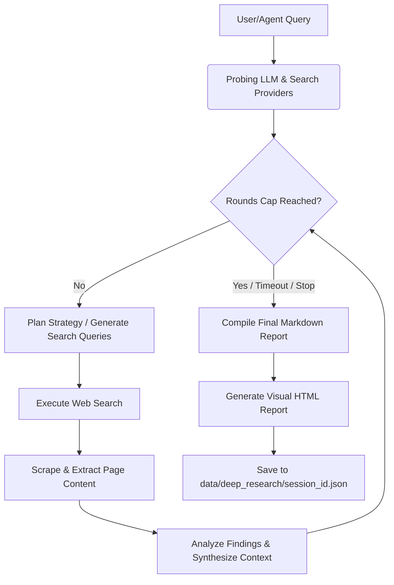

# Deep Research Integration

AION Agent includes a native **Deep Research** module, ported from the [Odysseus](https://github.com/) IterResearch loop under Apache 2.0 license (see [DeepResearch-Apache-2.0.txt](licenses/DeepResearch-Apache-2.0.txt)). 

Instead of generating quick, single-turn chat answers, this module executes an autonomous, multi-step research loop: **Plan $\rightarrow$ Search $\rightarrow$ Extract $\rightarrow$ Synthesize $\rightarrow$ Stop**. It streams progress in real time via Server-Sent Events (SSE) and persists results as self-contained HTML reports with advanced layout options.

---

## Architecture & Workflow

The deep research engine runs completely in the background via FastAPI's event loop or the main application global loop. The flow proceeds as follows:



1. **Probing**: The engine verifies connection to the LLM model and checks active search providers (Tavily, Brave, or SearXNG).
2. **Planning**: An LLM agent plans a search strategy for the current round and translates the research goal into specific search queries.
3. **Searching**: Queries are executed using the configured search providers.
4. **Reading / Page Extraction**: The engine scrapes the retrieved URLs in parallel to extract text and findings, filtering out low-quality or irrelevant content.
5. **Analyzing & Synthesizing**: Collected findings are integrated into the running session state.
6. **Writing**: When the safety cap or time budget is reached, or the agent determines that it has gathered sufficient details, it compiles the final report, applies styling rules, and generates a visual HTML report page.

---

## Deep Research Mode

The AION system supports a dedicated **Deep Research Mode** (represented by a **violet** theme in the Chat UI), distinct from normal chat mode and the orange-themed **Plan Mode**.

When the agent is placed in Deep Research Mode:
- **System Prompt Modifications**: The system prompt is appended with instructions to use the `trigger_research` tool and direct the user to the progress anchor, instead of doing manual quick lookups.
- **Tool Blocking**: To enforce the autonomous loop, standard tools that modify the environment, execute code, or perform basic single-step lookups are blocked. These include:
  - `web_search` and `web_fetch_page` (replaced by the autonomous loop)
  - Plan execution tools (`draft_execution_plan`, `get_execution_plan`, `update_execution_plan`, `mark_task_completed`)
  - Sandbox command execution and file editors (`sandbox_write_workspace_file`, `sandbox_edit_workspace_file`, `sandbox_exec_allowlisted`, etc.)
  - Subagent delegation (`delegate_to_subagent`)

### Mode Comparison Matrix

| Feature | Normal Mode | Plan Mode | Deep Research Mode |
| :--- | :--- | :--- | :--- |
| **UI Color Theme** | Dark/Light Neutral | Orange | **Violet** |
| **Output Type** | Direct chat response | Interactive execution plan | **Autonomous visual HTML report** |
| **User Approvals** | Optional (standard rules) | Required for each task step | **Not required** (autonomous background execution) |
| **Primary Web Tool**| `web_search` (quick lookup) | `web_search` / `web_fetch_page` | **`trigger_research`** (IterResearch loop) |
| **Execution Context**| Synchronous turn | Human-in-the-loop task tracker | **Asynchronous background task** |

---

## Environment Configuration

Configure the deep research engine using the following keys in your `.env` file:

| Variable | Default Value | Bounds / Constraints | Purpose |
| :--- | :--- | :--- | :--- |
| `AION_DEEP_RESEARCH_ENABLED` | `1` | `0` or `1` | Master switch to enable/disable the module and register its native tools. |
| `AION_DEEP_RESEARCH_MAX_ROUNDS` | `8` | `1` to `32` | Safety cap on the maximum number of search/synthesize rounds. |
| `AION_DEEP_RESEARCH_MAX_TIME` | `600` | `60` to `3600` | Time budget in seconds for the entire research run. |
| `AION_DEEP_RESEARCH_RUN_TIMEOUT` | `1800` | `60` to `86400` | Absolute hard timeout in seconds on background task execution. |
| `AION_DEEP_RESEARCH_DATA_DIR` | `data/deep_research` | Absolute or relative path | Output directory for saving reports and status JSON files. |
| `AION_DEEP_RESEARCH_MAX_TOKENS` | `16384` | Integer | Token budget allocated to the LLM for report synthesis. |
| `AION_DEEP_RESEARCH_MAX_CONCURRENT`| `2` | Integer ($\ge 1$) | Maximum number of concurrent research runs allowed per user. |
| `AION_DEEP_RESEARCH_EXTRACTION_TIMEOUT` | `90` | `15` to `3600` | Hard timeout in seconds for downloading and parsing a single webpage. |
| `AION_DEEP_RESEARCH_EXTRACTION_CONCURRENCY` | `3` | `1` to `12` | Number of webpages extracted in parallel during a round. |
| `AION_DEEP_RESEARCH_BLOCKED_TOOLS` | *(Default list)* | Comma-separated strings | List of tool names to block when resolved agent mode is `deep_research`. |

---

## Agent Tools

When `AION_DEEP_RESEARCH_ENABLED=1`, the following two in-process tools are registered to standard profiles:

### 1. `trigger_research`

Starts a deep research background job on a target topic.

- **Parameters**:
  - `topic` (string, **required**): The research question, objective, or topic description.
  - `max_rounds` (integer, optional): Maximum search rounds (defaults to `AION_DEEP_RESEARCH_MAX_ROUNDS`).
  - `max_time` (integer, optional): Maximum execution seconds (defaults to `AION_DEEP_RESEARCH_MAX_TIME`).
  - `category` (string, optional): Research type constraint. Supported values: `product`, `comparison`, `howto`, `factcheck`.
- **Output**: Returns a JSON string payload containing a markdown anchor pointing to the session ID:
  ```json
  {
    "output": "Deep research started: [topic](#research-rp-abc123xyz). Open the Deep Research panel to watch progress and read the report.",
    "session_id": "rp-abc123xyz",
    "research_session_id": "rp-abc123xyz",
    "anchor": "[topic](#research-rp-abc123xyz)",
    "ui_event": "research_started",
    "query": "topic",
    "exit_code": 0
  }
  ```

### 2. `manage_research`

Lists, retrieves, or deletes saved research reports from the user's library.

- **Parameters**:
  - `action` (string, **required**): One of `list`, `read`, or `delete`.
  - `id` (string, optional): The target research session ID (required for `read` and `delete`).
  - `search` (string, optional): A text filter to query the report library by topic.
- **Output**: Returns a formatted text report/list or a status code (e.g., `Deleted research rp-abc123xyz.`).

---

## Profiles Registration

To expose deep research tools to a specific profile, list the `deep_research` bundle under the `native_tool_groups` section in the profile YAML (e.g., [aion_std.yaml](config_std/profiles/aion_std.yaml)):

```yaml
native_tool_groups:
  - web_research
  - deep_research
```

---

## REST API Reference

All endpoints are authenticated using chat token identity or the `X-AION-User-Id` header:

### 1. Start & Cancel Jobs
- **`POST /research/start`**
  - **Payload**:
    ```json
    {
      "query": "Topic string",
      "max_rounds": 0,
      "max_time": 300,
      "category": "comparison",
      "session_id": "optional-custom-id",
      "chat_session_id": "optional-chat-session-id"
    }
    ```
  - **Returns**: `{"session_id": "rp-xyz", "status": "running", "query": "..."}`
- **`POST /research/cancel/{session_id}`**
  - **Returns**: `{"cancelled": true}`

### 2. Check Status & SSE Progress
- **`GET /research/enabled`**
  - **Returns**: `{"enabled": true}`
- **`GET /research/active`**
  - **Query parameters**: `chat_session_id` (optional)
  - **Returns**: A list of running research jobs for the current user owner.
- **`GET /research/status/{session_id}`**
  - **Returns**:
    ```json
    {
      "status": "running",
      "progress": {
        "phase": "reading",
        "round": 2,
        "label": "Reading sources...",
        "ts": 17822929.0
      },
      "activities": [ ... ],
      "query": "Topic",
      "started_at": 17822900.0,
      "chat_session_id": "chat-xyz"
    }
    ```
- **`GET /research/stream/{session_id}`**
  - **Type**: `text/event-stream` (SSE)
  - **Returns**: A continuous stream of progress payloads (`data: {...}\n\n`) until completion, ending with a `final: true` event.

### 3. Retrieve Results & HTML Reports
- **`GET /research/report/{session_id}`**
  - **Returns**: An `HTMLResponse` containing the visual report page.
- **`GET /research/detail/{session_id}`**
  - **Returns**: The raw JSON payload containing the synthesized Markdown, stats, and sources.
- **`POST /research/result-peek/{session_id}`**
  - **Returns**: The current draft report without marking it as consumed.
- **`POST /research/result/{session_id}`**
  - **Returns**: Returns the final report content and marks it as consumed (prevents multiple agents from reading the same report).

### 4. Library Management
- **`GET /research/library`**
  - **Query parameters**: `search` (filter), `sort` (`recent`, `oldest`, `alpha`), `limit`, `archived` (boolean), `chat_session_id`.
  - **Returns**: `{"research": [ ... ], "total": N}`
- **`POST /research/{session_id}/archive`**
  - **Query parameters**: `archived=true` or `archived=false`
  - **Returns**: `{"ok": true, "id": "session_id", "archived": true}`
- **`DELETE /research/{session_id}`**
  - **Returns**: `{"deleted": true}`

### 5. Media Concealment in HTML Reports
- **`POST /research/{session_id}/hide-image`**
  - **Payload**: `{"url": "image-url-to-hide"}`
  - **Returns**: `{"ok": true}`
- **`POST /research/{session_id}/unhide-images`**
  - **Returns**: `{"ok": true}` (unhides all images in the report)

---

## UI Integration

The Chat UI integrates deep research tightly to provide a premium user experience:

- **Violet Mode Switcher**: Users can explicitly toggle the chat input mode to **Deep Research**. This instructs the backend and frontend to use the deep research execution pipeline.
- **Research Panel / Dock**: Clicking a research progress anchor link `[topic](#research-{session_id})` in the chat feed intercepts the navigation and slides open a dedicated research dock on the right side of the screen.
- **SSE Progress Feed**: Inside the dock, the application streams real-time activities (e.g., planning, reading specific URLs, synthesis) directly from `/research/stream/{session_id}`.
- **Dynamic HTML Report**: Upon completion, the dock displays a button to open the full HTML report. This report includes:
  - Sticky table of contents (TOC) navigation sidebar.
  - Harmony layout with light/dark theme synchronization.
  - Image carousel showing open graph (OG) previews and scraped visual elements.
  - Print-to-PDF styles optimization (`window.print()` outputs a clean executive brief).
- **Research Library**: Accessible at `/research`, it displays all past completed reports, allowing users to search, sort, archive, or delete them.
