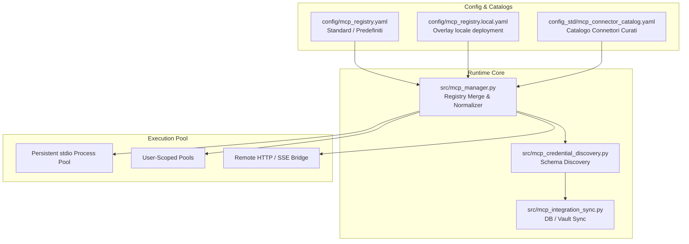
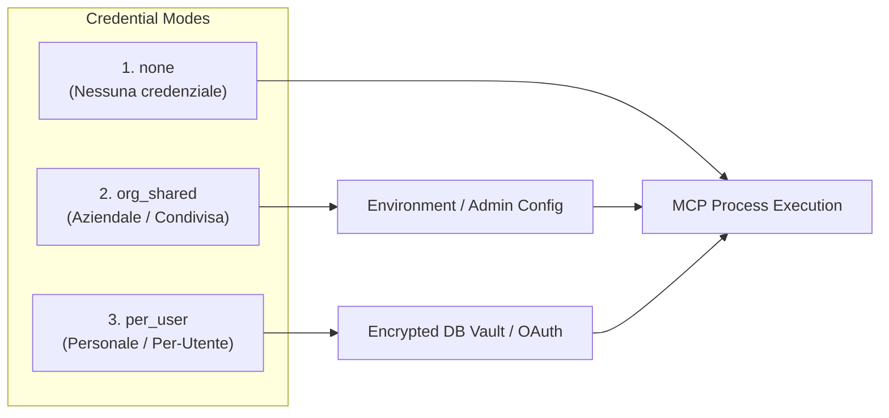

# Integrazioni MCP (Model Context Protocol)

**Model Context Protocol (MCP)** è lo standard aperto adottato da AION per connettere l'agente a strumenti esterni, API, database, workspace di codice e servizi SaaS (GitHub, Google Workspace, Microsoft 365, Postgres, ClickUp, e molti altri).

Grazie all'architettura modulare di AION, i server MCP operano come processi esterni isolati dal runtime principale dell'agente, garantendo **sicurezza**, **sandboxing**, **scalabilità** e **interoperabilità** immediata con l'ecosistema MCP (compatibilità con Claude Desktop, Cursor e VS Code).

---

## 1. Architettura e Registry System

AION adotta un pattern **Base + Local Overlay** con gestione a doppio registro (`YAML` e `JSON`).



### Struttura dei File di Configurazione

1. **`config/mcp_registry.yaml` (Base)**:
   - Contiene i server MCP built-in e standard (es. `session_sandbox`, `ocr`, `skills_hub`, `prometheus`, `grafana`, `query_memory`).
   - Il template di riferimento committed risiede in `config_std/mcp_registry.yaml`.

2. **`config/mcp_registry.local.yaml` (Local Overlay Flat)**:
   - Configurazione specifica dell'installazione locale (non committata in git).
   - Le voci definite qui sovrascrivono o arricchiscono il registry base.

3. **`config/mcp_registry.local.json` (Local Overlay Standard)**:
   - Supporta il formato nativo `{"mcpServers": { ... }}` compatibile al 100% con Claude Desktop, Cursor e Smithery.

4. **`config_std/mcp_connector_catalog.yaml` (Catalogo Connettori)**:
   - Fonte di verità per connettori pronti all'uso con metadata di autenticazione, descrizioni, categorie e template di configurazione.

---

## 2. Modalità di Installazione degli MCP

AION offre diverse modalità di installazione per soddisfare qualsiasi scenario, dalla UI grafica all'inclusione manuale in codice.

### A. Installazione da MCP Hub (Admin UI)

All'interno dell'interfaccia **Admin Dashboard → MCP Hub**:

1. **Catalogo Curato**: Sfoglia l'elenco dei connettori certificati (GitHub, Slack, PostgreSQL, Notion, ecc.) e clicca su **Install**.
2. **Marketplace Search**: Cerca pacchetti pubblici su npm, PyPI o Smithery. Il backend clona o scarica il pacchetto e ne normalizza automaticamente l'entrypoint.
3. **Remote Endpoint**: Aggiungi un server MCP remoto ospitato via URL (HTTP o SSE).

```http
POST /admin/mcp/install-from-catalog?connector_id=github
POST /admin/market/install
POST /admin/market/install-remote
```

### B. Normalizzazione Automatica degli Entrypoint

Quando si installa un pacchetto dal marketplace (`src/mcp_registry_normalize.py`), AION rileva automaticamente come eseguire il processo:

- **Python**:
  - Se è presente `pyproject.toml`, usa `uv run --directory <dir> <script> stdio` o cerca l'eseguibile compilato in `.venv/Scripts/` o `.venv/bin/`.
  - Se è un pacchetto PyPI puro, usa `uvx <package>@latest stdio`.
  - Se è presente `requirements.txt`, esegue con l'interprete Python configurato (`python3 server.py`).
- **Node.js / TypeScript**:
  - Compila o esegue file `build/index.js`, `index.ts` (con `tsx` o `bun`), o `package.json` scripts.
- **Docker**:
  - Può eseguire container MCP isolati tramite `docker run -i --rm ...`.

### C. Configurazione Manuale in `mcp_registry.local.yaml`

È possibile aggiungere o personalizzare manualmente qualsiasi server MCP inserendolo in `config/mcp_registry.local.yaml`:

```yaml
# Esempio: Server locale via uvx (Python)
mcp_postgres:
  command: "uvx"
  args:
    - "mcp-server-postgres@latest"
    - "stdio"
  env:
    POSTGRES_URL: "${POSTGRES_CONNECTION_STRING}"
  description: "Connettore database PostgreSQL"

# Esempio: Server Node.js via npx
mcp_github:
  command: "npx"
  args:
    - "-y"
    - "@modelcontextprotocol/server-github"
  env:
    GITHUB_PERSONAL_ACCESS_TOKEN: "${AION_USER_GITHUB_TOKEN}"
  description: "Gestione issue, PR e repository GitHub"

# Esempio: Server Remoto SSE / HTTP
mcp_remote_saas:
  command: "remote"
  url: "https://mcp.internal.company.com/sse"
  auth_type: "bearer"
  env:
    BEARER_TOKEN: "${INTERNAL_MCP_TOKEN}"
  description: "Microservizi interni aziendali"
```

---

## 3. Modalità di Esecuzione e Ciclo di Vita (Runtime Modes)

AION include un runtime avanzato per garantire latenze sub-millisecondo ed evitare l'overhead di avvio continuo dei processi per ogni richiesta.

### 1. Persistent stdio Pool (`AION_MCP_POOL=1`)
- **Default attivo**. I processi MCP stdio vengono avviati e mantenuti attivi in un pool persistente a livello di processo.
- **Auto-Recovery**: In caso di crash o interruzione del sottoprocesso, il pool effettua un riavvio automatico trasparente al successivo utilizzo.
- **Multi-Worker Safety**: Il backend AION opera in modalità `workers: 1` per preservare lo stato in-memory del pool.

### 2. Ambito dei Processi (Process Scoping)

| Ambito | Configurazione / Trigger | Descrizione |
|---|---|---|
| **Global / Shared Pool** | Standard per tool stateless o a credenziale condivisa | I tool sono condivisi tra le sessioni per massimizzare il riuso della memoria |
| **Session-Scoped** | `AION_MCP_SESSION_SCOPED_SERVERS` (es. `session_sandbox`, `ocr`, `promo_render`, `skills_hub`) | Un processo isolato viene istanziato specificamente per ciascun `session_id`. Ha accesso alla sandbox filesystem della sessione |
| **User-Scoped Pool** | `AION_MCP_USER_POOL=1` | Pool indicizzato per `(user_id, tenant_id)`. Consente l'isolamento sicuro in ambienti multi-tenant quando gli utenti utilizzano proprie credenziali personali |

### 3. Rilevamento Compatibilità SDK MCP (`mcp<2` vs `mcp>=2`)
AION analizza a runtime i metadata `requires-dist` dei pacchetti PyPI per stabilire se il pacchetto richiede il nuovo SDK `mcp>=2` o la versione precedente `mcp<2` (FastMCP legacy), iniettando automaticamente i flag di compatibilità corretti in `uvx`.

---

## 4. Gestione Credenziali e Autenticazione

AION supporta tre modelli di gestione credenziali configurabili per ciascun server MCP (`src/mcp_integration_sync.py`):



### Modalità Credenziali (`credential_mode`)

1. **`none`**:
   - Nessuna chiave o credenziale richiesta (es. server di utilità locali, calcolo, documentazione).
2. **`org_shared`**:
   - Una sola credenziale a livello di istanza o tenant (es. database condiviso, account bot Slack aziendale, token Grafana/Prometheus).
   - Viene fornita tramite variabili d'ambiente globali (`.env`) o configurata dall'Admin nel pannello.
3. **`per_user`**:
   - Ciascun utente della chat deve autenticarsi o inserire la propria API Key / Personal Access Token (PAT).
   - I dati vengono memorizzati cifrati nel database unificato (`data/aion.db`).

### Autenticazione OAuth 2.0 per Server Remoti
Per servizi come **Google Workspace**, **Microsoft 365 / SharePoint** e **GitHub Copilot**, AION supporta flussi OAuth 2.0 completi:
- L'utente esegue il login direttamente dalla Chat UI cliccando su «Accedi con [Servizio]».
- I refresh token vengono rinnovati automaticamente in background.
- Non è richiesto all'utente finale di generare o copiare token manuali.

### Runtime Env Aliases e Placeholder Substitution
AION supporta la sintassi `${VAR_NAME}` in tutti i file YAML. Inoltre, tramite `runtime_env_aliases`, il sistema mappa automaticamente nomi alternativi di variabili richiesti da pacchetti MCP eterogenei:

```yaml
# Mappa automatica se il pacchetto richiede GITHUB_PERSONAL_ACCESS_TOKEN ma l'utente ha configurato GITHUB_TOKEN
runtime_env_aliases:
  GITHUB_PERSONAL_ACCESS_TOKEN:
    - GITHUB_TOKEN
    - GH_TOKEN
```

---

## 5. Assegnazione dei Tool ai Profili Agente

Gli MCP registrati possono essere associati selettivamente ai diversi **Profili Agente** (`config/profiles/*.yaml`):

```yaml
name: DevOps Assistant
description: Agente specializzato in infrastruttura e monitoring
model: gpt-4o

# Tool built-in Haystack
tools:
  - web_search
  - execute_command

# Server MCP attivi per questo profilo
mcp_servers:
  - session_sandbox
  - mcp_postgres
  - prometheus
  - grafana
```

Quando l'utente seleziona il profilo nella Chat UI, l'agente carica solo il set di tool associato, riducendo l'ingombro del context window del modello e prevenendo chiamate a strumenti non pertinenti.

---

## 6. Diagnostica e Troubleshooting

### Strumento di Diagnosi CLI
Per verificare lo stato di tutti i server MCP configurati, è disponibile uno script dedicato:

```bash
# Esegui la diagnosi di tutti i server MCP
python -m src.diagnose_mcp
```

### Checklist Risoluzione Problemi

| Sintomo | Causa Probabile | Soluzione |
|---|---|---|
| `Tool not found` o non listato | Server non abilitato nel profilo attivo | Verificare la lista `mcp_servers` nel profilo in `config/profiles/<profilo>.yaml` |
| Errore `spawn ENOENT` o `command not found` | `uv`, `uvx`, `node` o `npx` non presenti nel PATH | Assicurarsi che Node.js e `uv` siano installati nel sistema / container |
| Errore credenziali mancanti | Variabile d'ambiente non valorizzata o credenziale utente assente | Verificare le variabili nel file `.env` o richiedere all'utente di inserire la chiave in Chat UI |
| Timeout di avvio processo | Download o compilazione pacchetto lenta al primo avvio | Il primo avvio di pacchetti via `npx` o `uvx` può richiedere alcuni secondi per il download |
| Errore connessione server remoto | Endpoint SSE/HTTP non raggiungibile o certificato non valido | Utilizzare l'endpoint di test `POST /admin/mcp/probe-remote` per verificare la connettività |

---

## Documentazione Correlata

- [Registry MCP - Filosofia e Design](../mcp/registry.md)
- [Catalogo Connettori Curati](../mcp/connector-catalog.md)
- [Isolamento Utente e Credenziali](../mcp/user-isolation-and-credentials.md)
- [Orchestrazione e Ciclo di Vita](../mcp/orchestration.md)
