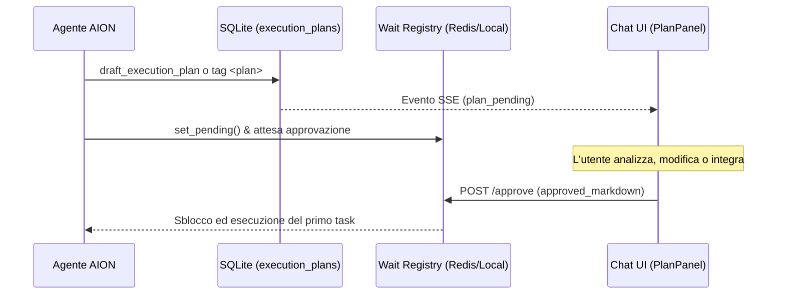

# Orchestrazione MCP, Task Graph e HITL

L'architettura di orchestrazione di AION introduce un sistema centralizzato per la pianificazione, la tracciabilità e la validazione interattiva (Human-in-the-Loop - HITL) dei flussi di lavoro complessi dell'agente.

---

## 1. Modelli Dati & Protocollo

I contratti e i modelli del grafo di esecuzione sono definiti in Pydantic v2 all'interno di [protocol.py](src/a2a/protocol.py):

*   **`TaskStatus`**: Enum che definisce il ciclo di vita di un singolo task:
    *   `pending`: In attesa che le dipendenze vengano risolte.
    *   `ready`: Dipendenze completate, pronto per essere eseguito.
    *   `running`: Attualmente in esecuzione.
    *   `completed`: Completato con successo.
    *   `failed`: Esecuzione fallita.
    *   `skipped`: Saltato a causa di fallimenti a monte o modifiche al piano.
*   **`ExecutionTask`**: Rappresenta un nodo del grafo con:
    *   `id`: Identificativo univoco autogenerato (es. `task_01`).
    *   `title`: Titolo descrittivo dell'azione atomica da compiere.
    *   `description`: Dettagli operativi, vincoli o criteri di accettazione del task.
    *   `depends_on`: Lista di ID di task da cui dipende. Il modello impedisce auto-dipendenze (`_no_self_dep`).
    *   `target_profile`: Nome dell'agente specializzato a cui delegare il task (opzionale).
    *   `status`: Stato corrente (`TaskStatus`).
*   **`ExecutionPlan`**: Contenitore del grafo che valida:
    *   L'assenza di ID duplicati tra i task.
    *   La risoluzione delle dipendenze (nessuna dipendenza verso task inesistenti).
    *   L'assenza di cicli nel grafo tramite algoritmo DFS (`_graph_consistent`).

---

## 2. Single Source of Truth (SSOT)

Il markdown del piano e lo stato di avanzamento delle checkbox **non risiedono nel workspace** come file fisici `execution_plan_*.md`. 

L'unica fonte di verità (SSOT) è il database relazionale SQLite (`data/aion.db`):

*   **Tabella `execution_plans`**: Mappata in [models.py](src/data/models.py#L326-L344) come `ExecutionPlanRecord`. Registra la cronologia, le revisioni incrementali, il markdown (sia bozza che approvato), le annotazioni utente e i todo strutturati.
*   **Pipeline & Artifacts**: Quando l'agente emette o modifica il piano nel tag `<plan>`, l'evento nel pipeline viene marcato con `saved: false` e `storage_key: orchestration://{plan_id}` (invece di salvare file nel workspace).
*   **Visualizzazione**: La sidebar (`TaskPlanManagerV4`) fa poll sul database e visualizza lo stato corrente ripristinandolo in caso di refresh della pagina. L'agente legge lo stato solo con `get_execution_plan()` e con l'output di `mark_task_completed()`.

---

## 3. Tool di Orchestrazione In-Process

Questi tool sono **built-in** per ogni profilo e registrati in-process tramite `merge_builtin_orchestration_tools()` in [main.py](src/main.py#L830). Eseguono in-process per garantire la coerenza tra lo stato HITL e i canali SSE di `chat-ui`:

1.  **`draft_execution_plan(goal, tasks)`**:
    Genera un piano di esecuzione in stato di bozza nel DB, inviando una notifica SSE `orchestration_plan_pending` e registrandolo nel Wait Registry.
2.  **`list_session_execution_plans(limit)`**:
    Elenca i piani di esecuzione registrati per la sessione corrente indicando quale sia il piano attivo.
3.  **`get_execution_plan(plan_id)`**:
    Recupera la bozza o il piano approvato in formato Markdown e lo stato di completamento di ciascun task direttamente dal database.
4.  **`update_execution_plan(plan_id, plan_markdown)`**:
    Consente all'agente o all'utente di sovrascrivere l'intero markdown del piano (es. per modificare i task o aggiungere passaggi di remediation a seguito di errori).
5.  **`mark_task_completed(plan_id, task_id)`**:
    Segna un task come completato (spuntando la checkbox `- [x]` nel markdown salvato sul DB). Ha un guard integrato per cui l'agente può eseguire una sola chiamata con successo per turno.

---

## 4. Flusso HITL e Wait Registry

Il flusso di approvazione garantisce la validazione umana prima dell'esecuzione di codice o azioni mutanti:

*   **Attesa Attiva**: Quando l'agente crea o aggiorna una bozza di piano, il thread di esecuzione attende che lo stato nel Wait Registry cambi da `pending` a `approved` o `rejected`.
*   **Wait Registry**: Implementato in [plan_wait_registry.py](src/runtime/plan_wait_registry.py). Si appoggia a Redis o a una coda in-memory locale (`LocalFallback`) se `AION_REDIS_FALLBACK_LOCAL=1` è configurato.
*   **Timeout**: Gestito dalla variabile `AION_ORCH_PLAN_WAIT_TIMEOUT_SEC` (default 600 secondi). Se scade, il piano viene marcato come `timeout` e l'esecuzione interrotta.

---

## 5. API Interne di Orchestrazione

Il router `src/api/orchestration.py` espone gli endpoint sotto il prefisso `/internal/orchestration`:

*   `GET /sessions/{session_id}/plans`: Elenca tutti i piani registrati per la conversazione.
*   `GET /plans/{plan_id}?session_id={session_id}`: Restituisce lo stato, la revisione e il markdown del piano specificato.
*   `POST /plans/{plan_id}/approve`: Approva il piano. Supporta l'invio del markdown modificato (`approved_markdown`), annotazioni e todo strutturati. Sveglia l'agente inviando un evento SSE ed enucleando la prima task pendente.
*   `POST /plans/{plan_id}/reject`: Rifiuta il piano inserendo la motivazione fornita dall'utente.
*   `POST /plans/{plan_id}/tasks/{task_id}/complete`: Marca manualmente una checkbox come completata dall'interfaccia.
*   `POST /plans/{plan_id}/tasks/complete-all`: Marca tutte le task aperte come completate.

### Sicurezza e Autenticazione delle API

L'accesso alle API interne è regolato da due livelli in `orchestration_auth`:

1.  **JWT Bearer Token (`Authorization`)**: Utilizzato da `chat-ui` per le richieste degli utenti. Il backend convalida che la sessione appartenga all'utente loggato confrontando `user_id` con la tabella `conversations`.
2.  **Secret Interno (`X-AION-Orch-Secret`)**: Utilizzato per comunicazioni server-to-server o background job. Abilitato impostando `AION_ORCHESTRATION_SECRET_AUTH=1` e confrontando l'header con il segreto configurato in `AION_ORCHESTRATION_INTERNAL_SECRET`.

---

## 6. Sub-agent e Delega (Sotto Sviluppo Attivo)

> [!WARNING]
> Il modulo dei Sub-agent (`aion_subagents` e le funzioni di delega come `delegate_task` / `delegate_to_subagent`) **non è attualmente funzionante ed è in fase di sviluppo attivo**. Non deve essere configurato o utilizzato in ambienti di produzione.

### Architettura Prevista per i Sub-agent

Il design originario dei sub-agent prevede un'architettura di isolamento a cascata:

*   **Punto di Ingresso**: Gestito da `delegate_to_subagent_async` in [delegate_subagent.py](src/runtime/delegate_subagent.py), che a sua volta invoca `run_subagent_task` in [subagent_orchestrator.py](src/runtime/subagent_orchestrator.py).
*   **Sessioni Figlie**: Ogni delega crea una sessione isolata temporanea identificata come `sub_{profile_slug}_{uuid}`.
*   **Copia dei File**: I file caricati dall'utente nella sessione padre (sotto `uploads/`) vengono copiati automaticamente nella cartella della sessione figlia prima dell'avvio del sub-agente (funzione `sync_parent_uploads_to_child` in [session_workspace.py](src/session_workspace.py#L213-L232)).
*   **Limitazioni Ambientali**: La sincronizzazione dei file tra sessioni padre e figlio è protetta da limiti massimi configurabili per prevenire l'esaurimento del disco (`AION_SUBAGENT_UPLOAD_SYNC_MAX_TOTAL_MB` e `AION_SUBAGENT_UPLOAD_SYNC_MAX_FILE_MB`).
*   **Integrazione**: Il risultato testuale del sub-agente viene condensato/tagliato in base a `AION_ORCH_DISTILL_MAX_CHARS` e restituito all'agente chiamante.

---

## 7. Variabili d'Ambiente Rilevanti

Di seguito sono elencate le variabili d'ambiente utilizzate per configurare l'orchestrazione e il comportamento HITL:

| Variabile | Valore Default | Descrizione |
| :--- | :--- | :--- |
| `AION_ORCHESTRATION_INTERNAL_SECRET` | `aion-orchestration-dev` | Segreto per autenticare le richieste server-to-server tramite header `X-AION-Orch-Secret`. |
| `AION_ORCHESTRATION_SECRET_AUTH` | `1` | Abilita (`1`) o disabilita (`0`) l'autenticazione tramite secret per le API interne. |
| `AION_ORCH_PLAN_WAIT_TIMEOUT_SEC` | `600` | Timeout massimo di attesa per l'approvazione umana (HITL). |
| `AION_ORCH_TOOL_TIMEOUT_SEC` | `900` | Timeout massimo per l'esecuzione in background di un tool di orchestrazione. |
| `AION_PLAN_MODE_TOOL_FIRST` | `1` | Forza l'agente a usare il tool `draft_execution_plan` anziché i tag XML `<plan>`. |
| `AION_PLAN_TEXT_PARSER` | `0` | Se impostato a `1`, abilita il fallback per il parsing dei piani in formato testo `<plan>...</plan>`. |
| `AION_PLAN_MODE_MAX_RESEARCH_TOOLS` | `2` | Numero massimo di tool di ricerca/lettura che l'agente può invocare prima di registrare un piano in Plan Mode. |
| `AION_PLAN_MODE_BLOCKED_TOOLS` | *(Vedi .env.example)* | CSV dei tool mutanti disabilitati durante la fase di pianificazione (Plan Mode). |
| `AION_REDIS_FALLBACK_LOCAL` | `0` | Se impostato a `1`, usa una coda locale in-memory invece di Redis per il Wait Registry (solo per sviluppo a singolo worker). |
| `AION_SUBAGENT_UPLOAD_SYNC_MAX_TOTAL_MB` | `50` | Limite massimo cumulativo di file trasferibili verso la sessione di un sub-agente. |
| `AION_SUBAGENT_UPLOAD_SYNC_MAX_FILE_MB` | `25` | Limite massimo per singolo file trasferibile verso la sessione di un sub-agente. |
| `AION_ORCH_DISTILL_MAX_CHARS` | — | Numero massimo di caratteri per condensare l'output di un sub-agente. |

---

## Documenti Correlati

*   [Registry MCP - Filosofia e Design](registry.md) - Informazioni sul caricamento e la configurazione dei server MCP.
*   [Plan Mode (tool-first)](../architecture/plan-execution-run-model.md) - Modalità operativa per la creazione dei piani da parte dell'agente.
*   [Plan execution — run model e activity feed](../architecture/plan-execution-run-model.md) - Dettagli sul monitoraggio in background dei piani e i canali di streaming.
