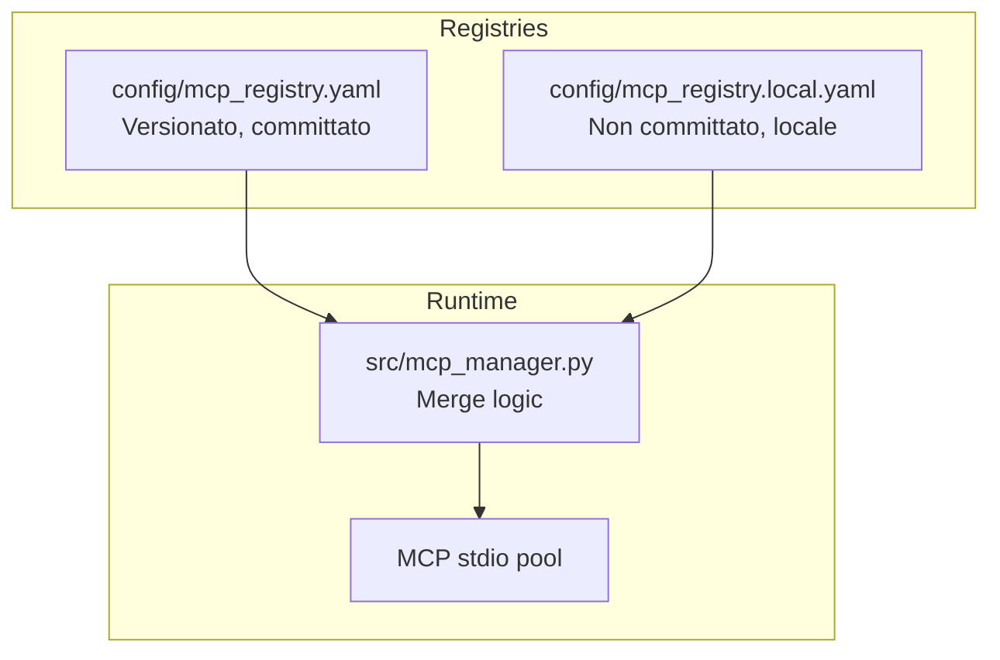
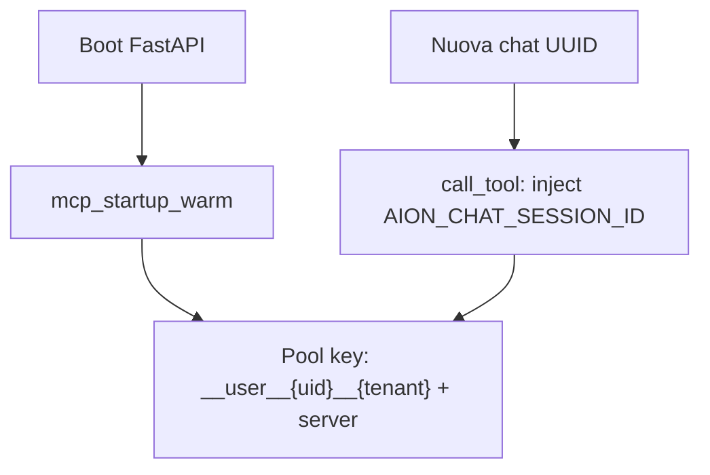

# Registry MCP - Logica Architetturale

## Perché MCP?

**MCP (Model Context Protocol)** è uno standard per l'integrazione di tool esterni con modelli LLM.

### Perché scegliere MCP?

| Motivo | Spiegazione |
|--------|-------------|
| **Standardizzazione** | MCP definisce un contratto standard per tool discovery, invece di scrivere wrapper personalizzati per ogni tool |
| **Separation of concerns** | I server MCP sono processi esterni, isolati dal runtime Python |
| **Scalabilità** | Nuovi tool aggiunti senza modificare il runtime principale |
| **Sicurezza** | Execution in sandbox isolata, non può influenzare il runtime principale |
| **Interoperabilità** | Compatibile con Claude Desktop, Cursor, altri client |

### Perché non usare direttamente Python functions?

**Problema:** Usare Python functions direttamente crea:
1. **Coupling:** I tool sono parte del runtime, non possono essere separati
2. **Security:** Execution diretto senza sandboxing
3. **Scalabilità:** Ogni nuovo tool richiede modifica del runtime

**Soluzione MCP:** Processi esterni comunicano via stdio/SSE, isolati dal runtime principale.

---

## Perché merge di registri?

### Base + Local Overlay pattern



### Perché due registri?

| Registro | Contenuto | Versionato | Scopo |
|----------|-----------|------------|-------|
| `mcp_registry.yaml` | Server standard (prometheus, grafana, etc.) | Template in `config_std/` | Copiato in `config/` al primo sync; **non** sovrascritto da `sync_config.py --force` |
| `mcp_registry.local.yaml` | Overlay flat (stile AION) | ❌ No | Specifico per deployment (es. `toolbox-mysql`) |
| `mcp_registry.local.json` | Overlay standard `{ "mcpServers": { ... } }` | ❌ No | Stesso merge del `.local.yaml`; formato Claude/Cursor/VS Code |

**Motivazione:**
1. **Base config committato:** Cambiamenti a server standard possono essere versionati e shared
2. **Local overlay non committato:** Configurazioni specifiche per deployment non devono essere committate
3. **Merge permette aggiornamenti:** Base può essere aggiornato senza perdere config locale

### Come funziona il merge

1. **Sovrascrittura completa:** Chiavi nel locale sovrascrivono completamente quelle del base
2. **Removal via `_removed`:** Lista di nomi server da escludere dal base
3. **Solo locale salvato:** `save_registry()` persiste solo il locale, non il base

```yaml
# config/mcp_registry.yaml (base)
prometheus:
  command: python
  args:
    - mcp_servers/prometheus/server.py
  env: {}

# config/mcp_registry.local.yaml (overlay)
mcp_servers:
  prometheus:  # Sovrascrive completamente
    command: python3
    args:
      - /custom/path/prometheus/server.py
    env:
      DEBUG: "1"

_removed:
  - legacy_rag  # Rimuove server dal base
```

---

## Perché pool stdio?

### Problema: Overhead di connessione

Ogni nuovo processo MCP stdio richiede avvio, handshake `initialize()` e `list_tools` — tipicamente **1–6 secondi per server** se ripetuto a ogni chat.

### Soluzione a tre livelli (default da v0.26+)

| Livello | Variabile | Comportamento |
|---------|-----------|---------------|
| **1. Pool** | `AION_MCP_POOL=1` | Non terminare il processo stdio dopo ogni tool call |
| **2. Pool utente** | `AION_MCP_USER_POOL=1` | Un worker per `(user_id, tenant, server)` **condiviso tra tutte le chat** |
| **3. Startup warm** | `AION_MCP_STARTUP_WARM=1` | Al boot API (`lifespan`), avvia handshake per i server dei profili configurati |



**Server session-scoped** (lista `AION_MCP_SESSION_SCOPED_SERVERS`, default include `session_sandbox`, `skills_hub`, `memory`, …): pool key `(chat_session_id, server)` anche con `AION_MCP_USER_POOL=1` — sandbox isolati per conversazione.

**Env inject legacy** (`AION_MCP_SESSION_ENV_INJECT`, default `0`): se `1`, muta `os.environ` nel parent prima di ogni `call_tool`. Preferire pool session-scoped + argomenti tool.

**Pre-chat dalla UI:** `POST /v1/chat/prepare` + polling `GET /v1/chat/prepare/status` riusano lo stesso pool (nessun respawn se il warm boot è già completato).

### Pool structure

- **Legacy** (`AION_MCP_USER_POOL=0`): `(chat_session_id, server_name)` — un processo per chat.
- **Default** (`AION_MCP_USER_POOL=1`): `(__user__{user}__{tenant}, server_name)` — processi caldi tra chat (eccetto server in `AION_MCP_SESSION_SCOPED_SERVERS`).
- **Bootstrap:** sessione sintetica `__bootstrap__` usata solo al warm boot per credenziali/HOME.

**Idle cleanup:** `AION_MCP_POOL_IDLE_SEC=0` (default) = worker mai spenti per inattività. Impostare `600` solo su ambienti con pochi MCP e RAM limitata.

---

## Variabili iniettate dal runtime

### Perché iniettare variabili?

I server MCP possono aver bisogno di contesto specifico per la sessione:

| Variabile | Scopo | Esempio |
|-----------|-------|---------|
| `AION_CHAT_SESSION_ID` | Identificatore sessione | `session_abc123` |
| `AION_CURRENT_PROFILE_SLUG` | Profilo corrente | `prometheus_specialist` |
| `AION_CURRENT_USER_ID` | Utente corrente | `user_456` |

**Perché iniettare:**
1. **Isolation:** Ogni sessione ha il proprio contesto
2. **Security:** Server non possono accedere ad altre sessioni
3. **Personalization:** Tool possono comportarsi diversamente per utente/profilo

### Come vengono iniettate

**Al spawn** (una volta per worker user-pool): credenziali MCP, `HOME` isolato, profilo di bootstrap.

**A ogni `call_tool`** (se `AION_MCP_SESSION_ENV_INJECT=1`): `AION_CHAT_SESSION_ID`, `AION_CURRENT_PROFILE_SLUG`, `AION_CURRENT_USER_ID`, `AION_CURRENT_TENANT_ID` — così `session_sandbox` e simili vedono la chat corrente senza un processo dedicato per UUID.

```python
# src/mcp_manager.py — spawn + inject per call
env = resolve_env_placeholders(server_env)
# call_tool: os.environ["AION_CHAT_SESSION_ID"] = conversation_id (restore dopo la call)
```

Vedi anche `docs/mcp/user-isolation-and-credentials.md` per `${AION_USER_*}`.

**Processo:**
1. Load env from YAML config
2. Inject runtime variables
3. Resolve `${VAR}` placeholders from environment
4. Pass to subprocess

---

## Security model

### Perché MCP process isolato?

**Rischio:** Un tool MCP può:
1. Leggere file sensibili
2. Eseguire comandi arbitrari
3. Accedere dati di altre sessioni

**Mitigazione:**
1. **Container jail (prod):** `session_sandbox` MCP worker runs in a Podman container with only `data/sessions/<id>/` mounted at `/session` (see [Session isolation](../security/session-isolation.md))
2. **Env scrubbing:** Subprocess tools use minimal env (`src/security/session_env.py`); secrets stripped from child processes
3. **Session isolation:** One MCP worker (and container) per chat session when `AION_MCP_SESSION_SCOPED_SERVERS` includes `session_sandbox`
4. **Network:** Container default `--network=none`; pip/npm enable `slirp4netns` only when install flags are on
5. **No shared state:** MCP workers do not share filesystem outside their session mount

### Sandbox per session

```python
# src/session_workspace.py
# Host: data/sessions/{session_id}/
# Container: mounted flat at /session (AION_SANDBOX_FLAT_SESSION_ROOT=1)
```

**MCP tool execution:** Tools access only the current session workspace. In container mode the host `.env`, DB, and other sessions are not mounted.

### Container mode

Enable with:

```bash
AION_SANDBOX_BACKEND=container
AION_CONTAINER_RUNTIME=podman
AION_SANDBOX_CONTAINER_IMAGE=aion/sandbox:latest
AION_SANDBOX_MCP_JAIL=1
AION_SANDBOX_FAIL_CLOSED=1
```

Build image: `docker compose --profile sandbox-build build sandbox`

Deploy details: [Podman sandbox deploy](../deployment/podman-sandbox.md)

### Approval system

**Implementation:** `src/security/approval_manager.py` (stub: critical tools return `ask` action)

**Critical tools include:** `sandbox_run_python_file`, `sandbox_execute_python`

**Status:** HITL wiring is partial; full UI approval is future work.

---

## Import configurazioni esterne

### Perché supportare import?

**Scenario:** Utenti possono avere configurazioni MCP da:
1. **Claude Desktop** (JSON format)
2. **Cursor** (JSON format)
3. **Altri client MCP** (format variations)

**Problema:** Convertire manualmente queste configurazioni in YAML è complesso.

**Soluzione:** `python -m src.mcp_import` converte automaticamente.

### Import process

```bash
# Convert Claude Desktop config to local MCP registry
python -m src.mcp_import --input /path/to/claude_desktop_config.json
```

**Options:**
| Flag | Scopo |
|------|-------|
| `--output` | Output file path (default: `config/mcp_registry.local.yaml`) |
| `--format` | `yaml` (flat) o `json` (`mcpServers`, consigliato per server remoti/npx) |
| `--dry-run` | Preview conversion without writing |
| `--replace` | Replace local registry instead of merging |

**Accepted input formats:**
- `mcpServers` (Claude Desktop, Claude Code, Cursor)
- `servers` (VS Code Copilot `mcp.json`)
- `mcp.servers` (varianti annidate)

**Runtime:** AION carica `config/mcp_registry.yaml` + opzionale `config/mcp_registry.json`, poi merge con `mcp_registry.local.yaml` e/o `mcp_registry.local.json` (`src/mcp_registry_io.py`).

**Sync:** `python scripts/sync_config.py --force` **non** sovrascrive i file `mcp_registry*.yaml/json` in `config/` (overlay locale preservato). Template: `config_std/mcp_registry.local.json.example`.

### Esempio conversione

**Input (Claude Desktop JSON):**
```json
{
  "mcpServers": {
    "prometheus": {
      "command": "python",
      "args": ["mcp_servers/prometheus/server.py"],
      "env": {}
    }
  }
}
```

**Output (local JSON, standard mercato):**
```bash
python -m src.mcp_import -i claude_desktop_config.json -o config/mcp_registry.local.json
```

```json
{
  "mcpServers": {
    "prometheus": {
      "command": "python",
      "args": ["mcp_servers/prometheus/server.py"],
      "env": {}
    }
  }
}
```

**Output (local YAML flat, opzionale):** stesso contenuto senza wrapper `mcpServers`.

---

## Server inclusi nel repository

### Server stdio (eseguiti localmente)

| Server | Directory | Scopo |
|--------|-----------|-------|
| `prometheus` | `mcp_servers/prometheus/` | Query Prometheus metrics |
| `grafana` | `mcp_servers/grafana/` | Access Grafana dashboards |
| `charts` | `mcp_servers/charts/` | Interactive chart generator (Line, Area, Bar) |
| `memory` | `mcp_servers/query_memory/` | Session search (FTS) |
| `mempalace` | — (package python) | Hierarchical long-term memory (facts & context) |
| `skills_hub` | `mcp_servers/skills_hub/` | Skill search, list, view |
| `code` | `mcp_servers/code_executor/` | Execute code in sandbox |
| `session_sandbox` | `mcp_servers/session_sandbox/` | Session workspace operations |
| `ocr` | `mcp_servers/ocr_mcp/` | OCR processing |
| `promo_render` | `mcp_servers/promo_render/` | Promotional graphics React/HTML → PNG |
| `agent_db` | `mcp_servers/agent_db/` | Agent SQLite database for structured memory |
| `aion_subagents` | `mcp_servers/aion_subagents/` | Delegate tasks to isolated subagents |

**`session_sandbox`:** `sandbox_list_files`, `sandbox_read_text_file`, **`sandbox_write_workspace_file`** (only `workspace/`), **`sandbox_edit_workspace_file`** (surgical replace), **`sandbox_apply_patch`** (OpenCode-style multi-file hunks), **`sandbox_install_npm_packages`** / **`sandbox_install_python_packages`** (session venv; gated by `AION_SANDBOX_ALLOW_*`; `AION_SANDBOX_NPM_MAX_PACKAGES` caps npm installs), `sandbox_run_python_file` (`workspace/*.py`), **`sandbox_run_node_file`** (`workspace/*.js` for docx-js; requires Node / `AION_NODE_PATH`). `sandbox_execute_python` is **permanently disabled** — use write + run file. Subprocess **cwd = session root**; Python from session `.venv` when `AION_SANDBOX_AUTO_VENV=1`. Isolation: **`AION_SANDBOX_BACKEND=subprocess`** (Landlock confinement when `AION_SANDBOX_SUBPROCESS_CONFINE=1`) in dev, **`container`** (Podman per session, see [Session isolation](../security/session-isolation.md)) in production. File delivery is tool-first (no `<aion_artifact>` in chat stream); see [Agent pipeline](../api-and-runtime/agent-pipeline.md#tool-first-file-delivery-opencode-style).

### Server SSE (remoti)

| Server | Type | Scopo |
|--------|------|-------|
| `khub_rag` | `sse` | Advanced semantic search in company docs (RAG) |
| `mem0` | `sse` | External memory service bridge |
| `mempalace` (remote) | `sse` | Long-term memory (alternative external service endpoint) |

**Nota:** Server SSE non richiedono avvii locali, solo URL configurato.

---

## Troubleshooting

### "MCP server non viene rilevato"

**Possible causes:**
1. Server non esiste in registry
2. Server rimosso via `_removed`
3. Path al server errato

**Check:**
```python
# Debug: list registered servers
from src.mcp_manager import mcp_manager
print(mcp_manager.list_servers())
```

### "MCP server non avvia"

**Possible causes:**
1. Path al processo errato
2. Permessi di esecuzione mancanti
3. Dipendenze mancanti

**Check:**
```bash
# Test manual launch
python mcp_servers/prometheus/server.py
```

### "Tool discovery fails"

**Possible causes:**
1. Processo MCP non risponde all'handshake
2. Timeout troppo breve
3. Processo crashato

**Check:**
```python
# Test connection
from src.mcp_manager import mcp_manager
tools = await mcp_manager.list_tools("prometheus")
```

---

## Configurazione completa

### File registry di esempio

```yaml
# config/mcp_registry.yaml (base)

prometheus:
  command: python
  args:
    - mcp_servers/prometheus/server.py
  env: {}

grafana:
  command: python
  args:
    - mcp_servers/grafana/server.py
  env: {}

mempalace:
  type: sse
  url: http://mempalace:8080/sse
  env:
    API_KEY: "${MEMPALACE_API_KEY}"

_removed:
  - deprecated_server
```

```yaml
# config/mcp_registry.local.yaml (overlay)

prometheus:
  command: python3
  args:
    - /custom/path/prometheus/server.py
  env:
    DEBUG: "1"

custom_server:
  command: python
  args:
    - mcp_servers/custom_server/server.py
  env: {}
```

---

## Variabili ambiente MCP

| Variabile | Default | Scopo |
|-----------|---------|-------|
| `AION_MCP_POOL` | `1` | Pool stdio persistente (obbligatorio per warm) |
| `AION_MCP_USER_POOL` | `1` | Worker condivisi per utente/tenant tra chat |
| `AION_MCP_SESSION_ENV_INJECT` | `0` (code) / `1` (env) | Inietta sessione/profilo a ogni `call_tool` |
| `AION_MCP_SESSION_SCOPED_SERVERS` | `session_sandbox,promo_render,ocr_mcp,skills_hub,memory,aion_subagents` | Server con pool per chat session (sandbox isolati anche con `AION_MCP_USER_POOL=1`) |
| `AION_MCP_STARTUP_WARM` | `1` | Warm MCP al boot API |
| `AION_MCP_STARTUP_WARM_ASYNC` | `0` | `1` = warm in background (healthcheck prima del warm) |
| `AION_MCP_STARTUP_WARM_PROFILES` | `aion_std,generic_assistant` | CSV profili, o `*` = tutti |
| `AION_MCP_STARTUP_WARM_ALL` | `0` | `1` = tutti gli stdio nel registry |
| `AION_MCP_STARTUP_WARM_USER_ID` | `default` | Utente per credenziali al boot |
| `AION_MCP_STARTUP_WARM_USER_IDS` | — | CSV di utenti per cui pre-riscaldare il pool MCP |
| `AION_MCP_POOL_IDLE_SEC` | `0` | Secondi prima di kill worker inattivi (`0` = mai) |
| `AION_MCP_USER_POOL_IDLE_CLEANUP` | `0` | `1` = applica idle cleanup anche ai worker user-pool (default 0 = sempre caldi) |
| `AION_MCP_WARM_TIMEOUT_SEC` | `20` | Timeout warm per server in `warm_session` |
| `AION_MCP_WARM_FAIL_COOLDOWN_SEC` | `600` | Cooldown prima di ritentare warm-up dopo un fallimento |
| `AION_MCP_WARM_RETRY_TIMEOUT_SEC` | `3` | Timeout sui retry dopo il primo fallimento |
| `AION_MCP_LIST_TOOLS_TIMEOUT_SEC` | `30` | Timeout discovery tool in `get_agent` |
| `AION_MCP_REGISTRY_PATH` | `config/mcp_registry.yaml` | Path registry base |
| `AION_MCP_REGISTRY_LOCAL_PATH` | Auto | Path overlay locale |
| `AION_MCP_TOOL_RESULT_TIMEOUT` | `120` | Timeout per tool execution |
| `AION_MCP_INIT_TIMEOUT` | `60` | Handshake `initialize()` stdio |
| `AION_MCP_WORKER_SHUTDOWN_TIMEOUT` | `15` | Timeout per shutdown worker |
| `AION_MCP_USER_HOME_ISOLATION` | `1` | Isola HOME/XDG per processo MCP (consigliato in multi-utente) |
| `AION_MCP_USER_CREDENTIALS` | `0` | Abilita credential store per-utente (`${AION_USER_*}`) e API /v1/integrations |
| `AION_MCP_ADVISE_TIMEOUT` | `120` | Timeout consigli AI wizard in MCP Hub |
| `AION_MCP_ADVISE_MAX_TOKENS` | `16480` | Max token di output consigli AI wizard in MCP Hub |
| `AION_MCP_ADVISE_DISABLE_REASONING` | `1` | `1` = disabilita il reasoning LLM per la generazione dei consigli |

---

## Documenti correlati

- [Albero dei sorgenti](../architecture/source-tree.md) - Struttura directory
- [Variabili ambiente](../configuration/environment.md) - Configurazioni
- [Profili agente](../configuration/profiles.md) - Come i profili usano MCP servers
- [Orchestrazione e HITL](./orchestration.md) — `mark_task_completed` built-in su tutti i profili; server `orchestration` (`type: in_process`), approve API, UI TaskPlanManager
