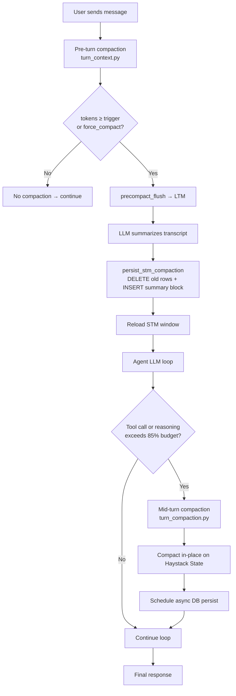

# Context Compaction

When a conversation grows long enough to approach the LLM's token window limit, AION automatically **compacts** it: old messages are summarized into a single compact block and the originals are deleted from the database, while the most recent messages are preserved intact.

This mechanism has two independent levels that can both activate in the same turn.

---

## Overview



---

## Level 1 — Pre-Turn Compaction

Runs **before** every turn, as part of `build_turn_context()` in [`turn_context.py`](../../src/runtime/turn/turn_context.py).

### Activation threshold

| Env var | Default | Meaning |
|---|---|---|
| `AION_MODEL_MAX_CONTEXT` | `131072` | Model total context window (tokens) |
| `AION_CONTEXT_COMPRESS_THRESHOLD` | `0.5` | Trigger fraction of window (e.g. 65,536 tokens) |
| `AION_CONTEXT_COMPRESS_KEEP_LAST` | `6` | Messages to preserve intact at the tail |
| `AION_CHAT_MAX_TOKENS` | `8192` | Output budget subtracted from max prompt |
| `AION_CONTEXT_COMPRESS_ENABLED` | `1` | Enable/disable pre-turn compaction |
| `AION_CONTEXT_COMPRESS_PERSIST` | `1` | Persist the compacted block to the DB |
| `AION_CONTEXT_COMPRESS_MAX_ROUNDS` | `3` | Max in-memory compression rounds |

Compaction activates if:
```
total_tokens >= trigger  OR  total_tokens >= max_prompt
```
It also activates unconditionally when `force_compact=True` (set by the `/compact` slash command via Redis).

### Step-by-step flow

1. **Token estimation** — `estimate_full_prompt_tokens()` calculates total tokens (messages + system overhead).
2. **Threshold check** — compares against `trigger` and `max_prompt` or the Redis force-compact flag.
3. **SSE notification** — emits `context_compacting { active: true }` to the client so the UI shows a loading indicator.
4. **DB-first path** (preferred):
   - `fetch_messages_for_compaction()` retrieves all rows from the DB **except** the last `keep_last_n`, enriched with `timeline_json`, `reasoning`, and `tool_name`.
   - `precompact_flush()` writes extracted facts to **LTM (MemPalace)** before deletion so information is not lost.
   - The LLM generates a summary via `summarize_transcript()`.
   - `persist_stm_compaction()` executes:
     - `DELETE` of old messages
     - `INSERT` of a single compacted block at `seq = min_seq_tail - 1`
   - `_reload_stm_window()` fetches the refreshed window from the DB.
5. **In-memory fallback** (if DB is empty): `compress_until_fits()` loops up to `max_rounds`, replacing the head with a summary and keeping the tail.
6. **SSE notification** — emits `context_compacting { active: false }`.

### What is preserved — precompact_flush and LTM

Before deletion, [`ltm_orchestrator.precompact_flush()`](../../src/memory/ltm_orchestrator.py) runs `extract_and_persist()` in `batch` mode. This:
- Sends the transcript to the LLM for structured fact extraction (entities, decisions, errors, file names).
- Writes the extracted facts permanently into **MemPalace** (the long-term memory store).
- Optionally calls the `mempalace_precompact_flush` MCP tool for custom server-side logic.

Individual messages may no longer exist in the `messages` table after compaction, but the agent can still access extracted information via its LTM retrieval tools.

---

## Level 2 — Mid-Turn Compaction

Runs **inside** the agent loop, between an LLM step and the next, triggered by callbacks in [`agent_pipeline.py`](../../src/agent_pipeline.py).

### Triggers

| Hook | When | What it does |
|---|---|---|
| `maybe_compact_after_tool()` | After every tool call | Truncates tool output + calls `compact_agent_messages_in_place()` |
| `maybe_compact_after_reasoning()` | After every reasoning chunk | Updates token estimate + calls `compact_agent_messages_in_place()` |

### `compact_agent_messages_in_place()` — how it works

Operates directly on the **Haystack agent State** object (accessed via `ContextVar`):

1. **Debounce** — enforces a minimum interval between consecutive mid-turn compactions (`AION_CONTEXT_COMPRESS_MID_TURN_MIN_SEC`, default 8 s).
2. **Token check** — calculates `total = msg_tokens + overhead`.
3. **Mid-turn threshold** — `mid_trigger = max_prompt × threshold_ratio` (default 85%).
4. **Guard** — if `total < mid_trigger AND total < compress_trigger` → skip.
5. **Summarization** — synchronous LLM call (`complete_text_sync()`, timeout 90 s) produces a summary of the head.
6. **In-place replacement** — `data["messages"] = system_msgs + [summary_msg] + tail`.
7. **Async DB persist** — schedules `_schedule_db_persist()` via `asyncio.run_coroutine_threadsafe`.
8. **SSE event** — emits `context_compacting` on the turn queue.

### Tool output truncation

Before considering mid-turn compaction, `maybe_compact_after_tool()` always truncates tool output:
```
cap = AION_TOOL_RESULT_MAX_CHARS  (default: 24,000 chars)
head = text[:cap//2]
tail = text[-(cap//4):]
note = "[AION: output {tool} troncato — N characters omitted…]"
```
Exception: `mempalace_*` tools and outputs smaller than 800 chars **do not trigger** compaction (only truncation).

### Mid-turn env vars

| Env var | Default | Meaning |
|---|---|---|
| `AION_CONTEXT_COMPRESS_MID_TURN` | `1` | Enable mid-turn compaction |
| `AION_CONTEXT_COMPRESS_MID_TURN_RATIO` | `0.85` | Threshold as fraction of `max_prompt` |
| `AION_CONTEXT_COMPRESS_MID_TURN_MIN_SEC` | `8` | Minimum seconds between compactions (debounce) |
| `AION_CONTEXT_COMPRESS_MID_TURN_TIMEOUT` | `90` | LLM call timeout for mid-turn summary |
| `AION_TOOL_RESULT_MAX_CHARS` | `24000` | Max chars per tool result before truncation |

---

## Manual Trigger — `/compact`

The slash command `/compact` ([`slash.py`](../../src/runtime/slash.py)):
1. Writes `force_compact:<conversation_id>` to Redis with TTL 600 s.
2. On the next user message, `redis_consume_force_compact()` reads and deletes the flag.
3. `force=True` is passed to `_apply_context_compression()`, making compaction run unconditionally regardless of token count.

---

## The Compaction Block

The block inserted into the DB and displayed in the UI has this structure:

```
[AION COMPACTION — contesto precedente sintetizzato] (N turni precedenti)
- The user asked to implement feature X...
- A bug was found in module Y and resolved...
- File utils.py was created...
```

The summary language is resolved by `resolve_compaction_language(user_id, db_lang)` and follows the user's conversation language (Italian, English, Spanish, French, German).

The `COMPACTION_MARKER` sentinel is used to:
- Skip already-compacted messages in `fetch_messages_for_compaction()` (prevents double compaction).
- Detect if the tail already contains a compacted block in `persist_stm_compaction()`.

---

## How to Verify Compaction Occurred

### 1. Backend logs (stdout)
Look for these lines in sequence in the server terminal:

```text
# Compaction triggered (e.g. by /compact)
CONTEXT ENHANCEMENT DEBUG - force_compact: True
>>> [CONTEXT] session=a846c38a total=19026 msg=370 overhead=18656 trigger=65536 max_prompt=114688 compact=YES

# DB rows read for summarization
context_compress db_start session=a846c38a rows=8 transcript_chars=1447

# After compaction — msg tokens reduced from 370 → 152
>>> [CONTEXT] session=a846c38a total=18808 msg=152 overhead=18656 trigger=65536 max_prompt=114688 compact=no
context_compress db_done session=a846c38a messages=5 total 19026→18808
```

For mid-turn compaction specifically:
```text
mid_turn_compact session=a846c38a messages 15→8 tokens 85000→12000
```

### 2. Chat UI (real-time)
During compaction the UI receives a `context_compacting` SSE event and shows a brief **"Compacting context…"** shimmer on the agent status indicator.

After the turn completes, scroll to the top of the chat: old individual messages are replaced by a single summary block starting with `[AION COMPACTION — contesto precedente sintetizzato]`.

### 3. SQLite database
Query `data/aion.db` directly:
```sql
SELECT role, content
FROM messages
WHERE conversation_id = '<your-session-id>'
ORDER BY seq ASC;
```
You should see the compaction block (`role = 'user'`, `content` starts with `[AION COMPACTION`) at a low `seq` value, followed only by the preserved tail messages.

---

## LTM Extraction and `llm_extract.py`

Both levels of compaction (and regular post-turn LTM extraction) call the helpers in [`llm_extract.py`](../../src/memory/llm_extract.py):

| Function | Purpose | Caller |
|---|---|---|
| `complete_json_sync()` | Synchronous LLM call → returns parsed JSON | `complete_json_async()`, mid-turn sync path |
| `complete_json_async()` | Async wrapper around `complete_json_sync` | `ltm_orchestrator.extract_and_persist()` |
| `complete_text_sync()` | Synchronous LLM call → returns plain text | `context_compressor.summarize_transcript()`, mid-turn `compact_agent_messages_in_place()` |

All three functions use `LiteLLMChatGeneratorWrapper` exclusively — direct `requests.post` HTTP calls were removed in favour of the unified LiteLLM adapter to ensure consistent provider routing.

---

## Key Source Files

| File | Role |
|---|---|
| [`src/runtime/turn/turn_context.py`](../../src/runtime/turn/turn_context.py) | Pre-turn orchestration, threshold check, SSE |
| [`src/agent_pipeline.py`](../../src/agent_pipeline.py) | `_apply_context_compression()`, pre-compact flush |
| [`src/runtime/turn_compaction.py`](../../src/runtime/turn_compaction.py) | Mid-turn compaction, tool truncation, `ContextVar` runtime |
| [`src/memory/context_compressor.py`](../../src/memory/context_compressor.py) | `ContextCompressor`: budgets, thresholds, LLM summary, `format_compaction_block` |
| [`src/data/history_bridge.py`](../../src/data/history_bridge.py) | `fetch_messages_for_compaction()`, `persist_stm_compaction()` |
| [`src/memory/ltm_orchestrator.py`](../../src/memory/ltm_orchestrator.py) | `precompact_flush()` → LTM batch save before pruning |
| [`src/memory/llm_extract.py`](../../src/memory/llm_extract.py) | `complete_json_sync/async`, `complete_text_sync` — unified LiteLLM helpers |
| [`src/runtime/slash.py`](../../src/runtime/slash.py) | `/compact` command, Redis flag |
| [`src/runtime/redis_client.py`](../../src/runtime/redis_client.py) | `redis_set_force_compact` / `redis_consume_force_compact` |
