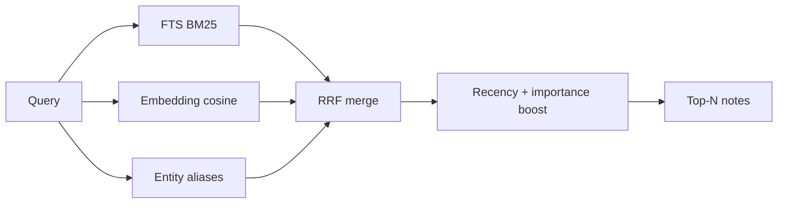

# Mnemos (LTM v2)

AION Mnemos provides an **in-process** long-term memory backend operating on the unified SQLite database (`data/aion.db`).

For the full architectural hardening report (phases 0–4, benchmark scores, trade-offs), see [Mnemos Architectural Hardening](./mnemos-hardening.md).

## Concepts

| Concept | Description |
|---------|-------------|
| **Note** | Single-line durable fact ($\le 500$ chars), append-only per scope (`seq` assigned server-side). |
| **Digest** | LLM-compressed summary over a block of notes (hierarchical). |
| **Scope** | `(tenant_id, scope_type, scope_key)` — `user`, `project`, or `global`. |
| **Project** | Hybrid entity: the same `sql_query_projects` row binds **SQL QueryMemory** and **Mnemos** notes by project slug. |

Notes support **supersede chains**, **confidence** (0–1), **valid_from / valid_to** (bi-temporal), and **source_message_id** (provenance from chat turns).

## Agent Tools (Native)

| Tool | Purpose |
|------|---------|
| `memory_recall` | Hybrid FTS + embedding search; `mode="current\|historical"`; `scope="auto\|user\|project\|global"`; optional `as_of`. |
| `memory_note` | Explicit “remember now”; optional `supersede_hint` to link supersession. |
| `memory_forget` | User-requested correction (soft supersede or delete). |

`memory_wake` runs **server-side** at turn start (injected into turn context via `ltm_orchestrator.wake_up()`).

## Recall Pipeline

- **Cross-scope (`auto`):** user + active project (+ optional global) merged with global score normalization.
- **`as_of`:** project recall projected to a past datetime (filters `valid_to` and supersede chains).
- **Fallback:** if `AION_EMBEDDING_*` is unset or unreachable, recall uses FTS + ranking only.

## Dream Cycle (Nightly Maintenance)

When `AION_MNEMOS_DREAM_ENABLED=1`, a background loop runs ([`src/memory/mnemos/dream.py`](../../src/memory/mnemos/dream.py)):

1. Compress pending digests
2. Resolve contradictory note pairs (embedding similarity + LLM)
3. Decay confidence on notes not recalled recently
4. Backfill missing embeddings
5. Snapshot quality metrics (active notes, never-recalled fraction)

Manual run: `python -m src.memory.mnemos.dream --tenant default`

## Environment

| Variable | Default | Purpose |
|----------|---------|---------|
| `AION_LTM_WAKE_MAX_ROWS` | `20` | Wake budget rows ($k$) |
| `AION_MNEMOS_RECALL_LIMIT` | `10` | Recall top-N results |
| `AION_LTM_MIN_IMPORTANCE` | `2` | Post-turn extraction filter (1–5) |
| `AION_MNEMOS_NATIVE_TOOLS` | `1` | Enable native memory tools (`memory_recall`, etc.) |
| `AION_MNEMOS_EMBEDDING_RECALL` | `1` | Hybrid FTS + embedding RRF |
| `AION_MNEMOS_EMBED_ON_BULK` | `1` | Embed on bulk insert (set `0` for huge imports) |
| `AION_MNEMOS_RANK_HALF_LIFE_DAYS` | `90` | Recency decay half-life in ranking |
| `AION_MNEMOS_DREAM_ENABLED` | `1` | Nightly dream cycle |
| `AION_MNEMOS_ENTITY_RECALL` | `0` | Optional entity alias RRF |

Full list: [Mnemos Architectural Hardening — Environment](./mnemos-hardening.md#environment-variables).

## REST Endpoints (Chat UI & Admin)

Project memory routes require **project membership** (consistent access model with SQL QueryMemory):

- `GET /v1/project-memory/notes?project=<slug>` — list project notes
- `POST /v1/project-memory/notes` — create note
- `GET /v1/project-memory/notes/search?q=...` — hybrid recall
- Admin: `/admin/ltm/*` — browse, compress, zoom

With `AION_CHAT_PASSWORD_AUTH=0` (dev only), authorization degrades because identity is anonymous.

## Skills

- `ltm_note_extraction` — post-turn JSON extractor (`confidence`, `valid_from`, `supersedes_hint`)
- `memory_protocol` — agent memory protocol
- `ltm_digest_compression` — internal digest compression job

## Migrations

| Revision | Content |
|----------|---------|
| `r0s1t2u020` | Provenance + bi-temporal columns on `ltm_notes` |
| `s1t2u3v021` | Entity index tables (`ltm_entities`, `ltm_note_entities`) |

Run `alembic upgrade head` on production. Dev/tests can use `store.ensure_ltm_schema()` without Alembic.

### Related Documents
- [STM, LTM, and QueryMemory](./stm-ltm-and-query.md)
- [Mnemos Architectural Hardening](./mnemos-hardening.md)
- [Long-Term Memory and Projects](./structured-memory.md)
- [Context Compaction](./context-compaction.md)
