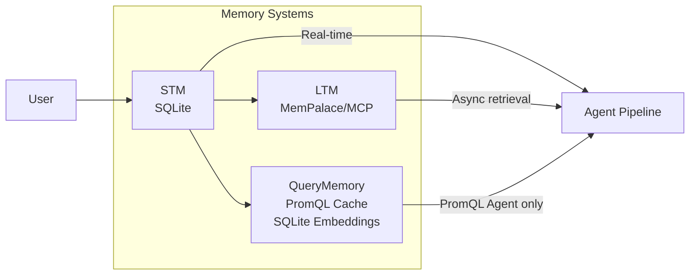
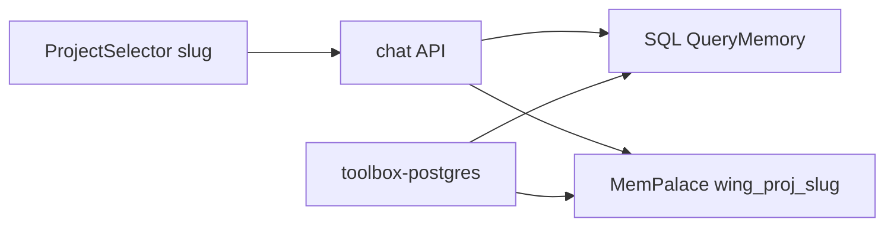
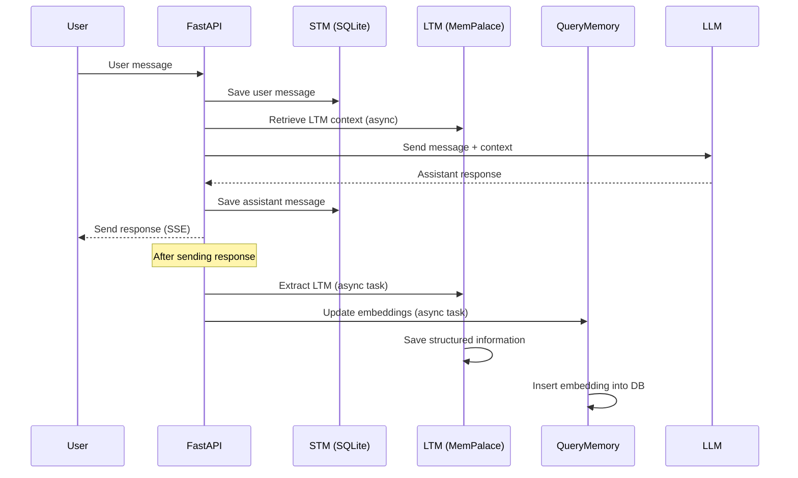

# Memory: STM, LTM and QueryMemory

This document explains **why** the system has three separate memory systems and how they interact with each other.

## Why three separate memory systems?

The system implements **three memory levels** with distinct responsibilities:

### STM (Short-Term Memory) - Short-term memory

**File:** `src/api/history.py` (and `src/data/history_bridge.py` for unified DB)  
**Database:** `data/aion.db` (SQLite, default with `AION_UNIFIED_DB=1` via `messages` and `messages_fts` tables) or `data/chat_memory.db` (legacy / fallback if `AION_UNIFIED_DB=0`)

**Responsibilities:**
- Store messages of the current conversation
- Provide immediate context for each agent turn
- Support FTS5 (full-text search) searches for `session_search`

**Why STM:**
- **Fast:** SQLite in-memory or WAL mode, O(1) queries for retrieve
- **Temporary:** Periodically cleaned, no long-term persistence needed
- **Order-preserving:** Maintains chronological order of messages
- **Lightweight:** Raw text only, no JSON parsing

**Trade-off:** STM sacrifices long-term persistence to achieve maximum speed. STM messages are periodically compressed/deleted (compaction and extraction into LTM before pruning).

:::info See also
For a complete description of how compaction works (pre-turn, mid-turn, manual trigger, DB verification), see **[Context Compaction](./context-compaction.md)**.
:::

#### Role of `UnifiedHistoryBridge`
When the environment variable `AION_UNIFIED_DB=1` (active by default), the history of the current conversation (Short-Term Memory) is not stored in isolated SQLite files, but is funneled into the main relational database `data/aion.db` (tables `conversations`, `messages`, `steps`, `attachments`) via the `src/data/history_bridge.py` module.

This "Bridge" component is instantiated by the global manager `ChatHistoryManager` (`src/api/history.py`) and is actively used by:
- **`src/agent_pipeline.py`**: at the beginning of the turn to read the historical session messages (`get_window`) and during/at the end of the turn to record user/assistant messages (`add_message`/`upsert_message_content`) and individual steps executed by tools (`add_step`).
- **`src/memory/stm_consolidator.py`**: to periodically retrieve messages not yet promoted to LTM (`fetch_unpromoted_rows`) and mark them as promoted (`mark_promoted`) after semantic extraction.
- **MCP Server `memory` (`session_search`)**: to query the FTS5 index managed by the bridge and perform quick searches in the conversation history (`fts_search_blocking`).

### LTM (Long-Term Memory) - Long-term memory

**File:** `src/memory/ltm_orchestrator.py`  
**Backend:** MCP server `mempalace` (external)  
**Extraction:** `src/memory/llm_extract.py`  
**Consolidation:** `src/memory/stm_consolidator.py` and `src/memory/context_compressor.py`

**First boot / Docker:** Chroma downloads the default ONNX model (~80MB) at the first semantic query.
The backend performs a background warmup (`AION_MEMPALACE_WARMUP=1`, cache in
`data/chroma_embedding_cache/`) and sends SSE keepalives during long tools
(`AION_SSE_KEEPALIVE_SEC`). See also `scripts/warmup_chroma_embeddings.py` and
`docker/Dockerfile.backend`.

**Responsibilities:**
- Store semantic information extracted from turns
- Provide relevant context from past conversations
- Structured JSON extraction via LLM

**Why LTM:**
- **Semantic:** Structured and meaningful information, not just raw text
- **Persistent:** Important information saved permanently
- **Extracted by LLM:** Another LLM analyzes the messages and extracts structured data
- **On-demand:** Retrieved only when necessary to avoid latency

**Trade-off:** LTM sacrifices speed to achieve semantic persistence. LTM retrieval is slower because:
1. It requires LLM extraction (can take seconds)
2. JSON parsing from mempalace
3. It is not necessary for every turn, only for relevant context

### QueryMemory — PromQL Cache

**File:** `src/query_memory.py`  
**Database:** `cached_queries` table in `data/aion.db` (SQLite) with `embedding` column (bytes)  
**Embeddings:** External HTTP service (configurable endpoint)

> ⚠️ **QueryMemory is NOT a generic memory.** It is exclusively a cache of validated PromQL queries
> (associations: `user_request (NL) → promql_query`). Do not use it to search for conversations or user facts.

**Responsibilities:**
- Store already verified Prometheus/PromQL queries associated with the natural language request
- Allow the PromQL Assistant to reuse complex queries avoiding syntax errors
- Cosine similarity comparison on embeddings (exact, semantic, or keyword fallback match)

**Why QueryMemory (PromQL Cache):**
- **High precision**: cosine similarity on embeddings guarantees coherent semantic matches
- **Reduces errors**: reusing verified queries drastically decreases PromQL syntax errors
- **Cross-session**: the cache persists permanently across sessions and users of the same namespace
- **Asynchronous**: embeddings are calculated in background after each successful query

**Trade-off:** QueryMemory sacrifices generality for domain-specific precision. Optimized
exclusively for the Prometheus/PromQL domain. Average latency of 100–300ms for embedding calculation.

**Exposed MCP tools (`memory` server):**
| Tool | Scope |
|------|-------|
| `search_known_query` | Search for similar PromQL queries before generating a new one |
| `save_successful_query` | Save a verified PromQL query in the cache |
| `mark_query_as_successful` | Increment the success counter of a query in the cache |
| `update_memory_entry` | Update an existing PromQL entry in the cache |
| `delete_memory_entry` | Permanently delete a PromQL entry from the cache |
| `session_search` | Search in the conversation history via FTS5 and generate a summary (RAG) |

### QueryMemory SQL — Postgres SELECT Cache

**Package:** `src/memory/sql_query_memory/`  
**Database:** `sql_query_projects`, `cached_sql_queries`, `tenant_query_memory_settings` tables in `data/aion.db`  
**Separation:** **no modification** to the PromQL table `cached_queries` nor to the tools `search_known_query` / `save_successful_query`.

**Responsibilities:**
- Store validated **NL question → SQL SELECT** pairs, organized by **drawer** (`project` slug: `default`, `vendite`, …)
- Hybrid search: normalized request, NL/SQL embedding, SQL fingerprint, keyword fallback
- Tenant scope: **shared** vs **per user** (admin settings + override per drawer)

**Tools for SQL QueryMemory:**
SQL QueryMemory management offers two integration channels depending on the agent profile: **Native in-process Tools** (recommended for lower latency) or **MCP Tools** provided by the `memory` server.

| MCP Tool | Native Tool | Type / Use |
|----------|-------------|------------|
| `search_known_sql` | `sql_memory_search` | Search for validated SQL queries in the active project before generating a new one |
| `save_successful_sql` | `sql_memory_save` | Save a working SQL SELECT query in the active project |
| `mark_sql_query_successful`| - | Increment the success counter of an SQL query |
| `list_saved_sql` | `sql_memory_list_saved` | List all saved SQL queries in the project drawer |
| `list_sql_projects` | `sql_memory_list_projects` | Show information about the active drawer/project linked to the turn |
| `update_sql_memory_entry` | `sql_memory_update` | Update request, SQL query, or verification status of an existing entry |
| `delete_sql_memory_entry` | `sql_memory_delete` | Delete a saved SQL query from the project drawer |

**Pipeline:** `pre_turn` (inject suggestions) and `post_tool` (optional auto-learn) hooks in `src/runtime/query_memory_hooks.py`.  
**API:** `GET /v1/query-memory/*` (chat-ui), `GET/PATCH /admin/query-memory/*` (admin-ui).  
**Profiles:** `postgres_metadata_assistant`, `mysql_metadata_assistant` + skill `datasource_memory_protocol`.

Variables: `AION_SQL_QM_*` in `.env.example`.

### MemPalace ERP navigation — two layers, same project

For SQL metadata profiles (Postgres/MySQL), **SQL QueryMemory** and **MemPalace** share the same **project slug** (UI drawer / `sql_query_project`):

| Project slug (unlimited) | MemPalace wing | Content |
|---------------------------|----------------|-----------|
| `{slug}` from chat-ui / admin | `wing_proj_{slug}` | DB navigation for that project |

The `PROJECT_SCOPE` text in the turn context comes from **`sql_query_projects.description`** (and `display_name`), not from hardcoded slugs in Python. Set the description when you create/rename a project in chat-ui or admin.

Stable business facts → **KG** + `wing_aion_system` / `wing_user_*`, not in `wing_proj_*` of other projects.

**Migration:** if in the past everything ended up in `default` or legacy wing `alibr`, run  
`python scripts/migrate_alibr_project_memory.py --dry-run` then without `--dry-run` (backend + MCP mempalace active).

| Layer | Storage | Content |
|-------|---------|-----------|
| SQL QueryMemory | `cached_sql_queries` by `project_id` | Validated SELECT |
| MemPalace navigation | `wing_proj_{slug}` | JOINs, entry points, pitfalls |

**Room** in the project wing: `entry_points`, `join_paths`, `pitfalls`, `heuristics`, `limitations`, `discoveries`.

**Pipeline:** `src/runtime/query_memory_hooks.py` and `db_navigation_mempalace_hooks.py` hooks — `pre_turn` inject (complete SQL + skip MemPalace if SQL cache); **no** `post_tool` auto-save by default (`AION_SQL_QM_AUTO_LEARN=0`, `AION_MEMPALACE_NAV_AUTO_LEARN=0`). SQL/nav persistence only via agent tools or post-turn LTM on explicit request.

**Automatic saving (OpenClaw / MemPalace hooks parity):**

| MemPalace Hook (Claude Code) | AION |
|------------------------------|------|
| `mempal_save_hook` (Stop, ~every N messages) | `ltm_orchestrator.extract_and_persist` **after** each assistant response (`AION_LTM_EXTRACT=1`, skill `ltm_extraction`) |
| `mempal_precompact_hook` (PreCompact) | `ltm_orchestrator.precompact_flush` before STM compression |
| `mempalace wake-up` | `wake_up` at start of turn (context header) |
| Chat agent tool | `mempalace_kg_add` / `mempalace_add_drawer` when the user asks "remember" or after a verified lesson — **no regex catcher** server-side |

LTM extraction uses the `ACTIVE_SQL_QUERY_PROJECT` context when present. Server validation in `_apply_persist`: minimum importance (`AION_LTM_MIN_IMPORTANCE`), allowed rooms on `wing_proj_*`.

**Palace per tenant:** `data/mempalace/{tenant_id}/` (override `AION_MEMPALACE_PALACE_PATH` → `MEMPALACE_PALACE_PATH` in the `mempalace` MCP subprocess).

**Audit:** `python scripts/audit_mempalace_project.py --project aion_am --list-wings --dedupe-hint` — flags generic drawers; uses `prune-legacy` API or `navigation_memory_service.prune_legacy_wings` for `alibr` wings and not `wing_proj_*`.

**One-shot bootstrap:** `python scripts/bootstrap_db_navigation_mempalace.py --project default` (option `--dry-run`) imports `db_navigation_map.md` into the wing.

**Skill:** `datasource_memory_protocol` (SQL + navigation), `mempalace_protocol` (wings/LTM for generic profiles), `ltm_extraction` (internal). The `db_navigation_map` skill remains a read-only seed in git (bootstrap ops, not on the metadata profile).

Variables: `AION_MEMPALACE_NAV_*`, `AION_LTM_MIN_IMPORTANCE`, `AION_AGENT_MIN_REASONING_CHARS_WITHOUT_TOOL` in `.env.example`.

---

## Cognitive routing — which system to use?

> This section is addressed to both developers and the LLM model to avoid confusion between systems.

| Question / Request | Correct system | Tool |
|---------------------|-----------------|------|
| "What did we say yesterday?" | STM / FTS (session_search) | `session_search` |
| "Remember my preference X?" / "remember it" (fact) | LTM post-turn + in-turn tool | `mempalace_kg_add` + `wing_user_*` (agent); `extract_and_persist` after the turn |
| "How do I connect table A and B?" (Postgres) | MemPalace nav `wing_proj_{project}` | `mempalace_search` + wing |
| "What is the SELECT for X?" (Postgres) | SQL QueryMemory | `sql_memory_search` |
| "What is the PromQL query for X?" | QueryMemory (PromQL Cache) | `search_known_query` |
| "Save this working PromQL query" | QueryMemory (PromQL Cache) | `save_successful_query` |
| "Save this working SELECT" | SQL QueryMemory | `sql_memory_save` |

## Data flow between the three systems

### Step-by-step

1. **User sends message**
   - Message saved in STM immediately
   - LTM context retrieved for additional context

2. **Agent generates response**
   - Uses STM + LTM context to generate response
   - Response sent to the user (SSE streaming)

3. **Post-turn (async)**
   - LTM extraction: Analyzes the turn, extracts structured information
   - QueryMemory update: Calculates embedding, inserts into the DB

**Important:** Steps 3 are asynchronous and **do not block** the response to the user.

---

## When to use each system

### STM (Short-Term Memory)

**Use STM when:**
- You want recent messages from the current conversation
- You need speed (query < 1ms)
- Chronological order is important
- You want FTS search for keywords

**Do not use STM when:**
- You are looking for information from past conversations
- You need structured information
- You want semantic search

### LTM (Long-Term Memory)

**Use LTM when:**
- You want extracted semantic information
- You need long-term persistence
- You want context from past conversations
- Speed is not critical (seconds OK)

**Do not use LTM when:**
- You need real-time responses
- You want raw unstructured information
- Latency must be < 100ms

### QueryMemory (PromQL Cache)

**Use QueryMemory when:**
- You are about to generate a new Prometheus/PromQL query and want to check if a similar already tested one exists
- You want to save a complex PromQL query to reuse it in the future
- You work with Prometheus metrics and want to avoid syntax errors

**Do NOT use QueryMemory when:**
- You are looking for past conversations → use `session_search` (STM/FTS)
- You are looking for user facts or preferences → use `mempalace_search` (LTM)
- You are looking for anything other than a Prometheus/PromQL query

---

## Architectural trade-offs

### Why not a single database?

A single SQLite database cannot satisfy all requirements:

| Requirement | STM | LTM | QueryMemory | Solution |
|-------------|-----|-----|-------------|----------|
| Speed (< 1ms) | ✅ | ❌ | ❌ | STM |
| Long-term persistence | ❌ | ✅ | ✅ | LTM/QM |
| Semantic structure | ❌ | ✅ | ✅ | LTM/QM |
| Chronological order | ✅ | ❌ | ❌ | STM |
| Semantic search | ❌ | ❌ | ✅ | QueryMemory |

**Decision:** Three separate systems, each optimized for a subset of requirements.

### Why the STM/LTM separation?

**Problem:** If STM and LTM were the same system:

1. **LTM would be slower:** LLM extraction would add seconds of latency to each message
2. **STM would be heavier:** Semantic persistence would increase memory/disk usage
3. **Impossible trade-off:** STM wants speed, LTM wants persistence. Two opposing goals.

**Solution:** Separation allows STM to be fast (no LLM extraction) and LTM to be rich (semantic extraction) without compromise.

### Why a separate QueryMemory?

**Problem:** If QueryMemory were integrated into STM:

1. **Embeddings would increase space:** Each message would have an embedding (several KB)
2. **Semantic search would be slow:** Real-time embedding calculation is expensive
3. **Not cross-session:** STM is for the current conversation, QueryMemory for all sessions

**Solution:** Separate QueryMemory allows:
- Embeddings calculated in the background
- Semantic search without affecting STM
- Cross-session queries

---

## Critical configuration variables

| Variable | Default | Purpose | Trade-off |
|-----------|---------|---------|-----------|
| `AION_UNIFIED_DB` | `1` | Enables the use of the unified database `data/aion.db` for messages/sessions instead of scattered SQLite files | Recommended active; disabling it uses separate history files per session |
| `AION_STM_MAX_TURNS` | `10` | STM messages per turn | More turns = richer context = more tokens = more latency |
| `AION_STM_TOKEN_BUDGET` | `null` | STM token budget | Set a limit to control costs |
| `AION_STM_CONSOLIDATE_EVERY` | `10` | Consolidation every N turns | More consolidation = more cleanup but more overhead |
| `AION_STM_PRUNE_KEEP` | `50` | Messages to keep after prune | Fewer messages = less space but less context |
| `AION_CONTEXT_COMPRESS_ENABLED` | `1` | Enables automatic Claude-style context compression (compaction) if the token budget is exceeded | Requires a synchronous LLM call to compact the context before the turn |
| `AION_LTM_RETRIEVAL` | `1` | Enables LTM retrieval | Disable = faster but less context |
| `AION_LTM_SEARCH_LIMIT` | `5` | Number of LTM results | More results = more context but more tokens |
| `AION_LTM_MIN_IMPORTANCE` | `2` | Minimum importance (1-5) to save an extracted drawer in LTM | Higher = saves only very important facts and avoids memory clutter |
| `AION_SQL_QM_ENABLED` | `1` | Master switch to enable SQL QueryMemory | Completely disables the SQL query cache system |
| `AION_SQL_QM_AUTO_LEARN` | `0` | Auto-saving of successful PostgreSQL SELECTs in cache (post-tool hook) | Disabled by default to avoid cache pollution; explicit use of tools by the agent is recommended |
| `AION_MEMPALACE_NAV_ENABLED` | `1` | Enables the database navigation layer of MemPalace | Disables retrieval/persistence of DB joins and entry points |
| `AION_MEMPALACE_NAV_PRE_TURN_INJECT` | `0` | Pre-turn inject of MemPalace navigation suggestions | Disabled by default (0), the agent uses `mempalace_search` when necessary |
| `AION_MEMPALACE_NAV_AUTO_LEARN` | `0` | Auto-saving of join logic and pitfalls in the MemPalace navigation drawer | Disabled by default to avoid pollution; preferably managed via the agent protocol |

---

## When to enable/disable each system

### STM

**Always active** - it is required for basic agent operation.

**To disable (not recommended):** If you want to reduce disk usage in test deployments.

### LTM

**Enable when:**
- You want the agent to "remember" important information from past conversations
- Response time can be slightly slower (+1-2s for retrieval)

**Disable when:**
- You want maximum speed for each turn
- You do not need semantic persistence
- Test deployments without long-term memory

### QueryMemory (PromQL Cache)

**Enable when:**
- You work with Prometheus/Grafana and want the agent to reuse already verified PromQL queries
- You want to reduce syntax errors in metric queries

**Disable when:**
- You do not use Prometheus/PromQL in your deployment
- You want to reduce space usage (the `cached_queries` table with embeddings occupies space proportional to the number of saved queries)

---

## Source files

| File | Role |
|------|------|
| `src/api/history.py` | STM operations, FTS queries |
| `src/data/history_bridge.py` | Bridge for STM on unified database (`aion.db`) |
| `src/memory/ltm_orchestrator.py` | LTM orchestration, extraction |
| `src/memory/llm_extract.py` | LLM-based extraction via HTTP |
| `src/memory/stm_consolidator.py` | STM cleanup and consolidation |
| `src/memory/context_compressor.py` | Claude-style context compaction/summarization |
| `src/query_memory.py` | QueryMemory PromQL operations |
| `src/memory/sql_query_memory/` | QueryMemory SQL (Postgres) |
| `src/runtime/sql_query_memory_tools.py` | Native in-process tools for SQL QueryMemory |
| `mcp_servers/query_memory/server.py` | MCP server for PromQL and SQL QueryMemory |
| `src/runtime/query_memory_hooks.py` | Pre-turn and post-tool hooks for SQL QueryMemory |
| `src/runtime/db_navigation_mempalace_hooks.py` | Pre-turn and post-tool hooks for MemPalace navigation |
| `src/api/v1/query_memory.py` | User REST for drawers/SQL queries |
| `src/api/admin_query_memory.py` | Admin REST scope and settings |

## Related skills

- `ltm_extraction.md` - Schema for LTM extraction
- `session_search.md` - Tool for session search
- `sql_query_memory_protocol.md` - SQL QueryMemory protocol (Postgres)
- `datasource_memory_protocol.md` - Extended protocol for SQL QueryMemory and MemPalace navigation
- `mempalace_protocol.md` - Protocol for using LTM wings

---

## Related documents

- [Agent Pipeline Flow](../api-and-runtime/agent-pipeline.md)
- [History and FTS](./chat-history-and-fts.md)
- [Environment variables](../configuration/environment.md)
