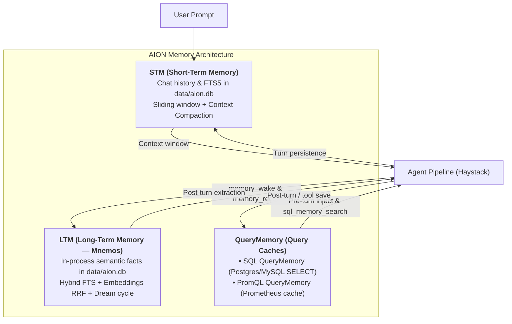
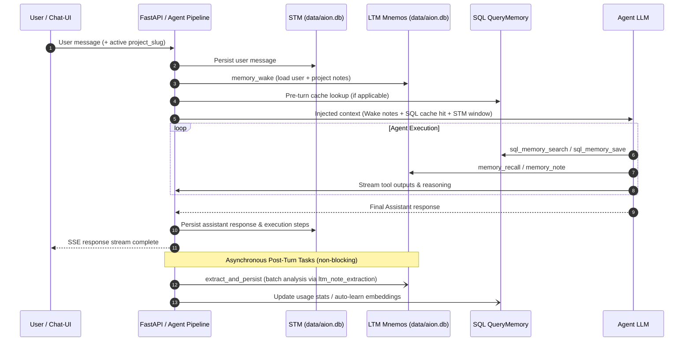

# Memory: STM, LTM, and QueryMemory

This document explains the conceptual model of memory in AION Agent, why the system implements **three distinct memory tiers**, and how they interact during execution.

---

## Why Three Separate Memory Systems?

A single storage mechanism cannot simultaneously satisfy low-latency real-time conversation, long-term semantic persistence, and specialized query caching. AION partitions memory into three specialized tiers:

```mermaid
flowchart TD
    subgraph "AION Memory Architecture"
        STM["<b>STM (Short-Term Memory)</b><br/>Chat history & FTS5 in data/aion.db<br/>Sliding window + Context Compaction"]
        LTM["<b>LTM (Long-Term Memory — Mnemos)</b><br/>In-process semantic facts in data/aion.db<br/>Hybrid FTS + Embeddings RRF + Dream cycle"]
        QM["<b>QueryMemory (Query Caches)</b><br/>• SQL QueryMemory (Postgres/MySQL SELECT)<br/>• PromQL QueryMemory (Prometheus cache)"]
    end

    User["User Prompt"] --> STM
    STM -->|"Context window"| Pipeline["Agent Pipeline (Haystack)"]
    LTM -->|"memory_wake & memory_recall"| Pipeline
    QM -->|"Pre-turn inject & sql_memory_search"| Pipeline
    Pipeline -->|"Post-turn extraction"| LTM
    Pipeline -->|"Post-turn / tool save"| QM
    Pipeline -->|"Turn persistence"| STM
```

---

## 1. STM (Short-Term Memory) — Chat History

- **Database:** `data/aion.db` (SQLite, default via `AION_UNIFIED_DB=1`)
- **Primary tables:** `conversations`, `messages`, `steps`, `attachments`, `messages_fts` (FTS5 virtual table)
- **Managers:** `UnifiedHistoryBridge` in [`src/data/history_bridge.py`](../../src/data/history_bridge.py), `ChatHistoryManager` in [`src/api/history.py`](../../src/api/history.py)

### Responsibilities
- Preserves the chronological order of turns in the active conversation.
- Provides immediate turn context (`get_window`) up to `AION_STM_MAX_TURNS`.
- Automatically triggers **Context Compaction** (pre-turn and mid-turn) when token thresholds are reached.
- Powers full-text keyword searches across past sessions via the `session_search` tool.

### Trade-offs
STM optimizes for raw speed ($<1\text{ms}$ query latency) and chronological accuracy. Individual messages may be compacted and purged from active window context after their durable facts are extracted to LTM.

:::info Context Compaction
For details on the two-level compaction mechanism (pre-turn summarization and mid-turn state compression), see [Context Compaction](./context-compaction.md).
:::

---

## 2. LTM (Long-Term Memory) — AION Mnemos

- **Database:** `data/aion.db` (SQLite)
- **Primary tables:** `ltm_notes`, `ltm_digests`, `ltm_entities`, `ltm_note_entities`
- **Orchestrators:** [`src/memory/ltm_orchestrator.py`](../../src/memory/ltm_orchestrator.py), [`src/memory/mnemos/`](../../src/memory/mnemos/)

### Responsibilities
- Stores durable, concise facts ($\le 500$ chars) scoped by `(tenant_id, scope_type, scope_key)` across `user`, `project`, and `global` scopes.
- Injects relevant notes into turn context at startup via server-side `memory_wake`.
- Performs hybrid semantic retrieval (BM25 FTS5 + vector cosine embeddings merged via Reciprocal Rank Fusion) with recency decay and importance weighting.
- Maintains bi-temporal validity (`valid_from`, `valid_to`), confidence scores, and supersede chains.
- Executes automated background extraction post-turn (`ltm_note_extraction` skill) and nightly maintenance via the **Dream Cycle** (`src/memory/mnemos/dream.py`).

### Native In-Process Tools
Mnemos exposes native Haystack tools directly within the agent runtime:

| Tool | Description |
|------|-------------|
| `memory_recall` | Hybrid search across notes (`mode="current|historical"`, `scope="auto|user|project|global"`, `as_of=datetime`). |
| `memory_note` | Explicitly saves a new note in the active scope, with optional `supersede_hint`. |
| `memory_forget` | Soft-supersedes or removes an outdated note upon user request. |

:::info Mnemos Architecture & Hardening
See [Mnemos Long-Term Memory](./mnemos.md) and [Mnemos Architectural Hardening](./mnemos-hardening.md) for full benchmarks, mathematical ranking formulas, and retrieval design.
:::

---

## 3. QueryMemory — Domain Query Caches

QueryMemory provides specialized, high-precision query caching to prevent repetitive LLM hallucinations on complex syntax.

### 3.1 SQL QueryMemory (PostgreSQL / MySQL SELECT Cache)
- **Package:** [`src/memory/sql_query_memory/`](../../src/memory/sql_query_memory/)
- **Primary tables:** `sql_query_projects`, `cached_sql_queries`, `tenant_query_memory_settings` in `data/aion.db`
- **Purpose:** Stores validated **Natural Language Intent $\rightarrow$ Parameterized SQL SELECT** templates bound to project drawers (`project_slug`).
- **Retrieval:** Multi-stage hybrid matching using normalized intent, semantic embeddings, SQL AST fingerprinting, and keyword fallback.
- **Tools:**
  - **Native tools:** `sql_memory_search`, `sql_memory_save`, `sql_memory_update`, `sql_memory_delete`, `sql_memory_list_saved`, `sql_memory_list_projects`.
  - **MCP tools:** `search_known_sql`, `save_successful_sql`, `mark_sql_query_successful`, `list_saved_sql`, `list_sql_projects`, `update_sql_memory_entry`, `delete_sql_memory_entry`.

:::info Structured Memory & Projects
See [Long-Term Memory and Projects](./structured-memory.md) for how SQL QueryMemory and Mnemos project notes coordinate around the shared project drawer.
:::

### 3.2 PromQL QueryMemory (Prometheus Metrics Cache)
- **Module:** [`src/query_memory.py`](../../src/query_memory.py)
- **Primary table:** `cached_queries` in `data/aion.db`
- **Purpose:** Caches verified Prometheus PromQL queries mapped to natural language metric requests.
- **MCP Tools (`memory` server):** `search_known_query`, `save_successful_query`, `mark_query_as_successful`, `update_memory_entry`, `delete_memory_entry`.

---

## Cognitive Routing: Which System to Use?

| User Intent / Scenario | Memory Tier | Primary Tool / Mechanism |
|------------------------|-------------|--------------------------|
| *"What did we discuss yesterday about X?"* | STM / FTS5 | `session_search` |
| *"Remember that our staging server is on port 8080"* | LTM (Mnemos) | `memory_note` (`scope="project"` or `"user"`) / post-turn extraction |
| *"What are our coding conventions for schema migrations?"* | LTM (Mnemos) | `memory_recall` |
| *"Show me the query to calculate active monthly subscribers"* (Postgres) | SQL QueryMemory | `sql_memory_search` (or `search_known_sql`) |
| *"Save this verified SELECT query for future turns"* (Postgres) | SQL QueryMemory | `sql_memory_save` (or `save_successful_sql`) |
| *"Find the PromQL query for CPU utilization"* | PromQL QueryMemory | `search_known_query` |
| *"Save this working PromQL expression"* | PromQL QueryMemory | `save_successful_query` |

---

## Data Flow Between Systems

```mermaid
sequenceDiagram
    autonumber
    participant User as User / Chat-UI
    participant API as FastAPI / Agent Pipeline
    participant STM as STM (data/aion.db)
    participant Mnemos as LTM Mnemos (data/aion.db)
    participant SQLQM as SQL QueryMemory
    participant LLM as Agent LLM

    User->>API: User message (+ active project_slug)
    API->>STM: Persist user message
    API->>Mnemos: memory_wake (load user + project notes)
    API->>SQLQM: Pre-turn cache lookup (if applicable)
    API->>LLM: Injected context (Wake notes + SQL cache hit + STM window)
    
    loop Agent Execution
        LLM->>SQLQM: sql_memory_search / sql_memory_save
        LLM->>Mnemos: memory_recall / memory_note
        LLM->>API: Stream tool outputs & reasoning
    end

    LLM-->>API: Final Assistant response
    API->>STM: Persist assistant response & execution steps
    API-->>User: SSE response stream complete

    Note over API,Mnemos: Asynchronous Post-Turn Tasks (non-blocking)
    API-)Mnemos: extract_and_persist (batch analysis via ltm_note_extraction)
    API-)SQLQM: Update usage stats / auto-learn embeddings
```

---

## Critical Configuration Variables

| Variable | Default | Description |
|----------|---------|-------------|
| `AION_UNIFIED_DB` | `1` | Consolidates all history and sessions into `data/aion.db`. |
| `AION_STM_MAX_TURNS` | `10` | Maximum chronological turns loaded into active STM context. |
| `AION_CONTEXT_COMPRESS_ENABLED` | `1` | Enables pre-turn STM context compaction when budget is exceeded. |
| `AION_CONTEXT_COMPRESS_MID_TURN` | `1` | Enables mid-turn in-place state compaction during long tool chains. |
| `AION_LTM_EXTRACT` | `1` | Enables asynchronous post-turn fact extraction into Mnemos. |
| `AION_LTM_MIN_IMPORTANCE` | `2` | Minimum importance score (1–5) required to persist an extracted note. |
| `AION_MNEMOS_NATIVE_TOOLS` | `1` | Enables in-process `memory_recall`, `memory_note`, `memory_forget`. |
| `AION_MNEMOS_EMBEDDING_RECALL` | `1` | Enables hybrid BM25 + cosine vector retrieval via RRF. |
| `AION_MNEMOS_DREAM_ENABLED` | `1` | Enables nightly background compaction, decay, and contradiction resolution. |
| `AION_SQL_QM_ENABLED` | `1` | Master switch for SQL QueryMemory (Postgres / MySQL drawers). |
| `AION_SQL_QM_AUTO_LEARN` | `0` | Auto-saving of successful SELECT queries (0 = explicit tool save recommended). |

---

## Key Source Files

| Component | Source Files |
|-----------|--------------|
| **STM & History Bridge** | [`src/data/history_bridge.py`](../../src/data/history_bridge.py), [`src/api/history.py`](../../src/api/history.py), [`src/data/bootstrap.py`](../../src/data/bootstrap.py) |
| **Context Compaction** | [`src/memory/context_compressor.py`](../../src/memory/context_compressor.py), [`src/runtime/turn_compaction.py`](../../src/runtime/turn_compaction.py), [`src/runtime/turn/turn_context.py`](../../src/runtime/turn/turn_context.py) |
| **Mnemos Core & Store** | [`src/memory/mnemos/store.py`](../../src/memory/mnemos/store.py), [`fts.py`](../../src/memory/mnemos/fts.py), [`ranking.py`](../../src/memory/mnemos/ranking.py), [`recall.py`](../../src/memory/mnemos/recall.py) |
| **Mnemos Runtime & Tools** | [`src/memory/ltm_orchestrator.py`](../../src/memory/ltm_orchestrator.py), [`src/runtime/mnemos_tools.py`](../../src/runtime/mnemos_tools.py), [`src/memory/mnemos/dream.py`](../../src/memory/mnemos/dream.py) |
| **SQL QueryMemory** | [`src/memory/sql_query_memory/service.py`](../../src/memory/sql_query_memory/service.py), [`models.py`](../../src/memory/sql_query_memory/models.py), [`fingerprint.py`](../../src/memory/sql_query_memory/fingerprint.py) |
| **PromQL QueryMemory** | [`src/query_memory.py`](../../src/query_memory.py), [`mcp_servers/query_memory/server.py`](../../mcp_servers/query_memory/server.py) |

### Related Documentation
- [Mnemos Long-Term Memory](./mnemos.md)
- [Mnemos Architectural Hardening](./mnemos-hardening.md)
- [Long-Term Memory and Projects](./structured-memory.md)
- [Chat History and FTS Search](./chat-history-and-fts.md)
- [Context Compaction](./context-compaction.md)
