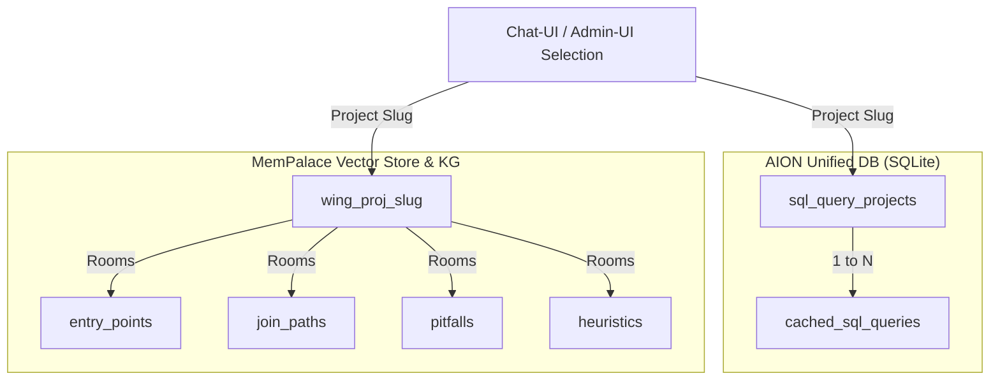

# Long-Term Memory (LTM) and Projects

This document describes how the structured **Long-Term Memory (LTM)** works in AION Agent, how it integrates with the concept of **Project**, and how data is stored and extracted.

> [!NOTE]
> **Agent DB (Deprecated):** The "Agent DB" system (previously used for the autonomous creation of user-isolated SQLite tables and ingestion of CSV/XLSX files) **is no longer used** and is to be considered deprecated. Structured long-term memory is now entirely managed through the combination of **Projects** and **MemPalace**.

---

## Architecture and Components

Structured long-term memory consists of two main elements that share the same project identifier (**project slug**):



### 1. Projects (Persistence on `aion.db`)
Projects are saved in the main relational database (`data/aion.db`) in the `sql_query_projects` table. Each project represents a domain or a work drawer (e.g. `default`, `vendite`, `magazzino`).
- **SQL QueryMemory**: Within the project, the `cached_sql_queries` table stores the SELECT SQL queries (pairs of natural language question → SQL SELECT) successfully validated and tested.

### 2. MemPalace Project Wings
MemPalace is the MCP server that acts as semantic and episodic memory. For each project, MemPalace allocates a dedicated **wing** named `wing_proj_{project_slug}` (e.g. `wing_proj_default` or `wing_proj_vendite`).
Within this wing, database structure and navigation information are organized into **rooms**:

| Room | Content |
|------|-----------|
| `entry_points` | Which tables to use as a starting point for specific business questions. |
| `join_paths` | Verified JOIN paths (foreign keys, relations, and join order). |
| `pitfalls` | Errors, failed queries, timeouts, or paths returning 0 rows to be avoided. |
| `heuristics` | Conventions on filters, data formats, SQL dialect quirks. |
| `limitations` | Database limitations, excessively large tables, read-only permissions. |
| `discoveries` | New discoveries or navigation notes not yet classified. |

---

## Memory Life Cycle (Workflow)

The AION runtime implements a structured flow (**Datasource Memory Workflow**) that manages the asynchronous reading and writing of memory.

### 1. Pre-Turn (Context Injection)
At the beginning of each turn, if the agent has a database-type profile (e.g. `postgres_metadata_assistant`):
1. The **Wake-up** of MemPalace is executed to load the initial state and the preferences of the agent.
2. The user request is searched for both in **SQL QueryMemory** (`sql_memory_search`) and in **MemPalace** (`mempalace_search`).
3. If a high-confidence match is found in QueryMemory, the SQL code block is injected into the prompt (identified as `QueryMemory — server cache`).
4. If navigation suggestions are found in MemPalace, they are injected into the `[project_context]` block and under the `## MemPalace navigation` header.

### 2. Post-Turn (Extraction and Saving)
At the end of each assistant response (if `AION_LTM_EXTRACT=1`), an asynchronous background task is started:
1. An LLM analyzes the current conversation (via the internal skill `ltm_extraction`).
2. Extracts structured information in the form of **drawers** (text drawers for MemPalace), **KG Triples** (stable graph relations like `table_a joins_via table_b`), and **Diary Entries** (narrative history).
3. Performs validation and filtering:
   - Saves only drawers with importance greater than or equal to `AION_LTM_MIN_IMPORTANCE` (default: `2`).
   - Verifies that project rooms are part of the allowed list (`NAV_ROOMS`).
   - Checks for the presence of duplicates before insertion (`mempalace_check_duplicate`).
4. Persists the information in MemPalace via the relative MCP tools (`mempalace_add_drawer`, `mempalace_kg_add`).

---

## Drawer Format in MemPalace

To avoid pollution or generic descriptions of little use, the drawers saved in the project wing must follow a specific and schematic format (in English, maximum 500 characters):

```text
Q: <intent description>
Schema: <db_schema>
Entry: <starting_table> (columns_used)
Path: <table_a>.<key> = <table_b>.<key>; filter <condition>
Pitfall: <what to avoid, e.g. column naming quirks>
```

### Correct Example (`join_paths`):
```text
Q: device assigned to user by name (iPhone)
Schema: asset_manager
Entry: Users (nome, cognome, user_id)
Path: Users.user_id = DeviceMovement.to_user_id; latest row by date; Device.device_id; filter Device.type='iPhone'
Pitfall: use column 'nome' instead of 'first_name'; escape apostrophes
```

### Incorrect Example (To avoid):
```text
Verified path for Giuseppe's PC: join users and devices.
```

---

## Development Conventions and Environment Variables

The behavior of the structured memory is regulated by the following variables in the `.env` file:

- `AION_LTM_EXTRACT`: Enables automatic post-turn extraction (`1` or `0`).
- `AION_LTM_MIN_IMPORTANCE`: Minimum importance level to save information (default: `2`).
- `AION_MEMPALACE_NAV_ENABLED`: Enables the database navigation layer of MemPalace (`1` or `0`).
- `AION_SQL_QM_AUTO_LEARN`: Cache auto-saving of successful PostgreSQL SELECTs (default: `0`, disabled to avoid pollution; the agent prefers to save explicitly via `sql_memory_save`).

### Related Documents
- [STM, LTM, and QueryMemory (PromQL Cache)](./stm-ltm-and-query.md)
- [Chat history and FTS search](./chat-history-and-fts.md)
- [Environment variables](../configuration/environment.md)
