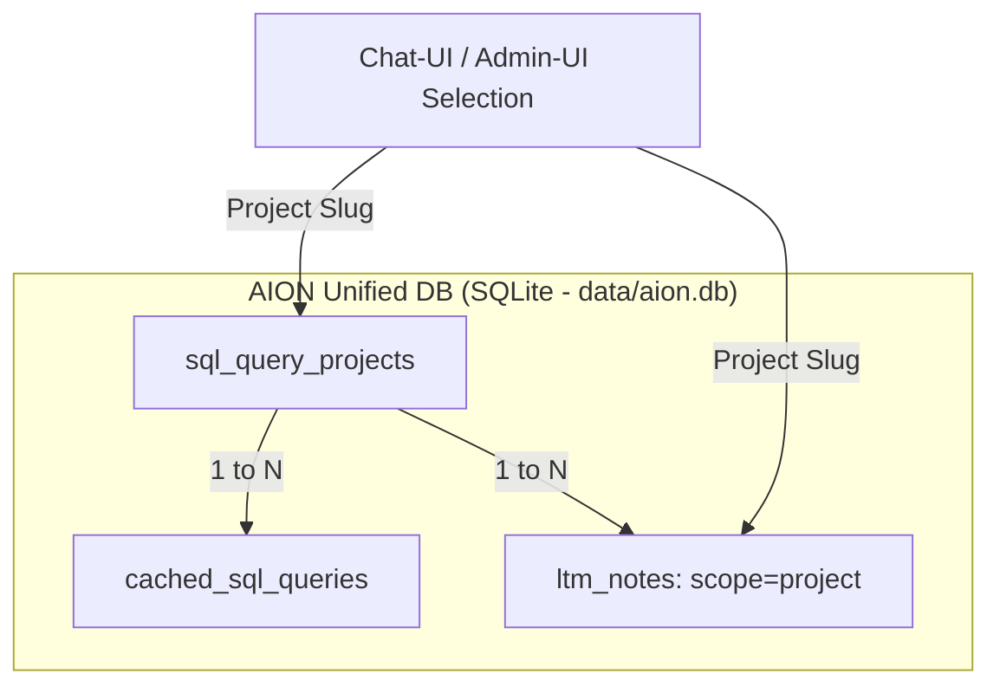

# Long-Term Memory (LTM) and Projects

This document describes how the structured **Long-Term Memory (LTM)** works in AION Agent, how it integrates with the concept of **Project**, and how data is stored and extracted using **Mnemos**.

---

## Architecture and Components

Structured long-term memory consists of two layers that share the same project identifier (**project slug**):

```mermaid
flowchart TD
    subgraph "AION Unified DB (SQLite - data/aion.db)"
        Proj[sql_query_projects] -->|1 to N| Cache[cached_sql_queries]
        Proj -->|1 to N| Notes[ltm_notes: scope=project]
    end

    User["Chat-UI / Admin-UI Selection"] -->|Project Slug| Proj
    User -->|Project Slug| Notes
```

### 1. SQL QueryMemory (SQL Templates)
Saved in `data/aion.db` in `cached_sql_queries` table.
- Stores validated SQL SELECT templates (intent $\rightarrow$ parameterized SQL).
- Injected into the turn context on cache hits via `src/runtime/query_memory_hooks.py`.
- Managed via tools: `sql_memory_search`, `sql_memory_save`, `sql_memory_update`, `sql_memory_delete`.

### 2. Mnemos Project Notes (Knowledge & Navigation)
Saved in `data/aion.db` in `ltm_notes` table with `scope_type='project'` and `scope_id='{tenant}:project:{slug}'`.
- Stores concise domain knowledge, JOIN paths, conventions, and pitfalls.
- Recalled via hybrid FTS5 + embedding search using `memory_recall`.
- Created via `memory_note` (in-turn) or automatic post-turn extraction (`ltm_note_extraction`).

---

## Memory Life Cycle (Workflow)

### 1. Pre-Turn (Context Injection)
At the beginning of each turn:
1. **Mnemos Wake-up**: Loads relevant project and user notes into context.
2. **QueryMemory Search**: Checks for cached SQL templates matching the user prompt.
3. If cached SQL is found, it is injected as `QueryMemory — server cache` with execution guardrails.

### 2. In-Turn (Exploration & Persistence)
1. The agent searches existing knowledge (`sql_memory_search` + `memory_recall`).
2. Explores metadata (`list_tables`, `execute_sql`).
3. When a reusable path or convention is verified:
   - Saves parameterized SQL with `sql_memory_save`.
   - Saves concise lessons with `memory_note` (`scope="project"`).

### 3. Post-Turn (Automatic Extraction)
When `AION_LTM_EXTRACT=1`, the background extractor analyzes the turn:
1. Evaluates if new durable knowledge was created.
2. Persists notes via `mnemos_orchestrator.apply_extraction()` when importance $\ge$ `AION_LTM_MIN_IMPORTANCE`.

---

## Environment Variables

- `AION_LTM_EXTRACT`: Enables automatic post-turn extraction (`1` or `0`).
- `AION_LTM_MIN_IMPORTANCE`: Minimum importance level to save information (default: `2`).
- `AION_MNEMOS_NATIVE_TOOLS`: Enables native Mnemos tools `memory_recall`, `memory_note`, `memory_forget` (`1` or `0`).
- `AION_SQL_QM_AUTO_LEARN`: Cache auto-saving of successful SELECTs (default: `0`).

### Related Documents
- [Mnemos Architecture](./mnemos.md)
- [STM, LTM, and QueryMemory](./stm-ltm-and-query.md)
- [Chat history and FTS search](./chat-history-and-fts.md)
- [Environment variables](../configuration/environment.md)
