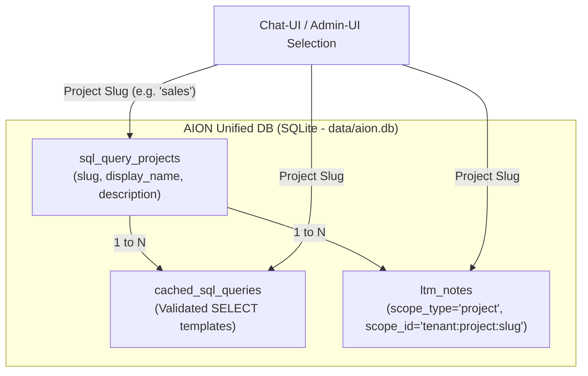
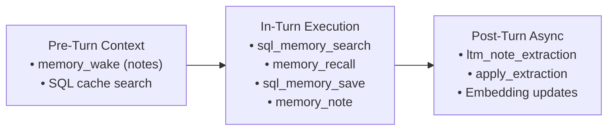

# Long-Term Memory (LTM) and Projects

This document describes how structured **Long-Term Memory (LTM)** functions in AION Agent, how it integrates with the concept of **Project**, and how knowledge and SQL templates are scoped using **Mnemos** and **SQL QueryMemory**.

---

## Architecture and Components

Structured project memory consists of two coordinated layers that share the same project identifier (**project slug**):

```mermaid
flowchart TD
    subgraph "AION Unified DB (SQLite - data/aion.db)"
        Proj["sql_query_projects<br/>(slug, display_name, description)"] -->|1 to N| Cache["cached_sql_queries<br/>(Validated SELECT templates)"]
        Proj -->|1 to N| Notes["ltm_notes<br/>(scope_type='project', scope_id='tenant:project:slug')"]
    end

    User["Chat-UI / Admin-UI Selection"] -->|"Project Slug (e.g. 'sales')"| Proj
    User -->|Project Slug| Notes
    User -->|Project Slug| Cache
```

### 1. SQL QueryMemory (SQL Templates)
Saved in `data/aion.db` in the `cached_sql_queries` table.
- Stores validated SQL SELECT templates (intent $\rightarrow$ parameterized SQL).
- Injected into turn context on cache hits via [`src/runtime/query_memory_hooks.py`](../../src/runtime/query_memory_hooks.py).
- Managed via native tools: `sql_memory_search`, `sql_memory_save`, `sql_memory_update`, `sql_memory_delete`, `sql_memory_list_saved`, `sql_memory_list_projects`.

### 2. Mnemos Project Notes (Domain Knowledge & Navigation)
Saved in `data/aion.db` in the `ltm_notes` table with `scope_type='project'` and `scope_id='{tenant}:project:{slug}'`.
- Stores concise domain knowledge, JOIN paths, business logic conventions, and pitfalls.
- Recalled via hybrid FTS5 + embedding search using native `memory_recall`.
- Created via explicit `memory_note` (in-turn) or automatic post-turn extraction (`ltm_note_extraction` skill).

---

## Memory Life Cycle

```mermaid
flowchart LR
    A["Pre-Turn Context<br/>• memory_wake (notes)<br/>• SQL cache search"] --> B["In-Turn Execution<br/>• sql_memory_search<br/>• memory_recall<br/>• sql_memory_save<br/>• memory_note"]
    B --> C["Post-Turn Async<br/>• ltm_note_extraction<br/>• apply_extraction<br/>• Embedding updates"]
```

### 1. Pre-Turn (Context Injection)
At the beginning of each turn:
1. **Mnemos Wake-up**: Loads relevant project and user notes into context via `ltm_orchestrator.wake_up()`.
2. **QueryMemory Search**: Checks for cached SQL templates matching the user prompt.
3. If cached SQL is found, it is injected as `QueryMemory — server cache` with execution guardrails.

### 2. In-Turn (Exploration & Persistence)
1. The agent searches existing knowledge (`sql_memory_search` + `memory_recall`).
2. Explores metadata (`list_tables`, `execute_sql`).
3. When a reusable path or convention is verified:
   - Saves parameterized SQL with `sql_memory_save`.
   - Saves concise lessons with `memory_note` (`scope="project"`).

### 3. Post-Turn (Automatic Extraction)
When `AION_LTM_EXTRACT=1`, the background extractor analyzes the turn:
1. Evaluates if new durable knowledge was produced.
2. Persists notes via `mnemos_orchestrator.apply_extraction()` when importance $\ge$ `AION_LTM_MIN_IMPORTANCE`.

---

## Environment Variables

| Variable | Default | Purpose |
|----------|---------|---------|
| `AION_LTM_EXTRACT` | `1` | Enables automatic post-turn extraction. |
| `AION_LTM_MIN_IMPORTANCE` | `2` | Minimum importance level to persist an extracted note (1–5). |
| `AION_MNEMOS_NATIVE_TOOLS` | `1` | Enables native Mnemos tools `memory_recall`, `memory_note`, `memory_forget`. |
| `AION_SQL_QM_ENABLED` | `1` | Master switch to enable SQL QueryMemory. |
| `AION_SQL_QM_AUTO_LEARN` | `0` | Auto-saving of successful SELECTs (default: 0, explicit tool save recommended). |

### Related Documents
- [STM, LTM, and QueryMemory](./stm-ltm-and-query.md)
- [Mnemos Long-Term Memory](./mnemos.md)
- [Mnemos Architectural Hardening](./mnemos-hardening.md)
- [Chat History and FTS Search](./chat-history-and-fts.md)
- [Context Compaction](./context-compaction.md)
