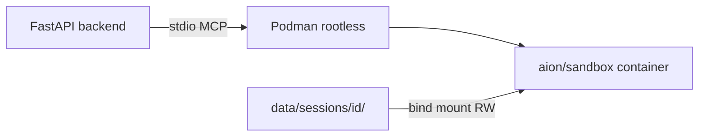

# Session isolation

AION isolates untrusted agent code (Python/Node scripts, pip/npm installs) per chat session.

## Threat model

User or agent-generated code must not:

- Read host secrets (`.env`, API keys, DB URLs)
- Access other users' sessions or `data/aion.db`
- Reach the network without explicit policy

## Architecture

- **One Podman container per chat session** for the `session_sandbox` MCP worker
- Container lifecycle tied to `mcp_manager.release_session()` (end of conversation)
- Subprocess tools (`sandbox_run_python_file`, pip, npm) run **inside** the container namespace
- Host backend spawns other MCP servers (Prometheus, OCR, …) unchanged

## Backends

| `AION_SANDBOX_BACKEND` | Use case |
|------------------------|----------|
| `subprocess` | macOS dev, local pytest — **env scrub + FS confinement** (not secret-safe vs root on host) |
| `container` | Production Linux with Podman rootless — **recommended for untrusted code** |

Set `AION_SANDBOX_FAIL_CLOSED=1` (default) to block execution when the configured backend is unavailable.

## Key modules

| Module | Role |
|--------|------|
| `src/security/session_env.py` | Minimal env builder (deny secret `AION_*`) |
| `src/security/session_confinement.py` | Landlock path builder + Python FS guards |
| `src/security/sandbox_subprocess_entry.py` | Unified Landlock + exec/runpy entry |
| `src/security/sandbox_py_runner.py` | Legacy alias for `--python` mode |
| `src/security/session_runner.py` | Unified subprocess entry |
| `src/security/container_policy.py` | Podman run argv (caps, read-only rootfs, mounts) |
| `src/security/container_runtime.py` | Podman/Docker client for MCP stdio spawn |

## Environment variables

| Variable | Default | Purpose |
|----------|---------|---------|
| `AION_SANDBOX_BACKEND` | `subprocess` | Isolation backend |
| `AION_SANDBOX_FAIL_CLOSED` | `1` | No silent fallback |
| `AION_SANDBOX_MCP_JAIL` | `1` | Spawn `session_sandbox` in container |
| `AION_CONTAINER_RUNTIME` | `podman` | `podman` or `docker` |
| `AION_SANDBOX_CONTAINER_IMAGE` | `aion/sandbox:latest` | Sandbox image |
| `AION_PODMAN_SOCKET` | — | Socket path inside backend container |
| `AION_SANDBOX_CONTAINER_MEMORY` | `512m` | Memory limit |
| `AION_SANDBOX_CONTAINER_CPUS` | `1.0` | CPU limit |
| `AION_SANDBOX_CONTAINER_PIDS_LIMIT` | `256` | PID limit |
| `AION_SANDBOX_ALLOW_PACKAGE_INSTALL` | `1` | pip/uv (enables network in container) |
| `AION_SANDBOX_ALLOW_NPM_INSTALL` | `1` | npm install |
| `AION_SANDBOX_SUBPROCESS_CONFINE` | `1` | FS confinement for subprocess backend (`0` = tests only) |
| `AION_SANDBOX_LANDLOCK_REQUIRED` | `0` | `1` = abort sandbox exec on Linux when Landlock cannot be applied |

## Subprocess backend limits

With `AION_SANDBOX_BACKEND=subprocess`, **every** sandbox subprocess (Python, Node,
pip, npm, exec allowlist) goes through `sandbox_subprocess_entry`:

1. **Landlock** (Linux): deny-by-default filesystem; rules **persist across `execvp`**
   so Node/pip/npm inherit the same cage as Python.
2. **Python guards** (all OS): hooks on `open`, `os.walk`, `glob`, `sqlite3`, etc.
   for user scripts run via `--python`.
3. **Node hook** (all OS): `sandbox_node_hook.cjs` loaded via `node --require` blocks
   `/proc/*` (except `/proc/self`) and host paths even when Landlock fails in Docker.
4. **Env scrub**: host secrets stripped; `AION_DATA_DIR` points at the session root only.

| Tool | Confinement |
|------|-------------|
| `sandbox_run_python_file` | Landlock + Python guards |
| `sandbox_run_node_file` | Landlock + Node FS hook (`--require`) |
| `sandbox_install_*` / `sandbox_exec_allowlisted` | Landlock + exec |

This is **defense in depth for dev**, not a substitute for `container` in production.
Use `AION_SANDBOX_BACKEND=container` when the agent runs untrusted code on shared hosts.

## Production checklist

1. Build sandbox image: `docker compose --profile sandbox-build build sandbox`
2. Enable Podman rootless on host (see [Podman sandbox deploy](../deployment/podman-sandbox.md))
3. Set in `.env`: `AION_SANDBOX_BACKEND=container`, `AION_SANDBOX_FAIL_CLOSED=1`
4. Disable package installs unless required: `AION_SANDBOX_ALLOW_PACKAGE_INSTALL=0`
5. Keep `exec.enabled=false` in production FS policy

## Future: MicroVM tier

Tier 3 (E2B/Firecracker) is out of scope for the current release. Hook point: extend `container_runtime.py` with a `microvm` backend adapter.
