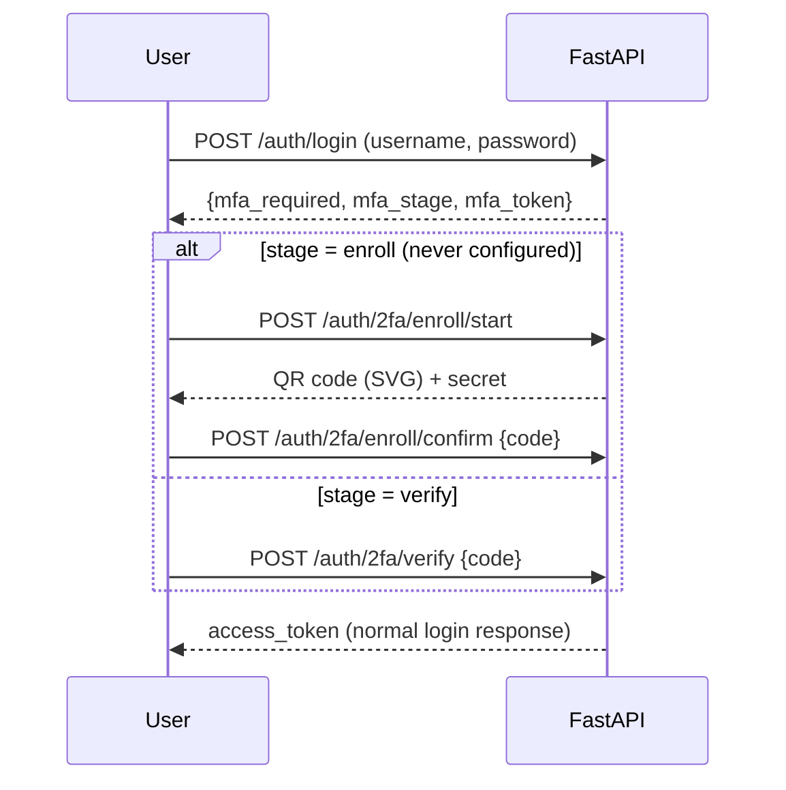

# Two-Factor Authentication (TOTP)

The administrator can require a TOTP code (Google Authenticator, Microsoft Authenticator, any RFC 6238 app) on top of the password. It applies to **every login through `POST /auth/login`** (chat-ui and admin-ui) and **only while `login_mode` is `password`**. SSO logins are never affected; when an SSO mode is active the setting is ignored (and cannot be enabled: `PUT /admin/auth/2fa` returns `409 sso_active`). Exception: during an SSO migration, users who already enrolled keep their TOTP and must enter the code at password login until they link SSO (see [SSO migration](./sso-migration.md)).

## Flow



No session token is issued until the code is valid. `mfa_token` is a stateless HMAC challenge (5 minutes, `AION_2FA_CHALLENGE_TTL_SEC`) signed with a key derived from `AION_CHAT_AUTH_SECRET`; it is never accepted as a chat token.

Users who already hold a session token when 2FA is enabled (or whose 2FA was reset) get `403 {"code": "mfa_enrollment_required"}` from protected endpoints; chat-ui and admin-ui then force a new login with enrollment.

## Admin API

| Endpoint | Purpose |
|---|---|
| `GET /admin/auth/2fa` | `required`, `effective`, `available`, enrolled/total password users |
| `PUT /admin/auth/2fa` `{required}` | Enable/disable (409 with SSO active) |
| `DELETE /admin/auth/users/{id}/2fa` | Reset a user's 2FA (they re-enroll at next login) |

The Admin UI exposes the toggle in **Settings** and a **Reset 2FA** action in **Users**.

## Security properties

- TOTP SHA1 / 6 digits / 30 s, tolerance of ±1 step.
- Secret encrypted at rest with `src/runtime/credential_store.py` (AES-GCM).
- Replay protection (`users.totp_last_used_step`) and lockout: 5 wrong codes lock the user for 5 minutes (`429 mfa_locked`).

## Database

Migration `v4w5x6y024`: `auth_settings.totp_required`, `auth_settings.totp_required_changed_at`, and on `users`: `totp_secret_encrypted`, `totp_enabled_at` (NULL = enrollment not confirmed), `totp_last_used_step`, `totp_failed_count`, `totp_locked_until`.

## Recovery

There are no backup codes: an admin resets the user's 2FA. If the only admin loses their device:

```bash
python -m src.auth.mfa reset <identifier>
```

or set `AION_2FA_FORCE_DISABLE=1` and restart the backend to bypass 2FA temporarily (remember to unset it).

## Environment

| Variable | Default | Description |
|---|---|---|
| `AION_2FA_ISSUER` | `AION` | Name shown in the authenticator app |
| `AION_2FA_CHALLENGE_TTL_SEC` | `300` | Validity of the password→code challenge |
| `AION_2FA_FORCE_DISABLE` | unset | `1` disables 2FA enforcement (emergency) |
