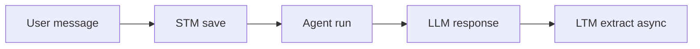

# Documentation Standards

## Documentation philosophy

### Why document the "why" before the "how"?

**Fundamental principle:** Documentation must explain **why** architectural decisions were made, not just **how** the code works.

**Why this principle:**
1. **Informed decisions:** The reader can understand the rationale behind the choices
2. **More efficient debugging:** Understanding the "why" helps diagnose problems
3. **Extensibility:** New developers can add features in a consistent way
4. **Maintainability:** Design decisions are documented, not just in the code

### What to document

**Document:**
- **Architectural choices:** Why the system is structured this way
- **Trade-offs:** What is sacrificed to obtain certain benefits
- **Design decisions:** Why one solution is chosen over another
- **Assumptions:** What the system assumes to function

**Do not document (too much):**
- **Every single function:** Too verbose, not very useful
- **Obvious logic:** If the code is self-documenting, there is no need to explain
- **Implementation details:** They change often, the rationale less so

---

## Documentation structure

### Organizational principles

**Organize by functional domain, not chronologically:**

```
docs/
├── introduction/      # Context and overview
├── architecture/      # Architecture and design
├── configuration/     # Configurations
├── api-and-runtime/   # API and runtime
├── clients/           # User interfaces
├── memory/            # Memory systems
├── mcp/               # MCP integration
├── security/          # Security
├── learning/          # Hermes features
└── standard/          # Standard documentation
```

**Why by domain:**
- **Intuitive navigation:** You find everything about a topic in one folder
- **Consistency:** Related documentation is kept together
- **Updates:** Changes to a domain in a single place

### Naming conventions

**File name:**
- **Kebab-case:** `agent-pipeline.md`, `chat-history-and-fts.md`
- **Descriptive:** `context-compression.md` not `compression.md`
- **Technical English:** `prometheus-integration.md`, not `integrazione-prometheus.md`

**File structure:**
```
# Frontmatter required
---
sidebar_position: 1
title: Short title for sidebar
description: One-line description
---

# Full title of the document

Content...
```

**Why frontmatter:**
- **Consistency:** All documents have a similar structure
- **SEO:** `title` and `description` for search
- **Navigation:** `sidebar_position` orders the sidebar

---

## Effective writing

### Principles of writing

#### 1. Explain the "why" before the "how"

**Incorrect (only "how"):**
```markdown
## Context compression

Compression is handled by `ContextCompressor` in `src/memory/context_compressor.py`.

The `should_compress` function checks if the context exceeds the threshold. If yes, it calls `compress()`.
```

**Correct (first "why"):**
```markdown
## Context compression

**Why compression?** LLM models have token limits (typically 32k).
If the context exceeds the limit, responses are truncated.

**How it works:** Compression keeps the last N messages intact and summarizes
the initial part, reducing token usage while maintaining key information.

**Configuration:** `AION_CONTEXT_COMPRESS_THRESHOLD=0.5` means "compress when
you use 50% of the token budget".
```

#### 2. Use diagrams to show flows

**Example:**


**Why diagrams:**
- **Visual understanding:** Easier to understand a complex flow
- **Reference:** The diagram remains stable while code changes
- **Quick overview:** See the big picture without reading everything

#### 3. Tables for comparisons

**Example:**
```markdown
| Feature | Pro | Con | When to use |
|---------|-----|-----|-------------|
| Compression | Reduces tokens | Loses information | Long sessions |
| No compression | Maximum quality | More tokens | Short sessions |
```

**Why tables:**
- **Clear comparison:** They see pros/cons at a glance
- **Decision making:** They help choose the right option
- **Reference:** Quick lookup for trade-offs

#### 4. Concrete examples

**Example:**
```markdown
**Configuration example:**
```yaml
# config/mcp_registry.yaml
prometheus:
  command: python
  args:
    - mcp_servers/prometheus/server.py
  env: {}
```

**Why examples:**
- **Concrete:** Understand how to apply the theory
- **Testing:** They can verify that it works
- **Reference:** Template for similar configurations
```

---

## Quality checklist

### Before publishing, verify:

- [ ] **Explanation of the "why"**: Is the rationale clear?
- [ ] **Trade-offs mentioned**: What is sacrificed to obtain benefits?
- [ ] **When to use**: Are specific situations documented?
- [ ] **Examples**: Are there concrete examples?
- [ ] **Diagrams**: Do diagrams help understand the flow?
- [ ] **Cross-references**: Links to related documents?
- [ ] **Troubleshooting**: Common problems and solutions?
- [ ] **Best practices**: Suggestions for deployment?

### Before modifying an existing document:

- [ ] **Complete reading**: Understand the context before modifying
- [ ] **Consistency**: Maintain style with other documents
- [ ] **Cross-check**: Verify that information does not change between documents
- [ ] **Update links**: Update links if a file is moved/renamed

---

## Document template

```markdown
---
sidebar_position: X
title: Short title for sidebar
description: One-line description
---

# Full title

## Philosophy / Why this exists

**Brief explanation** of why this component exists, what problem it solves.

## Architecture / How it works

**Explanation** of how it works, with:
- Diagrams if applicable
- Table of components
- Data flow

## Trade-offs

**Table** of pros/cons, when to use/disable.

## Configuration

**Table** of configurable variables with defaults and meaning.

## Examples

**Code or config examples** to demonstrate practical use.

## Troubleshooting

Common **problem** and solution.

## Best practices

**Suggestions** for deployment and optimal use.

## Related documents

- [Link to related doc 1]
- [Link to related doc 2]
```

---

## Examples of quality documentation

### Example 1: Good explanation of the "why"

**Before:**
```markdown
## STM Consolidator

The STM consolidator cleans up old messages after N turns.
```

**After:**
```markdown
## STM Consolidator - Why and How

**Why consolidate:** Without consolidation, the STM would grow indefinitely,
increasing token costs and latency. The consolidator keeps only relevant messages.

**How it works:** After N turns (`AION_STM_CONSOLIDATE_EVERY`), the consolidator:
1. Analyzes the last M messages (`AION_STM_PRUNE_KEEP`)
2. Removes obsolete messages
3. Keeps only the most recent messages

**Trade-offs:**
- **Pro:** Reduces token usage, improves performance
- **Con:** Loses context of old conversations

**When to enable:** Always, by default. Disable only for very short sessions (< 10 turns).
```

### Example 2: Good trade-off table

**Before:**
```markdown
## Compression settings

```yaml
AION_CONTEXT_COMPRESS_ENABLED: 1
AION_CONTEXT_COMPRESS_THRESHOLD: 0.5
```

**After:**
```markdown
## Compression Settings

| Setting | Default | When to modify | Trade-off |
|---------|---------|-------------------|-----------|
| `AION_CONTEXT_COMPRESS_ENABLED` | `1` | Disable for maximum quality | Enable: more efficient | Disable: more tokens |
| `AION_CONTEXT_COMPRESS_THRESHOLD` | `0.5` | 0.3 = early compression | 0.3 = loss of info | 0.7 = risk of truncation |
```

### Example 3: Good Troubleshooting

**Before:**
```markdown
## Errors

If there is an error, check logs.
```

**After:**
```markdown
## Troubleshooting

### "Response truncated"

**Symptom:** `finish_reason=length` in the stream

**Cause:** `AION_CHAT_MAX_TOKENS` too low for context + response

**Solutions:**
1. Increase `AION_CHAT_MAX_TOKENS` (e.g. 8192 → 16384)
2. Enable compression: `AION_CONTEXT_COMPRESS_ENABLED=1`
3. Reduce STM: `AION_STM_MAX_TURNS=8`

### "Timeout after 600s"

**Symptom:** `Timeout: too many steps or response too long`

**Cause:** Query too complex or tool execution blocked

**Solutions:**
1. Increase `AION_AGENT_TURN_TIMEOUT`
2. Reduce number of tool calls
3. Verify that the LLM server is reachable
```

---

## Language and tone

### Language

**Technical Italian**, with English terms for:
- **API names**: `/chat`, `/profiles`, `/admin`
- **Tech terms**: `WebSocket`, `JSON`, `SQLite`, `MCP`
- **Library names**: `FastAPI`, `Haystack`, `Next.js`

### Tone

**Professional, concise, informative:**
- Avoid colloquialisms
- Be direct, not verbose
- Use "you" or impersonal form ("the system" not "we do")

**Example:**
```markdown
# Incorrect (too colloquial)
"We all agree that this is important"

# Correct (professional)
"This feature is critical for the functioning of the system"
```

---

## Review and maintenance

### When to update the documentation

**Update documentation when:**
- A significant architecture change occurs
- A new important feature is added
- A significant behavior change occurs
- An error or inaccurate information is found

**Do not update for:**
- Refactoring that does not change behavior
- Variable name changes without a change in meaning
- Adding comments in code

### Review process

**Before merge:**
1. Read the updated documentation
2. Verify that it explains the "why"
3. Check cross-references
4. Verify examples and diagrams

**Who does the review:**
- **Author**: Author of the document or code
- **Reviewer**: Another developer (non-author)
- **Approver**: Project maintainer (for significant changes)

---

## Useful resources

- [Markdown syntax](https://commonmark.org/help/)
- [Mermaid diagrams](https://mermaid.js.org/)
- [Frontmatter spec](https://jekyllrb.com/docs/front-matter/)

---

## See Also

- [Introduction](../introduction/overview.md) - Project context
- [Architecture overview](../architecture/overview.md) - End-to-end flow
- [Configuration environment](../configuration/environment.md) - Configurations
- [API documentation](../api-and-runtime/rest-api.md) - API reference
